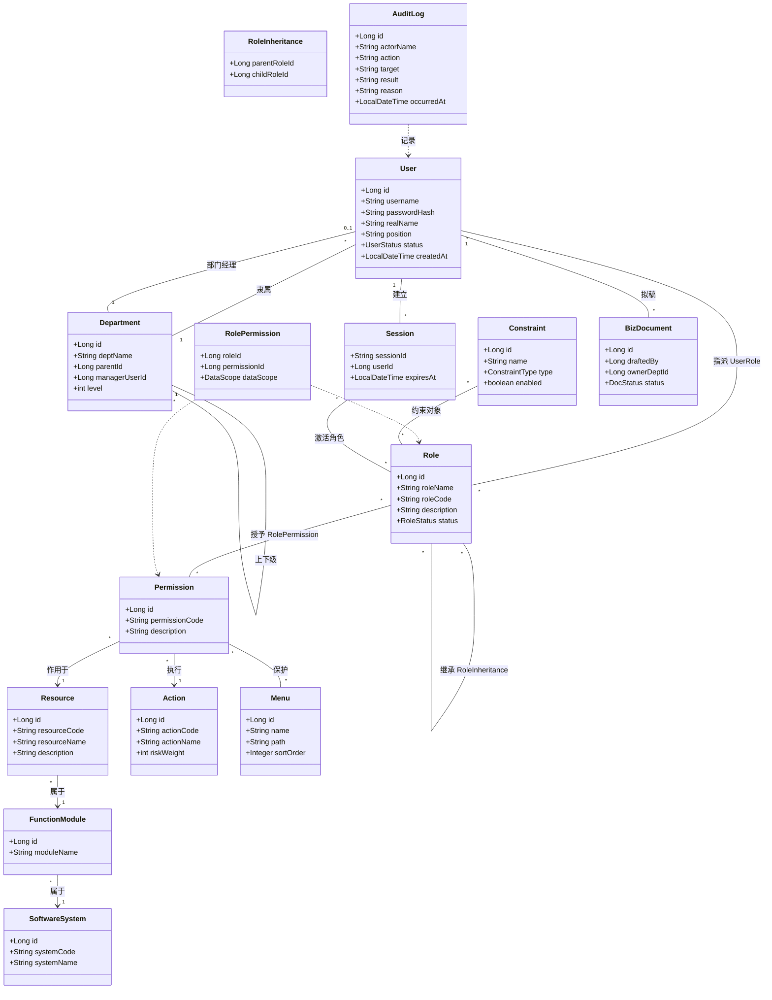
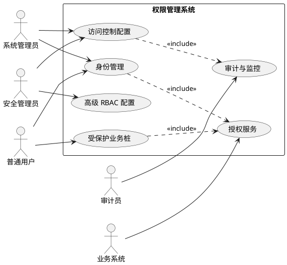
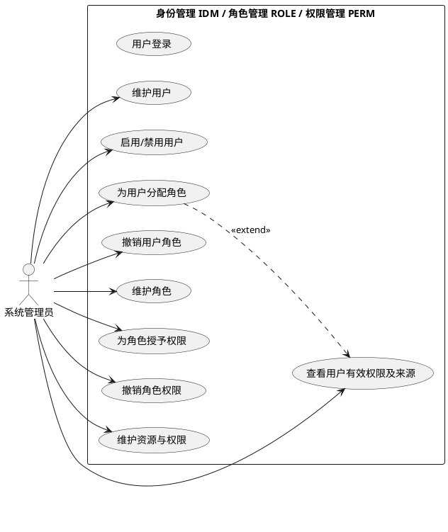
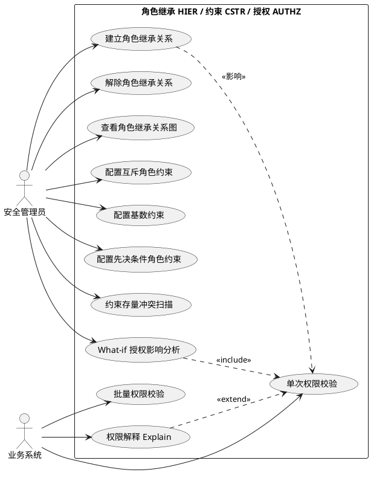
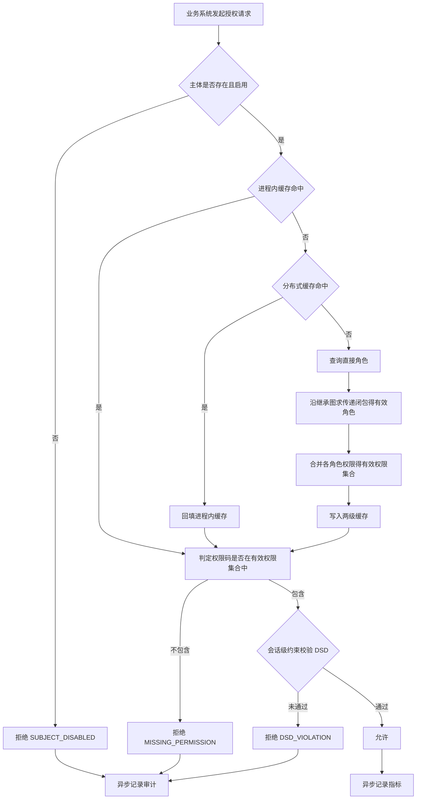
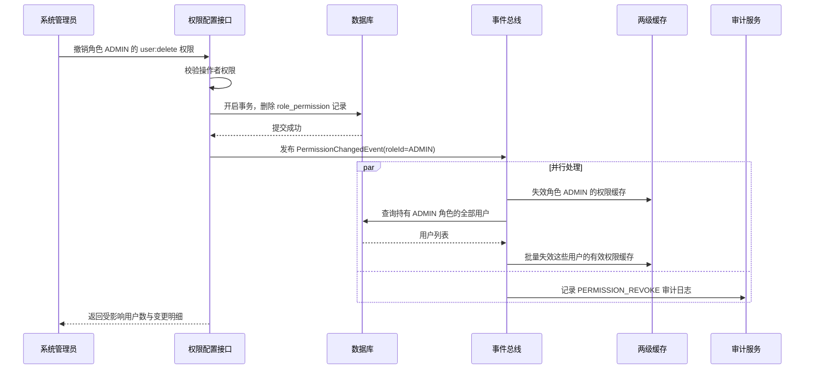
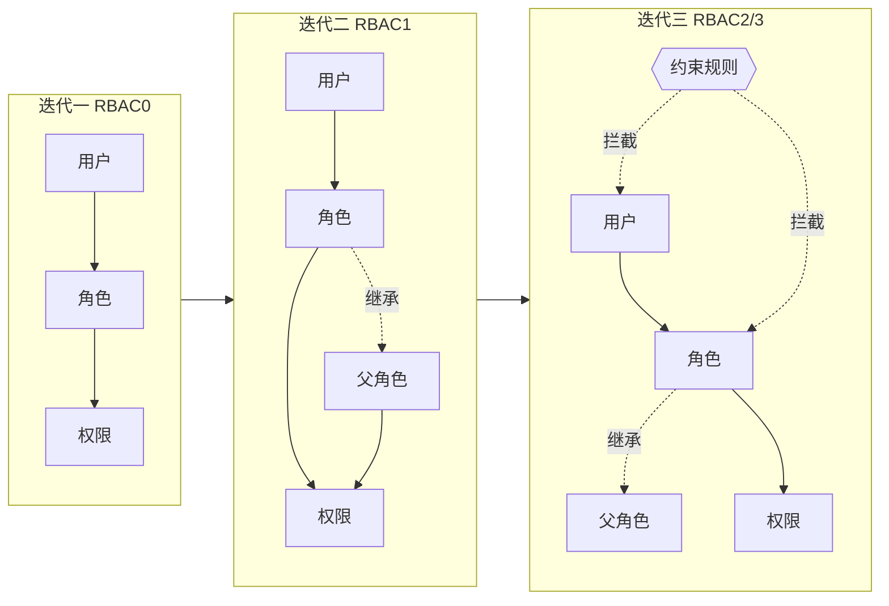

# 权限管理系统需求规格说明书

**版本 0.1 · 2026 年 9 月 20 日**

> 本文档格式参照课程提供的范本《支付模块需求规格说明书》(PayReqSPEC)。

---

## 目录

1. [引言](#1-引言)
2. [任务概述](#2-任务概述)
3. [数据描述](#3-数据描述)
4. [功能需求](#4-功能需求)
5. [性能需求](#5-性能需求)
6. [运行需求](#6-运行需求)
7. [其它需求](#7-其它需求)
- [附录 A 需求决策记录](#附录-a-需求决策记录)
- [附录 B 候选扩展功能](#附录-b-候选扩展功能)
- [附录 C 需求数据疑点](#附录-c-需求数据疑点)

---

# 1 引言

## 1.1 编写目的

为明确权限管理系统的需求、划清系统的边界、组织软件设计、开发与测试。

本文档的读者为本课程设计小组全体成员、任课教师与助教。本文档是后续概要设计、详细设计、数据库设计、API 设计与测试用例设计的唯一需求依据；任何未在本文档中登记编号的功能，不进入实现范围。

## 1.2 项目背景

a. **项目的委托单位、开发单位和主管部门**
委托单位：厦门大学信息学院《面向对象分析与设计》课程组（任课教师：邱明）。
开发单位：本课程设计小组。
本选题同时用于《软件工程》《JavaEE 平台技术》两门课程的课程设计。

b. **业务背景：市政工程公司**

本系统的服务对象是一家**市政工程公司**，其规模与组织结构由课程提供的三份基础数据确定：

| 数据文件 | 内容 | 规模 |
|---|---|---|
| 市政公司部门信息表 | 部门名称、部门经理、上级部门 | **111 个部门**，三级层次，单一根节点「总公司」 |
| 市政公司员工信息表 | 姓名、用户名、分公司、部门、岗位、电话 | **10000 名员工**，用户名形如 `SG000001` |
| 市政公司应用软件功能权限清单 | 软件系统 / 功能模块 / 功能点 / 功能说明 + 五个角色的权限 | **18 个软件系统、115 个功能模块、359 个功能点** |

组织结构为：

```
总公司
├── 职能部门（10 个）：综合办公室、党委工作部、人力资源部、财务部、
│                      市场经营部、工程技术部、安全质量部、物资设备部、
│                      审计监察部、工会办公室
├── 公司领导
└── 分公司（9 个）：道路工程、桥梁工程、隧道工程、轨道交通、管网工程、
                    水务工程、园林绿化、照明工程、市政养护
     └── 每个分公司下设：综合办公室、财务部、工程技术部、安全质量部、
                          物资设备部、市场经营部、第一至第四项目经理部
```

c. **该软件系统与其他系统的关系**

本系统是该公司的**统一权限中心**。清单中的 18 个业务系统（OA 协同办公、人力资源管理、财务管理、工程项目管理 PMIS、招投标管理、物资设备管理、移动巡检 APP、工地 AI 视频监控、GIS 地下管线管理、企业档案管理、车辆管理、安全生产管理、合同全生命周期管理、成本管控等）自身不再维护各自的权限模型，而是通过本系统提供的授权接口获得「某主体能否对某资源执行某操作」的判定结果。

本系统**不实现这 18 个业务系统本身**。课程检查中为验证权限确实生效，仅从权限清单中选取少量功能点实现为**受保护的业务桩**（见 §4.2.9）。

## 1.3 定义

### 1.3.1 需求用例编号规则

格式为 `XXXX-REQ-XXX-NNN`，含义如下表所示：

| 系统名称 | 文档类型 | 子系统 | 顺序编号 |
|---|---|---|---|
| RBAC — 权限管理系统 | REQ：需求文档 | IDM：身份管理<br>ORG：组织架构（部门/岗位）<br>ROLE：角色管理<br>PERM：权限与资源管理<br>HIER：角色继承<br>SCOPE：数据范围<br>CSTR：约束管理<br>AUTHZ：授权服务<br>SESS：会话管理<br>MENU：菜单管理<br>AUDIT：审计日志<br>BIZ：受保护业务桩<br>OBSV：监控与可观测性 | 从 001 开始 |

示例：`RBAC-REQ-AUTHZ-001` 表示权限管理系统授权服务子系统的第 1 号需求用例。

**编号一经分配不得变更**。需求废弃时保留编号并标注「已废弃」，不得回收复用。

### 1.3.2 术语表

| 术语 | 英文 / 缩写 | 定义 |
|---|---|---|
| 基于角色的访问控制 | RBAC | 将权限赋予角色而非用户，用户通过被指派角色间接获得权限的访问控制模型。ANSI/INCITS 359 标准 |
| 主体 | Subject | 发起访问请求的实体，本系统中即用户 |
| 资源 | Resource | 被保护的对象类型，如「员工台账」「发文稿件」「考勤记录」，对应权限清单中的功能点 |
| 操作 | Action | 对资源可施加的动作，如 READ、CREATE、APPROVE |
| 权限 | Permission | 功能点与操作的组合，标识符形如 `系统:模块:功能点:操作` |
| 角色 | Role | 一组权限的命名集合 |
| 直接角色 | Direct Role | 由用户-角色指派关系直接赋予用户的角色 |
| 有效角色 | Effective Role | 直接角色 ∪ 沿角色继承关系向上（或向下，视语义）可达的全部角色 |
| 有效权限 | Effective Permission | 用户全部有效角色所关联权限的并集 |
| 角色继承 | Role Hierarchy | RBAC1 引入的角色间偏序关系，子角色自动获得父角色的全部权限 |
| 静态职责分离 | SSD | 约束：同一用户不得被同时指派某组互斥角色 |
| 动态职责分离 | DSD | 约束：同一会话中不得同时激活某组互斥角色 |
| 基数约束 | Cardinality Constraint | 对「角色可分配用户数」「用户可拥有角色数」「角色可关联权限数」的上限约束 |
| 先决条件角色 | Prerequisite Role | 约束：用户须先拥有某低层级角色，才能被指派对应高层级角色 |
| 授权判定 | Authorization Check | 给定(主体, 资源, 操作)三元组，返回允许/拒绝的过程 |
| 权限解释 | Explain | 在授权判定结果之外，同时返回判定依据与推导路径 |
| 传递闭包 | Transitive Closure | 角色继承图（或部门树）上，从某节点出发可达的全部节点集合 |
| 功能权限 | Functional Permission | 「能否进入某功能、执行某操作」，粒度为功能点 × 操作 |
| 数据权限 / 数据范围 | Data Scope | 在拥有功能权限的前提下，**能看到哪些数据**。取值：全部 / 本部门 / 本部门及下属 / 仅本人 |
| 部门 | Department | 组织架构的节点，构成单根三层树。本系统中「项目经理部」也是部门 |
| 岗位 | Position | 员工的职务名称（部长、主管、专员、干事等）。岗位**不是**角色，但可用于派生初始角色 |
| 功能点 | Function Point | 权限清单中最细的功能单元，如「发文拟稿与审核」。全系统共 359 个 |

## 1.4 参考资料

1. 邱明.《面向对象分析与设计课程设计成绩计算办法》V1, 2026/09/07.
2. 邱明.《面向对象分析与设计——课程介绍》, 2026 秋季学期.
3. 邱明.《支付模块需求规格说明书》V1.0, 2023/09/15.（本文档格式范本）
4. ANSI/INCITS 359-2012. *Information Technology — Role Based Access Control*.
5. Sandhu R, Coyne E J, Feinstein H L, Youman C E. *Role-Based Access Control Models*. IEEE Computer, 1996, 29(2): 38-47.
6. Craig Larman. *Applying UML and Patterns*, 3rd ed. 机械工业出版社, 2006.
7. Alistair Cockburn. *Writing Effective Use Cases*. 机械工业出版社, 2002.
8. Neal Ford. *Functional Thinking*. O'Reilly Media, 2014.

---

# 2 任务概述

## 2.1 目标

权限管理是为了限制用户对系统的访问权限，从而使计算机系统在合法范围内使用。

本系统建设一个**统一授权中心**，向接入的业务系统提供：

1. **权限配置能力**——管理用户、角色、资源、权限及其相互关系，支持角色继承与约束规则；
2. **授权判定能力**——以高吞吐、低延迟回答「主体能否对资源执行操作」；
3. **权限可解释能力**——对每一次判定给出可追溯的依据，使权限问题可诊断；
4. **审计能力**——完整记录权限变更与授权结果，满足合规追溯要求。

系统的核心特征是**读写极度不对称**：权限的配置类操作（增删用户角色权限）频率极低，而授权判定操作频率极高，典型比例可达 10000:1。因此系统的架构重心不在 CRUD，而在**授权判定路径的性能与缓存一致性**。

系统按 RBAC 标准模型分三个迭代逐级构建：

| 迭代 | 模型 | 新增能力 | 对应检查 |
|---|---|---|---|
| 迭代一 | RBAC0 | 用户、角色、权限及其指派关系；基本授权判定 | 10/27 – 10/29 |
| 迭代二 | RBAC1 | 角色继承；有效权限推导；权限来源追溯；缓存 | 11/24 – 11/26 |
| 迭代三 | RBAC2 / RBAC3 | 互斥角色、基数、先决条件角色三类约束 | 12/22 – 12/24 |

## 2.2 运行环境

| 项 | 内容 |
|---|---|
| 操作系统 | Ubuntu 22.04 LTS（部署）/ Windows 11（开发） |
| 运行时 | JDK 17 |
| 应用容器 | Spring Boot 内嵌 Tomcat 10 |
| 数据库 | MySQL 8.0 |
| 缓存 | Redis 7（分布式）+ Caffeine（进程内） |
| 浏览器 | Chrome / Edge 最近两个大版本 |
| 部署环境 | 华为云（按课程《学生侧指南》领取的资源） |

## 2.3 条件与限制

**C-1 三范式并行实现的约束**
课程要求「分别用结构化（面向功能）和面向对象的方式实现」，并在迭代三「部分功能采用函数式设计」。因此同一套需求必须存在**多份实现**。为使对比有意义，各实现必须共用同一份数据库 schema 与同一份对外 API 契约，差异仅存在于内部设计。

**C-2 教师文档口径差异的处理**
《成绩计算办法》与《课程介绍》在三处表述不一致：
- 「面向功能」与「结构化」——视为同一范式，本文档统一写作「**结构化设计（面向功能）**」；
- 第三次检查的目标模型，《成绩计算办法》写 RBAC2、《课程介绍》写 RBAC3——本项目按 **RBAC3** 实施（即在迭代二已完成的角色继承之上叠加约束），该方案同时满足两种口径；
- 第二次检查截止日期 11/26 与 11/27——按 **11/26** 准备。
以上待答疑课向老师确认。

**C-3 高并发指标的验证条件**
课程环境无法提供真实的生产流量。§5 的性能指标以**本机/云主机单节点压测**方式验证，并在测试报告中明确标注硬件环境；未达标项需说明瓶颈与优化方向，不得隐瞒。

**C-4 前端不承担安全职责**
前端的菜单隐藏与按钮禁用仅为**可用性优化**，不构成安全机制。所有受保护接口必须在后端独立完成权限校验，不得依赖前端已做过控制的假设。

**C-5 密码存储**
用户口令一律使用 BCrypt 加盐哈希存储，系统任何位置不得出现明文口令或可逆加密口令。

---

# 3 数据描述

## 3.1 领域模型



**关系说明**

| 关系 | 说明 |
|---|---|
| `User–Role`、`Role–Permission` | 多对多，通过 `UserRole`、`RolePermission` 关联表实现 |
| `Role–Role` 继承 | **有向无环图（DAG）**而非树——一个角色可继承多个角色。这直接导出了「环检测」问题（见 `RBAC-REQ-HIER-001` 扩展场景） |
| `Department–Department` | **单根三层树**（总公司 → 分公司/职能部门 → 子部门）。求某部门的全部下级，与求某角色的全部祖先**是同一个传递闭包算法**——两处复用同一实现，见 `02-architecture.md` §4.3 |
| `SoftwareSystem–FunctionModule–Resource` | 三层资源层次，对应权限清单的「软件系统 / 功能模块 / 功能点」 |
| `RolePermission.dataScope` | **数据范围**挂在「角色-权限」这条边上，而不是挂在角色上。理由：同一角色对不同功能点的数据范围可以不同——「部门经理」对考勤是本部门范围，对公司制度是全部范围 |
| `Department.managerUserId` | 由部门信息表的「部门经理」列导入，是「谁管理这个部门」的权威绑定，也是 `DEPT` 数据范围的判定依据 |
| 「项目」 | **不单独建模**。权限清单中的「项目经理」对应组织架构中的「第 N 项目经理部」，项目即部门。这样「项目经理只能看本项目数据」与「部门经理只能看本部门数据」归一为同一条规则 |

## 3.2 核心概念说明

### 3.2.1 权限标识符格式

权限清单的层次是「软件系统 / 功能模块 / 功能点」，加上操作，权限采用**四段式**编码：

```
系统:模块:功能点:操作
```

示例：

```
oa:doc:draft:view          OA-公文管理-发文拟稿与审核-查看
oa:doc:draft:create        OA-公文管理-发文拟稿与审核-新增
oa:doc:draft:approve       OA-公文管理-发文拟稿与审核-审批
hr:attendance:record:edit  人力资源-考勤与休假管理-考勤管理-编辑
pmis:cost:change:approve   PMIS-成本管理-签证变更管理-审批
sys:user:account:assign    系统管理后台-用户与权限管理-角色分配
```

**操作词汇表**（由权限清单中的单元格取值归纳，共 5 个原子操作）：

| 操作码 | 中文 | 出现次数 | 说明 |
|---|---|---|---|
| `view` | 查看 | 878 | 最基础的操作，几乎所有非「无」的单元格都含此项 |
| `edit` | 编辑 | 235 | |
| `create` | 新增 | 109 | |
| `approve` | 审批 | 99 | 危险操作，是职责分离约束的主要对象 |
| `export` | 导出 | 66 | 数据外带，风险权重高 |

两个特殊取值：

- **「全部」**（359 次，即系统管理员对每个功能点的取值）：展开为该功能点的**全部 5 个原子操作**，而非一个独立的通配权限。
- **「无」**（552 次）：表示**不授予**，即该角色-功能点之间没有任何 `role_permission` 记录。

> **权限模型只有「授予」，没有显式「拒绝」。** 判定规则是：权限码在有效权限集合中即允许，否则拒绝。权限清单中的「无」是「未授予」而非「显式禁止」，因此不需要 Deny 语义、优先级或冲突消解规则。这一点简化了整个判定内核，必须在答辩中明确说明是**依据数据得出的结论**，而不是偷懒。

### 3.2.2 数据范围（数据权限）

权限清单中有 6 个功能点的「普通员工」列取值为 **「查看本人」** 或 **「查看/编辑本人」**：

| 功能点 | 普通员工的权限 |
|---|---|
| 人力资源 > 员工信息管理 > 员工台账管理 | 查看 / 编辑**本人** |
| 人力资源 > 考勤与休假管理 > 考勤管理 | 查看 / 编辑**本人** |
| 人力资源 > 薪酬福利管理 > 薪酬核算 | 查看**本人** |
| 人力资源 > 薪酬福利管理 > 福利管理 | 查看**本人** |
| 人力资源 > 绩效管理 > 考核结果应用 | 查看**本人** |
| 人力资源 > 培训与发展管理 > 职业发展管理 | 查看 / 编辑**本人** |

这证明**功能权限不足以描述需求**：普通员工确实拥有「查看考勤」这个功能权限，但只能看到自己的考勤记录。同理，「部门经理」与「项目经理」这两个角色若没有数据范围限制就失去意义——部门经理能编辑员工台账，但显然不应当能编辑全公司一万名员工。

因此引入**数据范围**，取值如下：

| 取值 | 含义 | 典型角色 |
|---|---|---|
| `ALL` | 全部数据 | 系统管理员、公司领导 |
| `DEPT_AND_SUB` | 本部门及所有下属部门 | 分公司负责人 |
| `DEPT` | 仅本部门 | 部门经理、项目经理 |
| `SELF` | 仅本人 | 普通员工（对上表 6 个功能点） |

判定规则扩展为：

```
allow(u, resource, action, context) =
      功能权限判定（同前）
  ∧   数据范围判定(dataScope, u.departmentId, context.targetDeptId / targetUserId)
```

> **实施计划**：`data_scope` 字段在迭代一的数据库 schema 中**就已存在并正确导入**，但**判定引擎在迭代一不做数据范围过滤**——第一次检查的要求是 RBAC0 功能级权限。数据范围作为判定管道中的一个独立阶段，在迭代二/三启用。这样既不影响第一次检查的范围，又避免了后期给数据库加字段、给接口加参数的大面积返工。

### 3.2.3 权限清单矩阵概览

权限清单是一张 `359 功能点 × 5 角色` 的矩阵：

| 角色 | 「无」的功能点数 | 「全部」的功能点数 | 部分权限的功能点数 |
|---|---|---|---|
| 系统管理员 | 0 | **359** | 0 |
| 公司领导 | 0 | 0 | 359 |
| 部门经理 | 62 | 0 | 297 |
| 项目经理 | 198 | 0 | 161 |
| 普通员工 | 292 | 0 | 67 |

展开为原子权限后，`role_permission` 约 **1800 条**授予记录。

**关于系统管理员**：其权限是**显式授予全部 359 个功能点的全部操作**，而不是在判定引擎中写一句 `if (isSuperAdmin) return ALLOW`。

| 方案 | 后果 |
|---|---|
| 引擎旁路（`if superAdmin return ALLOW`） | 约束不生效、数据范围不生效、审计中看不到实际命中的权限、无法回答「他凭什么能做这件事」 |
| **显式全量授予（采用）** | 判定路径唯一，约束与审计一视同仁，权限解释对超管同样可用 |

> 这是一条容易被忽略却影响很大的决策。教师课件强调 RBAC 的核心是「权限赋予角色」——一旦为超管开后门，这条原则就在系统里破了一个口子。代价是多了几千条授予记录，而这对数据库毫无压力。

### 3.2.4 角色层次的推导（迭代二）

权限清单给出的是一张**扁平矩阵**，五个角色之间**没有现成的继承关系**。经比对：公司领导对全部 359 个功能点都有「查看」，但部门经理在许多功能点上有「编辑」而公司领导只有「查看」——因此不存在严格的包含链。

迭代二的一项具体工作，是对五个角色展开后的权限集合做**两两包含关系分析**：凡 `Perms(A) ⊆ Perms(B)` 者，令 B 继承 A，并删去 B 中的重复授予。这使角色继承不是凭空设计出来的，而是**从真实数据中推导出来的**，是 RBAC1 最有说服力的引入理由。

### 3.2.5 有效权限的形式化定义

设 `DirectRoles(u)` 为用户 u 的直接角色集合，`↑r` 为角色 r 在继承图上可达的祖先角色集合（含自身），则：

```
EffectiveRoles(u) = ⋃ { ↑r | r ∈ DirectRoles(u) ∧ r.status = ENABLED }

EffectivePermissions(u) = ⋃ { Permissions(r) | r ∈ EffectiveRoles(u) }

allow(u, resource, action) =
      u.status = ENABLED
  ∧   (resource:action) ∈ EffectivePermissions(u)
  ∧   constraintsSatisfied(u)
```

该定义在三种范式的实现中保持一致，是三者行为等价性的判定依据，也是函数式实现最自然的落点（迭代三）。

### 3.2.6 数据量级

下列数字**来自课程提供的三份真实数据**，不是估算：

| 实体 | 规模 | 来源 / 说明 |
|---|---|---|
| 用户 | **10,000** | 员工信息表实际行数 |
| 部门 | **111** | 部门信息表实际行数；三层，单根 |
| 软件系统 | **18** | 权限清单 |
| 功能模块 | **115** | 权限清单 |
| 功能点（资源） | **359** | 权限清单 |
| 操作 | **5** | view / create / edit / approve / export |
| 权限（原子） | **约 1,795** | 359 功能点 × 5 操作 |
| 角色 | **5**（初始）→ 预留增长至 500 | 权限清单的 5 个角色列；后续公司可自建 |
| 用户-角色指派 | **约 10,000 ~ 30,000** | 初始每人 1 个派生角色，预留多角色增长 |
| 角色-权限授予 | **约 1,800** | 矩阵展开结果 |
| 审计日志 | 每日千万级 | 按鉴权量推算，需分区与归档 |

> **注意规模上的不对称**：配置数据很小（角色 5 个、权限 1800 条、部门 111 个），**可以全量常驻内存**；而鉴权请求量极大。这直接支持了 `02-architecture.md` §4.3 的选型——角色继承闭包与部门树可以在内存中计算，无需物化到数据库。这是一个由真实数据量级支撑的架构决策，而非拍脑袋。

---

# 4 功能需求

## 4.1 功能划分

### 4.1.1 用例总图



**图 4-1：用例总图**

### 4.1.2 参与者说明

| 参与者 | 类型 | 对应权限清单 | 说明 |
|---|---|---|---|
| 系统管理员 | 主要 | ✅ 清单列 1 | 对全部 359 个功能点拥有全部操作（显式授予，非引擎旁路）。管理用户、角色、权限、组织架构 |
| 公司领导 | 主要 | ✅ 清单列 2 | 对全部功能点至少有「查看」，部分有「审批」「导出」。数据范围为全公司 |
| 部门经理 | 主要 | ✅ 清单列 3 | 297 个功能点有权限。数据范围为本部门（由部门表的「部门经理」列绑定） |
| 项目经理 | 主要 | ✅ 清单列 4 | 161 个功能点有权限。「项目」即「第 N 项目经理部」，数据范围为该部门 |
| 普通员工 | 主要 | ✅ 清单列 5 | 67 个功能点有权限；其中 6 个为「本人」范围 |
| 安全管理员 | 主要 | ➕ 我方增设 | 管理角色继承与约束规则。**增设理由**：将「配置权限」与「配置约束」分离，本身即职责分离的示范；清单未给出该角色，属我方设计决策 |
| 审计员 | 主要 | ➕ 我方增设 | 只读访问审计日志与监控数据。**增设理由**：审计者不应有配置权限，否则审计失去独立性 |
| 业务系统 | 主要 | — | 18 个业务系统，通过授权接口获取判定结果 |
| 定时任务 | 辅助 | — | 触发临时授权回收、约束存量扫描等 |

> **增设角色必须说明**：清单给出的 5 个角色是业务角色，但系统本身的管理职责（约束配置、审计）若全部压给「系统管理员」，会造成一个角色权力过大，且无法演示 RBAC2 的职责分离。因此增设 2 个系统级角色。答辩时要讲清楚这是**有依据的扩展**而非偏离需求。

### 4.1.3 分包用例图



**图 4-2：访问控制配置用例图（迭代一）**



**图 4-3：高级 RBAC 与授权服务用例图（迭代二、三）**

### 4.1.4 需求清单总表

| 用例编号 | 用例名称 | 级别 | 迭代 | 优先级 |
|---|---|---|---|---|
| RBAC-REQ-IDM-001 | 用户登录 | 用户目标 | 一 | 必须 |
| RBAC-REQ-IDM-002 | 用户登出 | 子功能 | 一 | 必须 |
| RBAC-REQ-IDM-003 | 新增用户 | 用户目标 | 一 | 必须 |
| RBAC-REQ-IDM-004 | 修改用户信息 | 子功能 | 一 | 必须 |
| RBAC-REQ-IDM-005 | 启用/禁用用户 | 子功能 | 一 | 必须 |
| RBAC-REQ-IDM-006 | 删除用户 | 子功能 | 一 | 应该 |
| RBAC-REQ-IDM-007 | 查询用户列表 | 子功能 | 一 | 必须 |
| RBAC-REQ-IDM-008 | 查看用户有效权限及来源 | 用户目标 | 二 | 必须 |
| RBAC-REQ-ROLE-001 | 创建角色 | 用户目标 | 一 | 必须 |
| RBAC-REQ-ROLE-002 | 修改角色 | 子功能 | 一 | 必须 |
| RBAC-REQ-ROLE-003 | 删除角色 | 子功能 | 一 | 必须 |
| RBAC-REQ-ROLE-004 | 查询角色列表 | 子功能 | 一 | 必须 |
| RBAC-REQ-ROLE-005 | 为用户分配角色 | 用户目标 | 一 | 必须 |
| RBAC-REQ-ROLE-006 | 撤销用户角色 | 子功能 | 一 | 必须 |
| RBAC-REQ-PERM-001 | 维护资源 | 子功能 | 一 | 必须 |
| RBAC-REQ-PERM-002 | 维护权限 | 子功能 | 一 | 必须 |
| RBAC-REQ-PERM-003 | 为角色授予权限 | 用户目标 | 一 | 必须 |
| RBAC-REQ-PERM-004 | 撤销角色权限 | 子功能 | 一 | 必须 |
| RBAC-REQ-PERM-005 | 查询权限列表 | 子功能 | 一 | 必须 |
| RBAC-REQ-AUTHZ-001 | 单次权限校验 | 用户目标 | 一 | 必须 |
| RBAC-REQ-AUTHZ-002 | 批量权限校验 | 用户目标 | 二 | 必须 |
| RBAC-REQ-AUTHZ-003 | 权限解释 Explain | 用户目标 | 二 | 必须 |
| RBAC-REQ-AUTHZ-004 | 权限缓存失效 | 子功能 | 二 | 必须 |
| RBAC-REQ-HIER-001 | 建立角色继承关系 | 用户目标 | 二 | 必须 |
| RBAC-REQ-HIER-002 | 解除角色继承关系 | 子功能 | 二 | 必须 |
| RBAC-REQ-HIER-003 | 查看角色继承关系图 | 用户目标 | 二 | 必须 |
| RBAC-REQ-HIER-004 | 查看角色有效权限 | 子功能 | 二 | 必须 |
| RBAC-REQ-CSTR-001 | 配置互斥角色约束 | 用户目标 | 三 | 必须 |
| RBAC-REQ-CSTR-002 | 配置基数约束 | 用户目标 | 三 | 必须 |
| RBAC-REQ-CSTR-003 | 配置先决条件角色约束 | 用户目标 | 三 | 必须 |
| RBAC-REQ-CSTR-004 | 约束存量冲突扫描 | 用户目标 | 三 | 应该 |
| RBAC-REQ-CSTR-005 | What-if 授权影响分析 | 用户目标 | 三 | 应该 |
| RBAC-REQ-SESS-001 | 会话角色激活（DSD） | 用户目标 | 三 | 可选 |
| RBAC-REQ-MENU-001 | 查询当前用户菜单树 | 用户目标 | 二 | 必须 |
| RBAC-REQ-MENU-002 | 维护菜单 | 子功能 | 二 | 应该 |
| RBAC-REQ-AUDIT-001 | 记录审计日志 | 子功能 | 一 | 必须 |
| RBAC-REQ-AUDIT-002 | 查询审计日志 | 用户目标 | 二 | 必须 |
| RBAC-REQ-BIZ-001 | 发文拟稿 | 用户目标 | 一 | 必须 |
| RBAC-REQ-BIZ-002 | 审批发文稿件 | 用户目标 | 一 | 必须 |
| RBAC-REQ-BIZ-003 | 查询考勤记录 | 用户目标 | 一 | 必须 |
| RBAC-REQ-BIZ-004 | 编辑本人考勤 | 子功能 | 二 | 必须 |
| RBAC-REQ-ORG-001 | 查询部门树 | 用户目标 | 一 | 必须 |
| RBAC-REQ-ORG-002 | 维护部门 | 子功能 | 一 | 必须 |
| RBAC-REQ-ORG-003 | 设置部门经理 | 子功能 | 一 | 必须 |
| RBAC-REQ-ORG-004 | 查询部门下属员工 | 子功能 | 一 | 必须 |
| RBAC-REQ-ORG-005 | 导入组织架构与员工数据 | 用户目标 | 一 | 必须 |
| RBAC-REQ-SCOPE-001 | 配置角色的数据范围 | 用户目标 | 一（配置）/ 二（生效） | 必须 |
| RBAC-REQ-SCOPE-002 | 数据范围过滤 | 子功能 | 二 | 必须 |
| RBAC-REQ-SCOPE-003 | 查看用户数据范围汇总 | 用户目标 | 二 | 应该 |
| RBAC-REQ-OBSV-001 | 查看授权监控面板 | 用户目标 | 二 | 应该 |

**迭代一共 32 项（必须级 31 项），构成第一次检查的实现范围。**

---

## 4.2 功能描述

### 4.2.1 用户登录

| 用例编号：RBAC-REQ-IDM-001 | 用例名称：用户登录 |
|---|---|
| **级别：** 用户目标 ||
| **包：** 身份管理 IDM ||
| **参与者：** 普通员工、系统管理员 ||
| **描述：** 用户提交凭据换取访问令牌，系统同时返回该用户的有效权限集合供前端做展示控制 ||
| **触发事件：** 界面操作 ||
| **主成功场景：** | **信息** |
| 1. 用户输入用户名与口令，提交 | 用户名、口令 |
| 2. 系统校验用户存在且状态为「启用」 | |
| 3. 系统用 BCrypt 校验口令哈希 | |
| 4. 系统计算该用户的有效权限集合并建立会话 | 会话 ID、有效期 |
| 5. 系统返回访问令牌、用户基本信息、有效权限集合 | token、权限码列表、菜单树 |
| 6. 系统记录 LOGIN 审计日志 | 时间、IP、结果 |
| **扩展场景：** | **信息** |
| 2a. 用户不存在 | |
| &nbsp;&nbsp;1. 系统返回「用户名或口令错误」，记录 LOGIN_FAILED 审计 | 不得区分「用户不存在」与「口令错误」，避免用户名枚举 |
| 2b. 用户状态为「禁用」 | |
| &nbsp;&nbsp;1. 系统返回「账号已禁用」，记录审计 | |
| 3a. 口令错误 | |
| &nbsp;&nbsp;1. 累加失败次数；连续失败 5 次则锁定账号 15 分钟 | 失败次数、锁定截止时间 |
| **其他：** 令牌有效期 2 小时；口令仅以 BCrypt 哈希存储；失败响应时间需与成功响应时间相近，防止时序侧信道 ||

---

### 4.2.2 为用户分配角色

| 用例编号：RBAC-REQ-ROLE-005 | 用例名称：为用户分配角色 |
|---|---|
| **级别：** 用户目标 ||
| **包：** 角色管理 ROLE ||
| **参与者：** 系统管理员 ||
| **描述：** 管理员将一个或多个角色指派给用户，使用户获得这些角色所携带的权限。本用例是 RBAC 模型的核心写操作，也是所有约束规则的主要拦截点 ||
| **触发事件：** 界面操作 ||
| **主成功场景：** | **信息** |
| 1. 管理员选定目标用户，系统展示其当前角色 | 用户 ID、当前角色列表 |
| 2. 管理员勾选待分配的角色并提交 | 角色 ID 列表 |
| 3. 系统校验管理员本人持有 `system:role:assign` 权限 | |
| 4. 系统校验目标用户与各角色均存在且状态为「启用」 | |
| 5. 系统逐条校验约束规则（迭代三启用） | 互斥、基数、先决条件 |
| 6. 系统写入用户-角色指派关系 | |
| 7. 系统发布「权限变更事件」，失效该用户的权限缓存 | 用户 ID |
| 8. 系统记录 ROLE_ASSIGN 审计日志 | 操作人、目标、角色、结果 |
| 9. 系统返回该用户变更后的有效权限集合 | 新增权限、移除权限 |
| **扩展场景：** | **信息** |
| 4a. 角色状态为「禁用」 | |
| &nbsp;&nbsp;1. 系统拒绝并提示「角色已禁用，不可分配」 | |
| 5a. 违反互斥角色约束（SSD） | |
| &nbsp;&nbsp;1. 系统拒绝，返回冲突的约束名称与互斥角色对 | 约束名、冲突角色 |
| 5b. 违反基数约束 | |
| &nbsp;&nbsp;1. 系统拒绝，返回被突破的上限类型与当前值 | 上限类型、当前值、上限值 |
| 5c. 违反先决条件角色约束 | |
| &nbsp;&nbsp;1. 系统拒绝，返回缺失的前置角色 | 缺失角色列表 |
| 6a. 该指派关系已存在 | |
| &nbsp;&nbsp;1. 系统忽略该条，不视为错误（幂等） | |
| **其他：** 本用例必须是幂等的；批量分配时采用「全部成功或全部回滚」语义，不允许部分成功；缓存失效必须与数据库写入在同一事务边界内保证最终一致 ||

---

### 4.2.3 单次权限校验

> **本用例是整个系统的核心接口。** 系统其余功能的调用量合计可能只有每天数百次，而本接口的调用量可达每天上亿次。它的性能与正确性决定整个系统的价值。

| 用例编号：RBAC-REQ-AUTHZ-001 | 用例名称：单次权限校验 |
|---|---|
| **级别：** 用户目标 ||
| **包：** 授权服务 AUTHZ ||
| **参与者：** 业务系统 ||
| **描述：** 给定(主体, 资源, 操作)三元组，返回是否允许。这是本系统对外提供的最主要能力 ||
| **触发事件：** 被其他系统调用 ||
| **主成功场景：** | **信息** |
| 1. 业务系统提交授权请求 | subject、resource、action |
| 2. 系统查进程内缓存（Caffeine），命中则直接判定 | 用户有效权限集合 |
| 3. 未命中则查分布式缓存（Redis），命中则回填本地缓存 | |
| 4. 仍未命中则从数据库加载：直接角色 → 有效角色（含继承）→ 有效权限，并写入两级缓存 | |
| 5. 系统判定目标权限码是否属于有效权限集合 | |
| 6. 系统校验会话级约束（DSD，迭代三） | |
| 7. 系统返回判定结果 | allowed: true/false |
| 8. 系统异步记录鉴权指标；判定为拒绝时记录审计日志 | 耗时、缓存命中与否 |
| **扩展场景：** | **信息** |
| 2a. 用户不存在或已禁用 | |
| &nbsp;&nbsp;1. 返回 allowed=false，reason=SUBJECT_DISABLED | |
| 5a. 权限码不在有效权限集合中 | |
| &nbsp;&nbsp;1. 返回 allowed=false，reason=MISSING_PERMISSION | 所需权限码 |
| 4a. 数据库不可用 | |
| &nbsp;&nbsp;1. 按「失败关闭」原则返回 allowed=false，reason=SYSTEM_UNAVAILABLE，并触发告警 | 安全系统不得在故障时放行 |
| **其他：** 判定路径必须为 O(1) 平均复杂度（集合查找）；P99 延迟 < 50ms；缓存命中率 ≥ 95%；**判定逻辑不得依赖 Spring 注解等框架特性，必须是可独立调用、可独立测试的纯逻辑**——这是三种范式能够横向对比的前提 ||

---

### 4.2.4 权限解释 Explain

| 用例编号：RBAC-REQ-AUTHZ-003 | 用例名称：权限解释 Explain |
|---|---|
| **级别：** 用户目标 ||
| **包：** 授权服务 AUTHZ ||
| **参与者：** 系统管理员、安全管理员、业务系统 ||
| **描述：** 在授权判定结果之外，同时返回判定的完整依据：用户经由哪条角色路径获得（或未能获得）该权限。用于排查「为什么许禄不能审批公文」这类问题 ||
| **触发事件：** 界面操作或被其他系统调用 ||
| **主成功场景：** | **信息** |
| 1. 请求方提交主体、资源、操作，并指定需要解释 | subject、resource、action、explain=true |
| 2. 系统执行 RBAC-REQ-AUTHZ-001 的判定流程，但**全程记录推导轨迹** | |
| 3. 系统收集：用户的直接角色、经继承展开的有效角色、每个角色贡献的权限 | |
| 4. 判定为允许时，系统给出**最短授权路径**（用户 → 角色 → [父角色] → 权限） | 授权路径 |
| 5. 判定为拒绝时，系统给出拒绝原因分类与缺失的权限码 | 原因码、缺失权限 |
| 6. 系统返回判定结果与解释结构 | 见下 |
| **扩展场景：** | **信息** |
| 5a. 拒绝原因为约束拦截 | |
| &nbsp;&nbsp;1. 系统返回被触发的约束名称与冲突的角色集合 | 约束名、冲突角色 |
| 2a. 请求方无 `authz:explain:invoke` 权限 | |
| &nbsp;&nbsp;1. 降级为普通判定，只返回 allowed，不返回解释 | 解释信息本身是敏感信息 |
| **其他：** 解释模式的开销显著高于普通判定，**不走缓存快路径**，且必须限流；解释结果不得暴露请求方本身无权查看的角色与权限名称 ||

响应示例：

```json
{
  "allowed": false,
  "reason": "MISSING_PERMISSION",
  "requiredPermission": "oa:doc:draft:approve",
  "subject": "SG000013",
  "directRoles": ["EMPLOYEE"],
  "effectiveRoles": ["EMPLOYEE"],
  "evaluationPath": [
    "user:SG000013(许禄) -> role:EMPLOYEE (直接指派)",
    "role:EMPLOYEE -> permission:oa:doc:draft:view",
    "role:EMPLOYEE -> permission:oa:doc:draft:create",
    "oa:doc:draft:approve 未在任何有效角色中找到"
  ],
  "suggestion": "分配角色 DEPT_MANAGER 可获得该权限（新增 316 条权限，风险评分 34→72）"
}
```

---

### 4.2.5 建立角色继承关系

| 用例编号：RBAC-REQ-HIER-001 | 用例名称：建立角色继承关系 |
|---|---|
| **级别：** 用户目标 ||
| **包：** 角色继承 HIER ||
| **参与者：** 安全管理员 ||
| **描述：** 建立「子角色继承父角色」的关系，使子角色自动获得父角色的全部权限，避免权限重复配置。角色继承关系构成有向无环图 ||
| **触发事件：** 界面操作 ||
| **主成功场景：** | **信息** |
| 1. 安全管理员选定子角色与父角色，提交 | 子角色 ID、父角色 ID |
| 2. 系统校验两个角色均存在且状态为「启用」 | |
| 3. 系统校验该继承关系不重复 | |
| 4. **系统在继承图上做环检测**：若加入该边后存在环则拒绝 | |
| 5. 系统校验继承深度未超过上限（默认 10 层） | 当前深度 |
| 6. 系统写入继承关系，重算受影响角色的传递闭包 | 受影响角色集合 |
| 7. 系统发布权限变更事件，失效受影响角色下**全部用户**的权限缓存 | 受影响用户数 |
| 8. 系统记录 HIERARCHY_ADD 审计日志 | |
| 9. 系统返回受影响的角色与用户数量，以及新增的有效权限 | 影响面报告 |
| **扩展场景：** | **信息** |
| 4a. 检测到环（如 A→B，B→C，此时提交 C→A） | |
| &nbsp;&nbsp;1. 系统拒绝并返回构成环的完整角色路径 | 环路径 A→B→C→A |
| 2a. 子角色与父角色为同一角色 | |
| &nbsp;&nbsp;1. 系统拒绝（自环） | |
| 5a. 继承深度超限 | |
| &nbsp;&nbsp;1. 系统拒绝并提示当前深度 | 深度过大会使闭包计算退化 |
| 7a. 受影响用户数超过阈值（默认 1 万） | |
| &nbsp;&nbsp;1. 系统提示影响面，要求二次确认后再执行 | |
| **其他：** 环检测是本用例的核心难点。三种范式对此给出不同实现（结构化：显式栈 DFS；面向对象：图对象封装 + 访问者；函数式：不动点迭代），是范式对比的重点样本之一 ||

---

### 4.2.6 配置互斥角色约束

| 用例编号：RBAC-REQ-CSTR-001 | 用例名称：配置互斥角色约束 |
|---|---|
| **级别：** 用户目标 ||
| **包：** 约束管理 CSTR ||
| **参与者：** 安全管理员 ||
| **描述：** 定义一组互斥角色，限制同一用户可同时拥有的数量上限（静态职责分离 SSD）。典型场景：**审计员与系统管理员不得为同一人**——审计员的职责是监督系统管理员的操作，两者合一则审计失去独立性 ||
| **触发事件：** 界面操作 ||
| **主成功场景：** | **信息** |
| 1. 安全管理员录入约束名称、选择互斥角色集合、设定最大同时拥有数 | 名称、角色集合、上限 n |
| 2. 系统校验角色集合规模 ≥ 2 且 上限 n < 集合规模 | |
| 3. **系统扫描存量数据**，找出当前已违反该约束的用户 | 冲突用户清单 |
| 4. 存在冲突时，系统展示冲突清单，要求管理员选择处理方式 | 拒绝创建 / 创建但仅对新指派生效 |
| 5. 系统保存约束规则并置为启用 | |
| 6. 系统记录 CONSTRAINT_CREATE 审计日志 | |
| **扩展场景：** | **信息** |
| 2a. 上限 n ≥ 角色集合规模 | |
| &nbsp;&nbsp;1. 系统拒绝：该约束永远不会被触发，属无效配置 | |
| 3a. 存量冲突用户数过多 | |
| &nbsp;&nbsp;1. 系统只展示前 100 条并提供完整清单导出 | |
| 4a. 管理员选择「拒绝创建」 | |
| &nbsp;&nbsp;1. 系统放弃创建，返回冲突清单供先行整改 | |
| **其他：** 见下方两条重要约束 ||

> ⚠️ **互斥角色对不得存在继承关系。** 若 A 继承 B，而规则声明 A 与 B 互斥，则任何持有 A 的用户都会因继承获得 B 而违反该约束——该约束**不可满足**，任何人都无法持有 A。因此创建 SSD 规则时必须校验：规则中任意两个角色在继承图上不得互为祖先，违反则返回 `24005 CONSTRAINT_INEFFECTIVE`。
>
> 这一点是 RBAC1 与 RBAC2 交互产生的陷阱，容易在设计时被忽略。它也解释了为什么本系统的 SSD 演示对选用 **审计员 ⟂ 系统管理员**（两者无继承关系）而非「普通员工 ⟂ 部门经理」——后者在迭代二引入角色继承后，部门经理会继承普通员工，该规则将变得不可满足。
>
> ⚠️ **约束求值必须在「为用户分配角色」「建立角色继承关系」两个写入口同时生效**——继承也可能间接导致互斥（用户经由继承获得了互斥角色），这是容易遗漏的边界情况，必须在测试中覆盖（见 `09-test-plan.md` §3.4）。
>
> **业务级的职责分离另行处理**：「同一份公文的拟稿人不能是审批人」不是角色级约束（部门经理这个角色本身既可拟稿也可审批），而是绑定到具体单据的业务规则，由 `26003 SELF_APPROVAL_FORBIDDEN` 实现。两者互补，不可混为一谈。

---

### 4.2.7 配置基数约束

| 用例编号：RBAC-REQ-CSTR-002 | 用例名称：配置基数约束 |
|---|---|
| **级别：** 用户目标 ||
| **包：** 约束管理 CSTR ||
| **参与者：** 安全管理员 ||
| **描述：** 对 RBAC 关系的规模设定上限。课程要求覆盖**三类**基数约束 ||
| **触发事件：** 界面操作 ||
| **主成功场景：** | **信息** |
| 1. 安全管理员选择基数约束类型 | 见下表 |
| 2. 系统根据类型要求录入对应的约束对象与上限值 | |
| 3. 系统扫描存量数据，报告当前值与是否已超限 | 当前值、上限值 |
| 4. 系统保存并启用约束 | |
| 5. 系统记录审计日志 | |
| **扩展场景：** | **信息** |
| 3a. 当前值已超过拟设上限 | |
| &nbsp;&nbsp;1. 系统提示，允许创建但标注为「存量豁免」，仅拦截后续新增 | |
| **其他：** 三类基数约束必须全部实现，这是课程课件的明确要求 ||

**三类基数约束定义：**

| 类型 | 约束对象 | 含义 | 示例 |
|---|---|---|---|
| `ROLE_USER_MAX` | 单个角色 | 该角色最多可分配给多少个用户 | `SYS_ADMIN` 运维账号最多 3 个 |
| `USER_ROLE_MAX` | 单个用户（或全局） | 一个用户最多可拥有多少个角色 | 每用户最多 5 个角色 |
| `ROLE_PERM_MAX` | 单个角色 | 单个角色最多可关联多少条权限 | 普通角色最多 50 条权限 |

---

### 4.2.8 配置先决条件角色约束

| 用例编号：RBAC-REQ-CSTR-003 | 用例名称：配置先决条件角色约束 |
|---|---|
| **级别：** 用户目标 ||
| **包：** 约束管理 CSTR ||
| **参与者：** 安全管理员 ||
| **描述：** 规定用户必须先拥有某个低层级角色，才能被指派对应的高层级角色。例如必须先是「员工」才能成为「经理」 ||
| **触发事件：** 界面操作 ||
| **主成功场景：** | **信息** |
| 1. 安全管理员选择目标角色与其先决条件角色 | 目标角色、前置角色集合 |
| 2. 系统校验前置角色与目标角色不构成循环依赖 | |
| 3. 系统扫描存量数据，找出已持有目标角色但缺少前置角色的用户 | 冲突清单 |
| 4. 系统保存并启用约束 | |
| 5. 系统记录审计日志 | |
| **扩展场景：** | **信息** |
| 2a. 前置条件构成循环（A 需要 B，B 需要 A） | |
| &nbsp;&nbsp;1. 系统拒绝，返回循环路径 | |
| **其他：** 撤销角色时需反向校验：若撤销某角色会使用户失去其它角色的先决条件，应给出警告 ||

---

### 4.2.9 受保护业务桩

> 本系统**不实现**权限清单中的 18 个业务系统。为在检查中验证权限真实生效，从清单中选取**两个功能点**实现为受保护的业务桩。选取依据见下。

**桩一：OA > 公文管理 > 发文拟稿与审核**（`oa:doc:draft:*`）

矩阵原始取值：

| 系统管理员 | 公司领导 | 部门经理 | 项目经理 | 普通员工 |
|---|---|---|---|---|
| 全部 | 查看/审批 | 查看/编辑/审批 | 查看 | 查看/新增 |

选它的理由：**普通员工只能「新增」（拟稿），部门经理与公司领导才能「审批」**。拟稿与审批的分离是清单本身给出的、而非我们编造的职责分离场景，迭代三的 SSD 约束可以直接落在这里。

**桩二：人力资源 > 考勤与休假管理 > 考勤管理**（`hr:attendance:record:*`）

矩阵原始取值：

| 系统管理员 | 公司领导 | 部门经理 | 项目经理 | 普通员工 |
|---|---|---|---|---|
| 全部 | 查看 | 查看/编辑 | 查看 | 查看/**编辑本人** |

选它的理由：这是清单中明确出现 **「本人」** 的功能点，是迭代二/三**数据范围**功能最直接的验证场景——同一个「查看考勤」功能权限，部门经理看到本部门几十人，普通员工只看到自己一条。

| 用例编号：RBAC-REQ-BIZ-002 | 用例名称：审批发文稿件 |
|---|---|
| **级别：** 用户目标 ||
| **包：** 受保护业务桩 BIZ ||
| **参与者：** 部门经理、公司领导 ||
| **描述：** 审批人对待审的发文稿件做通过/驳回处理。该操作受 `oa:doc:draft:approve` 权限保护；迭代三受「拟稿与审批职责分离」约束保护 ||
| **触发事件：** 界面操作 ||
| **主成功场景：** | **信息** |
| 1. 审批人打开待审稿件列表 | 仅列出其数据范围内的稿件 |
| 2. 审批人选定稿件，提交审批意见 | 稿件 ID、通过/驳回、意见 |
| 3. **系统调用授权接口校验 `oa:doc:draft:approve` 权限** | 调用 AUTHZ-001 |
| 4. 系统校验该稿件的拟稿人不是审批人本人 | |
| 5. 系统更新稿件状态并记录审批记录 | |
| 6. 系统记录业务审计日志 | |
| **扩展场景：** | **信息** |
| 3a. 无审批权限 | |
| &nbsp;&nbsp;1. 系统返回 403 与「缺少权限 oa:doc:draft:approve」 | 前端此时按钮本应不可见，后端仍须独立拦截 |
| 4a. 拟稿人即审批人本人 | |
| &nbsp;&nbsp;1. 系统拒绝：不得自拟自批 | 业务级职责分离，与 RBAC 的 SSD 互补 |
| 1a. 稿件不在审批人数据范围内（迭代二起） | |
| &nbsp;&nbsp;1. 稿件不出现在列表中；直接按 ID 访问返回 403 | 数据范围必须在列表查询与单条访问**两处**都生效 |
| **其他：** 本用例是演示脚本的关键一环：同一用户在角色调整前后，同一个「审批」按钮从不可用变为可用 ||

---

### 4.2.10 组织架构与数据范围（ORG / SCOPE）

| 用例编号：RBAC-REQ-SCOPE-001 | 用例名称：配置角色的数据范围 |
|---|---|
| **级别：** 用户目标 ||
| **包：** 数据范围 SCOPE ||
| **参与者：** 系统管理员 ||
| **描述：** 为「角色-权限」这条授予关系指定数据范围，决定持有该角色的用户在该功能点上能看到哪些数据 ||
| **触发事件：** 界面操作 ||
| **主成功场景：** | **信息** |
| 1. 管理员进入角色的权限配置页，选定一个功能点 | |
| 2. 管理员为该功能点选择数据范围 | ALL / DEPT_AND_SUB / DEPT / SELF |
| 3. 系统校验该范围与角色语义不矛盾 | |
| 4. 系统更新 `role_permission.data_scope` | |
| 5. 系统失效该角色下全部用户的权限缓存 | |
| 6. 系统记录审计日志 | |
| **扩展场景：** | **信息** |
| 3a. 为「系统管理员」角色设置非 ALL 范围 | |
| &nbsp;&nbsp;1. 系统提示风险并要求二次确认 | |
| 2a. 用户无所属部门但角色范围为 DEPT | |
| &nbsp;&nbsp;1. 系统警告：该配置对无部门用户等价于无数据 | |
| **其他：** 数据范围的**执行**在迭代二启用；迭代一仅完成字段与配置界面 ||

**其余 ORG / SCOPE 用例：**

| 编号 | 名称 | 参与者 | 主要规则 | 迭代 |
|---|---|---|---|---|
| ORG-001 | 查询部门树 | 全部 | 单根三层；返回每个部门的人数与经理 | 一 |
| ORG-002 | 维护部门 | 系统管理员 | 不得成环；删除部门前须无下属部门且无在职员工 | 一 |
| ORG-003 | 设置部门经理 | 系统管理员 | 经理须为本部门员工；一人可管理多个部门（数据中「薛峰」即如此） | 一 |
| ORG-004 | 查询部门下属员工 | 有对应数据范围者 | 支持「仅本部门」与「含下属部门」两种口径 | 一 |
| ORG-005 | 导入组织架构与员工 | 系统管理员 | 从三份 xlsx 导入；见 `03-database.md` §5 | 一 |
| SCOPE-002 | 数据范围过滤（判定阶段） | 系统内部 | 判定管道中的独立阶段；列表查询与单条访问两处均生效 | 二 |
| SCOPE-003 | 查看用户的数据范围汇总 | 系统管理员 | 展示该用户在各功能点上的实际可见范围 | 二 |

---

### 4.2.11 新增用户

| 用例编号：RBAC-REQ-IDM-003 | 用例名称：新增用户 |
|---|---|
| **级别：** 用户目标 ||
| **包：** 身份管理 IDM ||
| **参与者：** 系统管理员 ||
| **描述：** 管理员创建新用户并指定其所属部门与岗位。新用户默认不携带任何角色 ||
| **触发事件：** 界面操作 ||
| **主成功场景：** | **信息** |
| 1. 管理员录入用户名、姓名、部门、岗位、联系方式 | 用户名、姓名、部门 ID、岗位 |
| 2. 系统校验用户名全局唯一 | |
| 3. 系统校验部门存在且未被删除 | |
| 4. 系统生成初始口令，以 BCrypt 哈希存储，并置「首次登录强制改密」 | 初始口令（仅此一次返回） |
| 5. 系统可选地按管理员勾选分配初始角色（迭代三须过约束校验） | 角色 ID 列表 |
| 6. 系统记录 USER_CREATE 审计日志 | |
| 7. 系统返回新用户信息与初始口令 | |
| **扩展场景：** | **信息** |
| 2a. 用户名已存在 | |
| &nbsp;&nbsp;1. 系统拒绝，返回 `20005 USERNAME_DUPLICATED` | 唯一性由数据库唯一索引兜底，不依赖应用层预查（并发下不可靠） |
| 3a. 部门不存在 | |
| &nbsp;&nbsp;1. 系统拒绝，返回 `27001 DEPT_NOT_FOUND` | |
| 5a. 分配的角色违反约束 | |
| &nbsp;&nbsp;1. 整个创建操作回滚，用户不被创建 | 不允许「用户已建但角色没分上」的中间态 |
| **其他：** 初始口令**只在本次响应中返回一次**，不落任何日志；管理员须自行转交。新用户**默认无任何角色**——不预设角色是最小权限原则的体现 ||

---

### 4.2.12 创建角色

| 用例编号：RBAC-REQ-ROLE-001 | 用例名称：创建角色 |
|---|---|
| **级别：** 用户目标 ||
| **包：** 角色管理 ROLE ||
| **参与者：** 系统管理员 ||
| **描述：** 管理员创建业务自定义角色。权限清单已预置 5 个角色，本用例用于公司后续扩展 ||
| **触发事件：** 界面操作 ||
| **主成功场景：** | **信息** |
| 1. 管理员录入角色编码、角色名称、描述 | roleCode、roleName |
| 2. 系统校验 roleCode 全局唯一 | |
| 3. 系统创建角色，状态为「启用」，`builtin = 0` | |
| 4. 系统记录 ROLE_CREATE 审计日志 | |
| 5. 系统返回角色信息 | |
| **扩展场景：** | **信息** |
| 2a. roleCode 已存在 | |
| &nbsp;&nbsp;1. 系统拒绝，返回 `21002 ROLE_CODE_DUPLICATED` | |
| **其他：** **roleCode 创建后不可修改**，roleName 可修改。理由：roleCode 会出现在权限配置、约束规则、外部系统的对接代码中，修改它等于隐式破坏这些引用；而 roleName 只用于展示。新建角色 `builtin = 0`，可被删除；权限清单预置的 7 个角色 `builtin = 1`，不可删除 ||

---

### 4.2.13 为角色授予权限

| 用例编号：RBAC-REQ-PERM-003 | 用例名称：为角色授予权限 |
|---|---|
| **级别：** 用户目标 ||
| **包：** 权限与资源管理 PERM ||
| **参与者：** 系统管理员 ||
| **描述：** 管理员为角色授予一组权限，并指定该组权限的数据范围。这是权限清单矩阵导入后管理员进行日常调整的主要入口 ||
| **触发事件：** 界面操作 ||
| **主成功场景：** | **信息** |
| 1. 管理员选定角色，系统按 系统→模块→功能点 三级树展示全部 359 个功能点及当前授予状态 | 权限树、已授予标记 |
| 2. 管理员勾选待授予的权限，并选择数据范围 | 权限 ID 列表、dataScope |
| 3. 系统校验管理员本人持有 `system:perm:grant` 权限 | |
| 4. 系统校验**不得授予自身不具备的权限** | 防止权限凭空放大 |
| 5. 系统校验角色状态为「启用」 | |
| 6. 系统校验 `CARD_ROLE_PERM_MAX` 基数约束（迭代三） | 当前权限数、上限 |
| 7. 系统幂等写入 `role_permission`，含 `data_scope` | |
| 8. 系统发布权限变更事件，失效该角色**及其全部子角色**持有者的缓存 | 受影响用户数 |
| 9. 系统记录 PERMISSION_ASSIGN 审计日志 | |
| 10. 系统返回受影响用户数 | |
| **扩展场景：** | **信息** |
| 4a. 管理员本人不具备待授予的权限 | |
| &nbsp;&nbsp;1. 系统拒绝该条，返回超出其权限范围的权限码清单 | 对应安全需求 S-5 |
| 6a. 超过角色权限数上限 | |
| &nbsp;&nbsp;1. 系统拒绝，返回当前值与上限值 | |
| 8a. 受影响用户数超过阈值（默认 1 万） | |
| &nbsp;&nbsp;1. 系统提示影响面，要求二次确认 | 授予给「普通员工」会影响 9000 余人 |
| **其他：** 批量授予采用「全部成功或全部回滚」；**缓存失效必须沿继承图向下传播**——授予父角色权限，受影响的是全部子角色的持有者，漏掉这一步是 RBAC1 引入后最易出现的缺陷；`data_scope` 在迭代一可配置并存储，迭代二起在判定中生效 ||

---

### 4.2.14 导入组织架构与员工数据

| 用例编号：RBAC-REQ-ORG-005 | 用例名称：导入组织架构与员工数据 |
|---|---|
| **级别：** 用户目标 ||
| **包：** 组织架构 ORG ||
| **参与者：** 系统管理员 ||
| **描述：** 从课程提供的三份 xlsx 导入部门、员工与权限矩阵，完成系统的初始数据装载。这是系统能够运行的前提，且包含大量校验逻辑 ||
| **触发事件：** 界面操作（上传文件） ||
| **主成功场景：** | **信息** |
| 1. 管理员上传三份 xlsx | 部门信息表、员工信息表、功能权限清单 |
| 2. 系统创建导入任务，异步执行，立即返回 taskId | taskId |
| 3. 系统导入部门树：先插入取得 ID，再回填 `parent_id` / `level` / `path` | 111 行 |
| 4. 系统校验部门树为**单根、无环、恰好三层** | |
| 5. 系统导入员工，按「部门」列精确匹配部门表；「分公司」列用于交叉校验 | 10000 行 |
| 6. 系统导入资源层次（18 / 115 / 359）并展开原子权限（1795 条） | |
| 7. 系统创建 7 个角色，解析矩阵单元格，展开为约 1800 条授予记录 | 含 data_scope |
| 8. 系统绑定部门经理：按「姓名 + 该部门或其祖先部门」联合匹配 | |
| 9. 系统按 `sys_position_role_mapping` 配置表派生用户角色 | 约 10000 条指派 |
| 10. 系统生成导入异常报告并落库 | 各表行数 + 异常明细 |
| **扩展场景：** | **信息** |
| 4a. 部门树成环或层数不为三 | |
| &nbsp;&nbsp;1. **中止导入**，报 `27006 IMPORT_VALIDATION_FAILED` | 结构性错误，继续导入只会产生垃圾数据 |
| 5a. 员工的部门在部门表中不存在 | |
| &nbsp;&nbsp;1. 记入异常报告，该员工 `department_id` 置空，导入继续 | |
| 5b. 「分公司」列与部门树的二级祖先不一致 | |
| &nbsp;&nbsp;1. 记入异常报告（疑点 C-9），以「部门」列为准 | |
| 7a. 单元格取值中英文混用（如 `view/新增`） | |
| &nbsp;&nbsp;1. 按归一化字典转换，并记 WARNING | 疑点 C-1、C-2 |
| 7b. 单元格为空 | |
| &nbsp;&nbsp;1. 按「无」处理（最小权限原则），记 WARNING | 疑点 C-3 |
| 8a. 部门经理姓名在员工表中有多个同名者，无法唯一确定 | |
| &nbsp;&nbsp;1. 记入异常报告待人工确认，**不随意选一个** | 疑点 C-12 |
| 1a. 重复导入 | |
| &nbsp;&nbsp;1. 幂等：按业务唯一键更新而非新增，不产生重复数据 | 开发期会反复运行，不幂等会导致数据混乱 |
| **其他：** 导入报告**落库而非打日志**——它要在一个月后的检查现场打开给老师看，每条 WARNING 对应附录 C 的一个数据疑点。步骤 9 **必须在步骤 8 之后**：岗位派生规则的优先级 2、3 依赖 `manager_user_id` 已填好，顺序颠倒会导致所有经理被误判为普通员工 ||

---

### 4.2.15 发文拟稿

| 用例编号：RBAC-REQ-BIZ-001 | 用例名称：发文拟稿 |
|---|---|
| **级别：** 用户目标 ||
| **包：** 受保护业务桩 BIZ ||
| **参与者：** 普通员工 ||
| **描述：** 员工起草一份发文稿件并提交审批。受 `oa:doc:draft:create` 权限保护。权限清单中「普通员工」对本功能点的取值是「查看/新增」——只能拟稿，不能审批 ||
| **触发事件：** 界面操作 ||
| **主成功场景：** | **信息** |
| 1. 员工填写标题与正文 | 标题、正文 |
| 2. **系统校验 `oa:doc:draft:create` 权限** | 调用 AUTHZ-001 |
| 3. 系统生成文号，记录拟稿人与**归属部门**（取拟稿人所属部门） | 文号、drafted_by、owner_dept_id |
| 4. 系统将稿件置为 `SUBMITTED` 状态 | |
| 5. 系统记录业务审计日志 | |
| **扩展场景：** | **信息** |
| 2a. 无拟稿权限 | |
| &nbsp;&nbsp;1. 返回 403 与 `MISSING_PERMISSION: oa:doc:draft:create` | 前端此时按钮本应不可见，后端仍须独立拦截 |
| 3a. 拟稿人无所属部门 | |
| &nbsp;&nbsp;1. 系统拒绝：稿件必须有归属部门，否则数据范围过滤无从判定 | |
| **其他：** `owner_dept_id` 是数据范围过滤的依据，在拟稿时就必须确定——若等到审批时再推断，一旦拟稿人转岗，历史稿件的归属就会漂移 ||

---

### 4.2.16 查询考勤记录

| 用例编号：RBAC-REQ-BIZ-003 | 用例名称：查询考勤记录 |
|---|---|
| **级别：** 用户目标 ||
| **包：** 受保护业务桩 BIZ ||
| **参与者：** 普通员工、部门经理、公司领导 ||
| **描述：** 查询考勤记录。受 `hr:attendance:record:view` 权限保护。**本用例是数据范围功能最直接的验证场景**——同一个接口，不同角色看到的数据量相差三个数量级 ||
| **触发事件：** 界面操作 ||
| **主成功场景：** | **信息** |
| 1. 用户指定查询月份 | 月份 |
| 2. **系统校验 `hr:attendance:record:view` 权限** | 调用 AUTHZ-001 |
| 3. 系统取该用户在本权限上的 `data_scope`（迭代二起） | ALL / DEPT_AND_SUB / DEPT / SELF |
| 4. 系统按数据范围**在 SQL 的 WHERE 子句中**过滤 | 见下表 |
| 5. 系统分页返回结果 | |
| **扩展场景：** | **信息** |
| 2a. 无查看权限 | |
| &nbsp;&nbsp;1. 返回 403 | |
| 4a. 用户显式指定了范围外的 `userId` | |
| &nbsp;&nbsp;1. 返回空结果或 `25004 OUT_OF_DATA_SCOPE` | 两种拒绝原因必须与 `MISSING_PERMISSION` 区分——前者要去申请权限，后者是越权访问，可能需要告警 |
| 3a. 用户无所属部门但范围为 DEPT | |
| &nbsp;&nbsp;1. 返回空结果，并在管理端提示该配置对无部门用户等价于无数据 | |
| **其他：** **过滤必须发生在 SQL 中，不能先查全部再在内存里筛**——后者在测试数据上能跑通，在 1 万条真实记录下会拖垮系统，且分页总数会算错。这是数据范围与功能权限最本质的区别：它要参与业务 SQL 的构造，而不只是入口处的 allow/deny ||

**同一请求在四种数据范围下的返回（迭代二验收用例）：**

| 调用者 | 授予的 data_scope | 返回记录数 |
|---|---|---|
| 许禄 SG000013（普通员工） | `SELF` | 本人 1 条/日 |
| 袁国智 SG000011（部门经理，管综合办公室） | `DEPT` | 综合办公室 18 人 |
| 曾禄（道路工程分公司负责人） | `DEPT_AND_SUB` | 该分公司及下属 9 个部门共 1120 人 |
| 薛峰 SG000001（公司领导） | `ALL` | 全部 10000 人 |

> 这四行是数据范围最直观的验收证据：**同一个 URL、同一份代码，四个人看到四种结果。**

---

### 4.2.17 其余用例登记

以下用例为标准 CRUD 或已在上文用例中有充分说明，采用简表登记，详细表格随迭代推进逐步补齐。

> 迭代一中**演示脚本会经过、或检查时最可能被追问**的 6 个用例（IDM-003、ROLE-001、PERM-003、ORG-005、BIZ-001、BIZ-003）已在 §4.2.11–§4.2.16 展开为完整用例表，不再出现在本简表中。

| 编号 | 名称 | 参与者 | 主要规则 | 迭代 |
|---|---|---|---|---|
| IDM-002 | 用户登出 | 全部 | 销毁会话，清理会话级角色激活状态，记录审计 | 一 |
| IDM-004 | 修改用户信息 | 系统管理员 | 不允许通过本接口修改口令与状态（各有专用接口，便于审计区分） | 一 |
| IDM-005 | 启用/禁用用户 | 系统管理员 | 禁用后立即失效其全部会话与权限缓存；不得禁用最后一个持有 `SYS_ADMIN` 的运维账号 | 一 |
| IDM-006 | 删除用户 | 系统管理员 | 逻辑删除；已产生业务数据的用户不得物理删除；同步清理角色指派 | 一 |
| IDM-007 | 查询用户列表 | 系统管理员 | 支持按用户名、状态、角色过滤；分页；不返回口令字段 | 一 |
| IDM-008 | 查看用户有效权限及来源 | 系统管理员 | 对每条权限标注其来源角色（直接或继承路径），是 Explain 能力的界面化 | 二 |
| ROLE-002 | 修改角色 | 系统管理员 | 禁用角色将使其权限对所有持有者失效，需二次确认并提示影响用户数 | 一 |
| ROLE-003 | 删除角色 | 系统管理员 | **已被用户持有或被其他角色继承的角色不得删除**，须先解除引用 | 一 |
| ROLE-004 | 查询角色列表 | 系统管理员 | 列表须含：用户数、权限数、父角色数、状态 | 一 |
| ROLE-006 | 撤销用户角色 | 系统管理员 | 幂等；触发缓存失效；迭代三需反查先决条件约束 | 一 |
| PERM-001 | 维护资源 | 系统管理员 | resourceCode 唯一；已被权限引用的资源不得删除 | 一 |
| PERM-002 | 维护权限 | 系统管理员 | permissionCode 唯一且符合 `系统:模块:功能点:操作` 格式；已被角色授予的权限不得删除 | 一 |
| PERM-004 | 撤销角色权限 | 系统管理员 | 同上；需提示受影响用户数 | 一 |
| PERM-005 | 查询权限列表 | 系统管理员 | 支持按模块、资源树形展示 | 一 |
| AUTHZ-002 | 批量权限校验 | 业务系统 | 一次请求内对同一主体校验多个(资源,操作)，只加载一次权限集合；单次请求上限 100 条 | 二 |
| AUTHZ-004 | 权限缓存失效 | 系统内部 | 由权限变更事件驱动；支持按用户、按角色、全量三种失效粒度 | 二 |
| HIER-002 | 解除角色继承关系 | 安全管理员 | 重算闭包；提示将失去的权限与受影响用户数 | 二 |
| HIER-003 | 查看角色继承关系图 | 安全管理员 | 以 DAG 图展示；点击角色显示直接权限/继承权限/最终有效权限三段 | 二 |
| HIER-004 | 查看角色有效权限 | 系统管理员 | 区分直接授予与继承获得，标注继承来源 | 二 |
| CSTR-004 | 约束存量冲突扫描 | 安全管理员 | 对全量用户执行所有启用中的约束，输出违规清单与整改建议 | 三 |
| CSTR-005 | What-if 授权影响分析 | 安全管理员 | 在**不落库**的前提下模拟一次角色指派，返回新增权限、移除权限、触发的约束、权限风险变化 | 三 |
| SESS-001 | 会话角色激活（DSD） | 普通用户 | 登录时选择本次会话激活的角色子集；同一会话内不得激活动态互斥的角色 | 三 |
| MENU-001 | 查询当前用户菜单树 | 全部 | 按有效权限过滤菜单；无权限的菜单不下发（而非下发后隐藏） | 二 |
| MENU-002 | 维护菜单 | 系统管理员 | 菜单与权限码绑定；树形结构 | 二 |
| AUDIT-001 | 记录审计日志 | 系统内部 | 记录 LOGIN / LOGOUT / AUTH_SUCCESS / AUTH_FAILED / ROLE_ASSIGN / ROLE_REVOKE / PERMISSION_ASSIGN / PERMISSION_REVOKE / HIERARCHY_ADD / HIERARCHY_REMOVE / CONSTRAINT_* 等事件；**异步写入，不阻塞主流程** | 一 |
| AUDIT-002 | 查询审计日志 | 审计员 | 按人/时间/动作/对象/结果多维过滤；审计日志本身不可修改不可删除 | 二 |
| BIZ-004 | 编辑本人考勤 | 普通员工 | 受 `hr:attendance:record:edit` + SELF 数据范围保护 | 二 |
| OBSV-001 | 查看授权监控面板 | 系统管理员 | 展示鉴权 QPS、成功率、P95/P99 延迟、缓存命中率、Top 拒绝原因 | 二 |

---

## 4.3 业务流程

### 4.3.1 授权判定总体流程



### 4.3.2 权限变更与缓存失效流程

> 这是本系统最容易出错、也最能体现设计水平的环节：管理员撤销了某角色的权限，若缓存不失效，持有该角色的用户在缓存有效期内**仍然拥有已被撤销的权限**——这是一个真实的安全漏洞。



**关键设计约束**：
- 缓存失效必须在数据库事务**提交后**发布事件，避免事务回滚但缓存已失效导致的不一致；
- 失效采用「删除」而非「更新」语义，下次访问时按需重建，避免更新风暴；
- 角色继承存在时，失效范围需沿继承图向下传播到所有子角色的持有者。

### 4.3.3 三个迭代的演进关系



---

# 5 性能需求

> 课程题目明确要求「**高负载大并发**」。本章给出可度量的指标，作为设计与验收依据。指标在单节点云主机（4 vCPU / 8GB）环境下压测验证；未达标项在测试报告中说明瓶颈与优化方向。

## 5.1 数据精确度

| 项 | 要求 |
|---|---|
| 授权判定结果 | 必须与「有效权限」的形式化定义（§3.2.2）完全一致，不允许近似 |
| 权限变更生效 | 缓存失效后**立即生效**，不等待 TTL 过期；端到端生效延迟 ≤ 1 秒。<br/>**一致性语义分两档**：权限**撤销**走强一致——写入提交后必须立即失效全部节点的缓存，不允许任何不一致窗口（窗口期内用户仍持有已撤销权限，是可被利用的安全漏洞）；权限**新增**可最终一致——短暂延迟只会让用户晚几百毫秒拿到新权限，不构成安全问题 |
| 审计日志 | 不丢不重；异步写入需有本地落盘缓冲，进程异常退出不得丢失已确认的事件 |
| 金额等业务字段 | 使用 `BigDecimal`，禁止浮点 |

## 5.2 时间特性

| 指标 | 目标值 | 说明 |
|---|---|---|
| 授权判定吞吐 | **≥ 10,000 QPS** | 单节点，缓存热态 |
| 授权判定 P95 延迟 | **< 20 ms** | |
| 授权判定 P99 延迟 | **< 50 ms** | |
| 缓存命中率 | **≥ 95%** | 稳态运行 |
| 批量判定（100 条） | P99 < 100 ms | 只加载一次权限集合 |
| 配置类接口响应 | P95 < 500 ms | 写操作，含缓存失效 |
| 有效权限重建（缓存未命中） | < 200 ms | 含继承闭包计算 |
| 角色继承闭包重算 | < 1 s | 500 角色规模 |
| 登录接口 | P95 < 800 ms | BCrypt 哈希本身耗时约 100ms，属预期开销 |

## 5.3 适应性

| 项 | 要求 |
|---|---|
| 可用性 | ≥ 99.9% |
| 水平扩展 | 应用层无状态，可通过增加实例线性扩展读能力 |
| 缓存降级 | Redis 不可用时降级为仅使用进程内缓存，功能不中断，性能下降但不失效 |
| 数据库降级 | 数据库不可用时授权判定按「**失败关闭**」返回拒绝，绝不放行 |
| 数据规模 | 支持 §3.2.3 规模；角色与权限全量常驻内存，用户权限按需缓存 |

---

# 6 运行需求

## 6.1 软件接口

| 接口 | 形式 | 说明 |
|---|---|---|
| 对业务系统 | RESTful HTTP/JSON | 授权判定、批量判定、权限解释 |
| 对管理前端 | RESTful HTTP/JSON | 全部配置类接口，详见 `04-api.md` |
| 对数据库 | JDBC | MySQL 8.0 |
| 对缓存 | Redis 协议 | |
| 认证方式 | Bearer Token（JWT） | 令牌有效期 2 小时 |

**API 契约由 `rbac-contract` 模块以 OpenAPI 规范统一定义**，结构化实现与面向对象实现必须满足同一份契约——这是两种实现可横向对比、可共用测试集与前端的前提。

## 6.2 故障处理

| 故障 | 处理策略 |
|---|---|
| 数据库不可用 | 授权判定**失败关闭**（返回拒绝）；配置类接口返回 503；触发告警 |
| Redis 不可用 | 降级为仅用进程内缓存；记录降级事件；不影响功能正确性 |
| 缓存与数据库不一致 | 提供全量缓存重建接口；缓存设 TTL 兜底（默认 30 分钟） |
| 事件总线投递失败 | 失效操作进入重试队列；连续失败则直接全量失效该角色相关缓存 |
| 审计写入失败 | 落本地磁盘缓冲后重试；审计不可用**不阻断**主流程，但须告警 |
| 单实例宕机 | 无状态设计，由负载均衡摘除；会话存于 Redis，不受影响 |

---

# 7 其它需求

## 7.1 安全需求

| 编号 | 要求 |
|---|---|
| S-1 | 口令使用 BCrypt（cost ≥ 10）加盐哈希存储，系统任何位置不得出现明文口令 |
| S-2 | 所有受保护接口必须在后端独立完成权限校验，不得依赖前端控制 |
| S-3 | 登录失败不区分「用户不存在」与「口令错误」，防止用户名枚举 |
| S-4 | 连续登录失败 5 次锁定账号 15 分钟 |
| S-5 | 禁止越权：管理员不得分配自身不具备的权限（权限不得凭空放大） |
| S-6 | 持有 `SYS_ADMIN` 角色的**运维账号**受基数约束保护（默认上限 3，可配置），且不得删除或禁用最后一个。注意该上限约束的是运维账号，不是「系统管理后台」这个业务系统的使用者——后者数量不受限 |
| S-7 | 权限解释接口本身需要独立权限，且不得泄露请求方无权查看的角色/权限名 |
| S-8 | 全部权限变更操作必须留下不可篡改的审计记录 |
| S-9 | 所有输入参数做校验；SQL 一律使用参数化查询 |

## 7.2 可维护性与可扩展性需求

| 编号 | 要求 |
|---|---|
| M-1 | **约束规则可扩展**：新增一类约束不得修改已有约束的代码（开闭原则）。面向对象实现用策略模式，函数式实现用谓词组合 |
| M-2 | **授权判定可扩展**：判定流程组织为可插拔的管道阶段，便于后续插入 ABAC 条件、时间约束等 |
| M-3 | 三种范式实现共用契约与数据库 schema，任一实现可独立替换 |
| M-4 | 日志、指标、审计三者分离，各自可独立开关 |

> M-1 与 M-2 直接回应组内提出的「要考虑可能会加入的特殊需求」。这两条不是空泛的口号，而是**可验证的**：在迭代三，我们将以「新增一类时间窗口约束」作为验收实验——若实现正确，该扩展应当只新增文件、不修改任何既有文件。

## 7.3 文档与交付需求

| 编号 | 要求 |
|---|---|
| Doc-1 | 每次检查前提交详细设计文档与 **Jacoco 测试报告** |
| Doc-2 | UML 图最终以 **StarUML** 绘制，`.mdj` 源文件随仓库提交 |
| Doc-3 | 需求变更须更新本文档并保留变更记录，编号不得回收 |

---

# 附录 A 需求决策记录

> 组内讨论中提出了一批需求层面的开放问题。本附录对每一条给出**默认决策**与理由，作为设计的既定前提。标注「待确认」的项需向老师或组内确认后更新。

| # | 问题 | 默认决策 | 理由 | 状态 |
|---|---|---|---|---|
| A-1 | 对应什么具体业务场景，还是通用权限平台？ | **已由数据确定：市政工程公司**，服务其 18 个业务系统 | 课程提供了部门表、员工表、功能权限清单三份真实数据，业务域不再是开放问题。本系统是该公司的统一权限中心，但不实现那 18 个系统本身 | 已定 |
| A-2 | 系统有哪些类型的用户？ | **已由数据确定：系统管理员、公司领导、部门经理、项目经理、普通员工** | 这是权限清单矩阵的五个列，不应自行发明角色 | 已定 |
| A-3 | 是否存在超级管理员？ | **系统管理员**即是，但其权限为**显式全量授予**，不走引擎旁路 | 见 §3.2.3。旁路会使约束、数据范围与审计对超管全部失效 | 已定 |
| A-4 | 一个用户是否允许拥有多个角色？ | **允许** | RBAC 标准模型即为多对多；单角色会使互斥约束、基数约束失去意义 | 已定 |
| A-5 | 角色是系统预设还是可自由创建？ | **可自由创建**；另有少量系统内置角色不可删除 | 内置角色保证系统可用，自定义角色体现管理能力 | 已定 |
| A-6 | 权限控制到什么粒度？ | **功能点 × 操作**，编码格式 `系统:模块:功能点:操作`；另加**数据范围**维度 | 四段式直接对应权限清单的层次；清单中的「查看本人」证明仅有功能权限不够，必须有数据范围 | 已定 |
| A-7 | 第一次检查包含哪些业务功能？ | 两个**受保护业务桩**：`oa:doc:draft:*`（发文拟稿与审核）与 `hr:attendance:record:*`（考勤管理） | 前者的矩阵取值天然含「拟稿/审批」分离，可直接复用为迭代三 SSD 场景；后者是清单中明确出现「本人」的功能点，是数据范围的验证场景。**两者都取自清单，不自行编造业务** | 已定 |
| A-7b | 权限是否控制到具体数据实例？ | **不控制到实例**，但控制到**数据范围**（全部/本部门/本部门及下属/仅本人） | 清单中出现的是「本人」这类范围限定，而非「订单 A 可见、订单 B 不可见」这类实例级 ACL。范围可用一个 SQL 条件表达，实例级则需要权限索引，量级完全不同 | 已定 |
| A-7c | 岗位与角色是什么关系？ | 岗位**不是**角色。导入时按岗位名**派生**初始角色，之后角色指派独立维护 | 员工表有岗位（部长/主任/主管/专员/干事…）但没有角色列，两者必须建立映射才能初始化。派生规则见 `03-database.md` §5 | 已定 |
| A-8 | 无权限时前端隐藏、禁用还是提示？ | **菜单隐藏 + 按钮禁用**（悬浮提示原因）；后端一律返回 403 | 隐藏减少干扰，禁用+提示比直接消失更可解释；但两者都只是体验优化 | 已定 |
| A-9 | 后端是否所有受保护接口都独立校验？ | **是，无例外** | 前端控制不是安全机制。这一条在检查时可作为亮点：演示绕过前端直接调接口仍被拦截 | 已定 |
| A-10 | 用户/角色/权限是否需要启用禁用状态？ | **用户与角色有状态；权限无状态** | 禁用是比删除更安全的下线方式；权限是系统能力的静态描述，用「是否被授予」表达即可，再加状态属冗余 | 已定 |
| A-11 | 已被使用的角色是否允许删除？ | **不允许**，须先解除全部引用 | 静默级联删除会造成不可预期的权限丢失；强制显式解除使影响面可见 | 已定 |
| A-12 | 权限变更后立即生效还是下次登录生效？ | **立即生效**（≤1 秒） | 撤销权限后仍能使用是真实的安全漏洞；这条要求直接导出了缓存失效机制这一核心设计 | 已定 |
| A-13 | 是否需要审计日志？ | **需要**，覆盖登录、授权结果、全部权限变更 | 权限系统没有审计等于没有追溯能力；且审计数据是监控面板的数据源 | 已定 |
| A-14 | 「高负载大并发」的具体指标？ | 见 §5.2：10,000 QPS / P95<20ms / P99<50ms / 命中率≥95% | 必须写成可度量的数字，否则无法验收，也无法在检查时形成说服力 | 已定 |
| A-15 | 第一次检查希望看到哪些可验收流程？ | 见下方「演示脚本」 | 检查是无领导小组面试，需要一条能在 5 分钟内跑完、且能证明权限真实生效的路径 | 已定 |
| A-16 | 第三次检查是 RBAC2 还是 RBAC3？ | 按 **RBAC3** 实施 | 两份教师文档口径不一，RBAC3 同时满足两者 | **待确认** |
| A-17 | 函数式设计的覆盖范围？ | 授权判定内核 + 约束求值 + 有效权限计算 | 这三处均为纯计算，是函数式最自然的落点，且正是三范式对比的核心样本 | **待确认** |
| A-18 | Jacoco 覆盖率门槛？ | 行覆盖 ≥70%，授权内核 ≥90% | 自设门槛，高于常见水平以形成区分度 | **待确认** |
| A-20 | 权限模型是否有显式 Deny？ | **无**。只有「授予」，未授予即拒绝 | 清单中的「无」是未授予而非显式禁止；没有 Deny 就不需要优先级与冲突消解，判定内核大幅简化 | 已定 |
| A-21 | 约束作用于直接角色还是有效角色？ | **有效角色**（含继承展开后） | 否则可通过「继承一个含互斥角色的父角色」绕过 SSD。代价是约束求值必须在闭包计算之后 | **待确认** |
| A-22 | 是否多租户 / 多应用？ | **单公司**；18 个业务系统作为权限编码的第一段命名空间，不引入 tenant 维度 | 数据只有一家公司。用编码段而非租户表，既隔离了 18 个系统的权限，又不引入全表的 tenant_id 改造 | 已定 |
| A-23 | 鉴权是集中调用还是 SDK 本地判断？ | **集中式远程调用**；预留本地缓存降级 | 课程重点是权限模型而非分布式策略下发；但判定内核无 I/O 依赖，未来可直接打包为 SDK | **待确认** |

## A-19 第一次检查演示脚本

使用**真实导入的数据**演示，不编造用户。演员：

| 用户名 | 姓名 | 部门 | 岗位 | 派生角色 |
|---|---|---|---|---|
| `SG000013` | 许禄 | 总公司-综合办公室 | 干事 | 普通员工 |
| `SG000011` | 袁国智 | 总公司-综合办公室 | 主任 | 部门经理（且为该部门经理） |
| `SG000001` | 薛峰 | 总公司-公司领导 | 董事长 | 公司领导 |
| `admin` | 系统管理员 | — | — | 系统管理员 |

一条可在 5 分钟内跑完、逐步证明权限体系真实生效的路径：

1. **许禄**（普通员工）登录 → 左侧菜单只有其有权限的模块；公文页面有「拟稿」按钮，**没有**「审批」按钮；
2. 绕过前端，直接调用 `POST /api/v1/oa/documents/1/approve` → 返回 **403 + `MISSING_PERMISSION: oa:doc:draft:approve`**，证明安全不依赖前端控制；
3. 许禄拟一份稿件并提交；
4. **袁国智**（部门经理）登录 → 待审列表中看到该稿件 → 审批通过。证明功能权限按角色正确区分；
5. **admin** 登录 → 为许禄追加「部门经理」角色 → 界面实时显示其**新增的有效权限**与来源角色；
6. 许禄刷新页面 → 「审批」按钮出现（证明变更**立即生效**，无需重新登录）；
7. admin 撤销该角色 → 许禄再次审批 → 立即被拒绝。证明**撤销同样立即生效**；
8. 打开组织架构树 → 展示 111 个部门的三层结构与各部门人数；
9. 打开审计日志 → 上述每一步均有完整记录（谁、何时、对谁、做了什么、结果、原因）；
10. 打开监控面板 → 展示本次演示期间的鉴权 QPS、延迟分布与缓存命中率。

> 第 6 步与第 7 步是整个演示的重点：它们证明的不是「能配权限」，而是「**权限变更能够穿透缓存立即生效**」，这正是高并发权限系统的难点所在。
>
> 用真实数据演示还有一个额外好处：10000 名用户、1800 条授予记录下的鉴权延迟是**真实测出来的**，而不是在三条测试数据上跑出来的。

---

# 附录 C 需求数据疑点

> 在解析课程提供的三份数据时发现下列问题。这些问题不阻塞设计（已按「当前处理」列的方式处置），但**需要向老师确认**，因为其中几条会影响导入结果的正确性。

## C.1 权限清单的数据问题

| # | 位置 | 问题 | 当前处理 |
|---|---|---|---|
| C-1 | 第 117 行<br>PMIS > 成本管理 > 签证变更管理 | 「项目经理」列取值为 **`view/新增`**，中英文混用（应为「查看/新增」） | 导入时归一化为 `查看/新增` |
| C-2 | 第 310 行<br>合同全生命周期 > 合同履约管理 > 合同变更管理 | 「部门经理」列取值为 **`view/编辑/审批`**，同上 | 归一化为 `查看/编辑/审批` |
| C-3 | 第 340 行<br>成本管控 > 成本报表管理 > 报表汇总分析 | 「普通员工」列**为空**，既不是「无」也不是任何权限 | **按「无」处理**（最小权限原则）。需确认是漏填还是有意留空 |
| C-4 | 全表 | 「全部」的语义未定义：是指该功能点的全部 5 个操作，还是包含未来新增的操作？ | 按**当前 5 个原子操作**展开。若按「通配」理解，则新增操作时系统管理员自动获得，语义不同 |
| C-5 | 全表 | 「查看本人」只出现在人力资源系统的 6 个功能点上。其他系统（如 PMIS 的项目数据、财务的成本数据）是否也应有数据范围限制？ | 按清单字面实现。但「部门经理」对 297 个功能点有权限却无范围限定，实际上等于全公司范围，这与常识不符 |
| C-6 | 全表 | 五个角色之间**没有给出继承关系**，且不存在严格的权限包含链（公司领导有「查看」之处，部门经理常有「编辑」） | 迭代二通过两两包含关系分析**推导**层次，见 §3.2.4 |

## C.2 组织与人员数据的问题

| # | 问题 | 当前处理 |
|---|---|---|
| C-7 | **「薛峰」同时是「总公司」和「公司领导」两个部门的经理** | 数据模型允许一人管理多个部门（`manager_user_id` 在部门侧，非唯一）。需确认是否有意 |
| C-8 | 「公司领导」既是一个**部门**（员工表中 10 人的部门字段为「公司领导」），又是权限清单中的一个**角色** | 两者分开建模：部门就是部门，角色就是角色。导入时该部门的员工派生为「公司领导」角色 |
| C-9 | 员工表有「分公司」与「部门」两列，但部门名已含分公司前缀（如「道路工程分公司-财务部」） | 以**部门**列为准匹配部门表；分公司列用于校验，不一致时报错 |
| C-10 | 员工表**没有角色列**，岗位（董事长/部长/主任/主管/专员/干事…）与五个角色之间的映射未给出 | 自定义派生规则，见 `03-database.md` §5.3。**这是最需要向老师确认的一条**——若老师有既定映射，我们的导入结果会与预期不符 |
| C-11 | 员工表无邮箱、无初始口令 | 统一生成初始口令并强制首次登录修改 |
| C-12 | 部门表的「部门经理」只给姓名不给用户名，而员工表中**存在同名员工**（如「钟晓」既在总公司人力资源部，又是桥梁工程分公司第二项目经理部经理） | 按「姓名 + 部门」联合匹配；仍无法唯一确定的记录列入导入异常报告，人工确认 |

## C.3 需要向老师确认的架构级问题

> 以下问题若在第二、三次检查时才提出，会导致数据模型、鉴权算法、缓存与接口协议同时返工。建议在答疑课集中提出。已被数据回答的，在「现状」列注明。

| # | 问题 | 现状 |
|---|---|---|
| Q1 | 后续是否会从纯 RBAC 扩展到基于用户属性、资源属性、资源所有权的 ABAC 类规则？ | **部分已答**：清单中的「本人」已经是数据范围，属 ABAC 的轻量形式。我们已在判定请求中预留 `context` 字段 |
| Q2 | 权限是否需要控制到**具体资源实例**（如「订单 A 可见、订单 B 不可见」）？ | **数据倾向于否**：清单中只有范围限定，无实例级。已按范围实现，见 A-7b |
| Q3 | 是否存在数据权限 / 数据范围？ | **已答：是**。见 §3.2.2 |
| Q4 | 是否需要多租户 / 多应用 / 多权限域？ | **已答：单公司**。18 个业务系统用编码命名空间隔离，见 A-22 |
| Q5 | `RolePermission` 是否会出现显式 **Deny**、优先级与冲突消解？ | **数据倾向于否**：清单只有授予与「无」。见 A-20。**但这是老师最容易用来制造需求变更的切入点，建议明确确认** |
| Q6 | RBAC1 是否允许多继承？继承是否传递？RBAC2 约束作用于**直接角色**还是**有效角色**？ | **未答，影响算法**。我们按：允许多继承（DAG）、继承传递、约束作用于有效角色。见 A-21 |
| Q7 | RBAC2 是否包含 Session 激活约束（DSD）、时间约束，以及依赖具体业务对象的动态约束（如「同一单据的拟稿人不能是审批人」）？ | **未答**。我们已实现业务级的「不得自拟自批」，但它属业务规则而非 RBAC 约束，两者边界需确认 |
| Q8 | 高并发下权限**撤销**要求多快全局生效？允许多长的不一致窗口？ | **未答**。我们自设 ≤1 秒，且撤销走强一致（立即失效）、新增可最终一致 |
| Q9 | 是否要求本地 SDK 鉴权 / 策略下发 / 鉴权服务不可用时的降级？ | **未答**。当前为集中式，见 A-23 |
| Q10 | 项目边界是否包含认证（SSO、Token 生命周期、第三方身份源）？ | **未答**。当前只做基础登录，重心在授权 |
| Q11 | 角色是否始终是唯一授权载体，还是会出现**用户直接授权**、**用户组/部门授权**？ | **未答**。数据中「部门经理」的身份来自部门表，已经接近「部门 → 角色」的授权路径。我们按角色唯一载体实现，部门只影响数据范围 |
| Q12 | 权限配置是否修改即生效，还是需要草稿、审核、发布与版本回滚？ | **未答**。当前为修改即生效 |

> **其中 Q5、Q6、Q8 三条最危险**：任何一条的答案与我们的假设不同，都会同时改动数据库、鉴权算法与缓存策略。建议在第一次检查的答疑课上优先提问。

---

# 附录 B 候选扩展功能

以下功能不在当前三个迭代的承诺范围内。若进度允许，按表中优先级择优实现；实现前须先在本文档正文中补充正式用例编号。

| 优先级 | 功能 | 与核心能力的关系 | 预估工作量 |
|---|---|---|---|
| ★★★ | **权限关系图谱**：用户→角色→父角色→权限的可视化 DAG，点击节点溯源 | 复用继承闭包计算，仅增前端 | 小 |
| ★★★ | **权限模拟器**：管理员模拟任意用户执行判定 | 直接复用授权内核 + Explain | 小 |
| ★★☆ | **临时授权**：角色指派带生效/失效时间，到期自动回收 | 需在授权判定中增加时间窗口过滤，是 M-2 可扩展性的验收实验 | 中 |
| ★★☆ | **权限风险评分**：按操作危险度（view=1 / create=2 / edit=3 / export=5 / approve=8）为用户打分，Dashboard 展示高风险用户排行 | 复用有效权限集合 | 小 |
| ★★☆ | **最小权限分析**：识别长期未使用的权限，建议回收 | 需授权日志累积，依赖审计数据 | 中 |
| ★☆☆ | **策略版本管理**：权限配置的版本化、diff 与回滚 | 需额外的版本存储模型 | 大 |
| ★☆☆ | **双人审批**：高危角色指派需两人审核 | 与 SSD 结合，流程较重 | 大 |
| ★☆☆ | **Break Glass 紧急权限**：申请→审批→限时提权→自动回收→全量审计 | 依赖临时授权 | 大 |
| ★☆☆ | **多租户 RBAC**：角色归属租户，同名角色在不同租户下权限不同 | 影响全部数据模型，改动面大 | 大 |
| ☆☆☆ | 权限使用热力图 | 依赖长期授权日志 | 中 |

> 选择原则：**优先实现复用授权内核、且能在答辩中直观演示的功能**。验证码、暗色模式、Excel 导出一类功能与 RBAC 模型无本质关系，不计入创新点。
