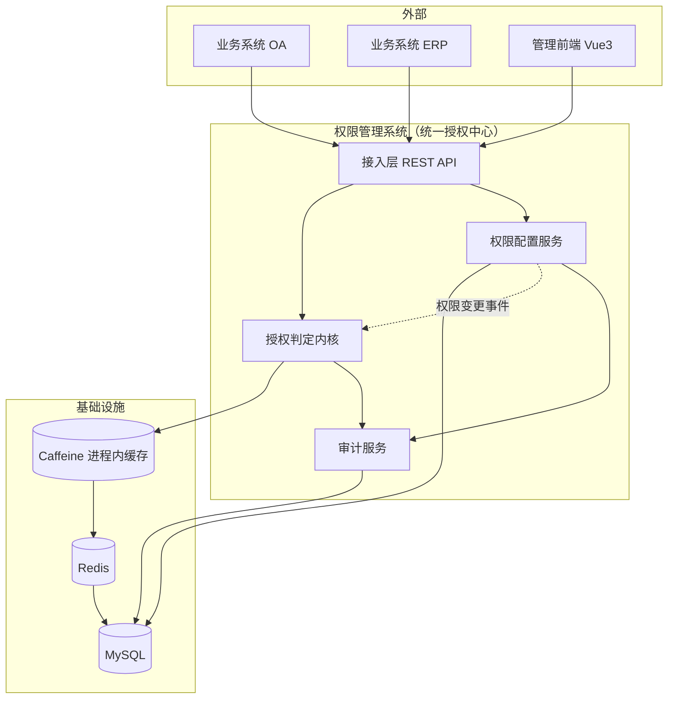
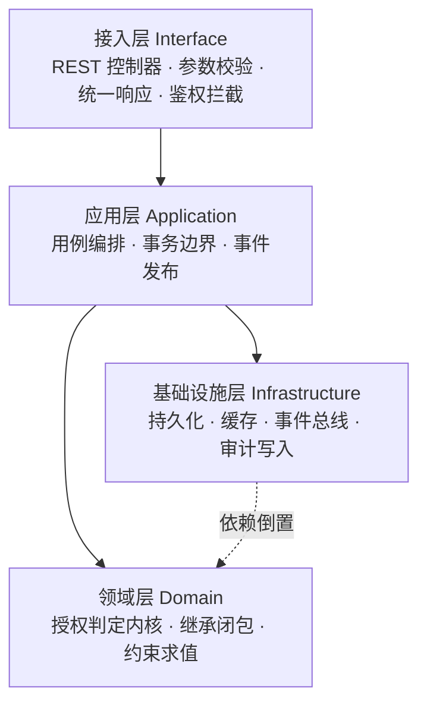
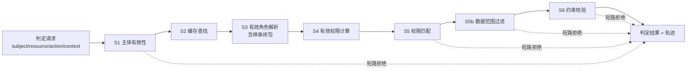
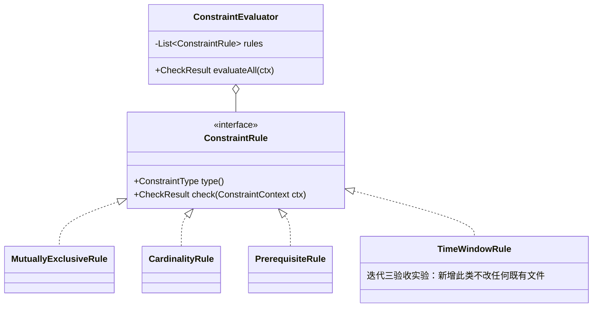
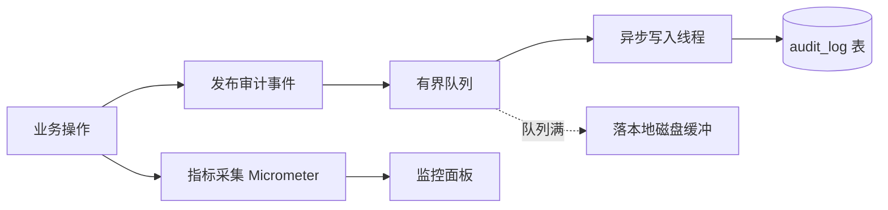
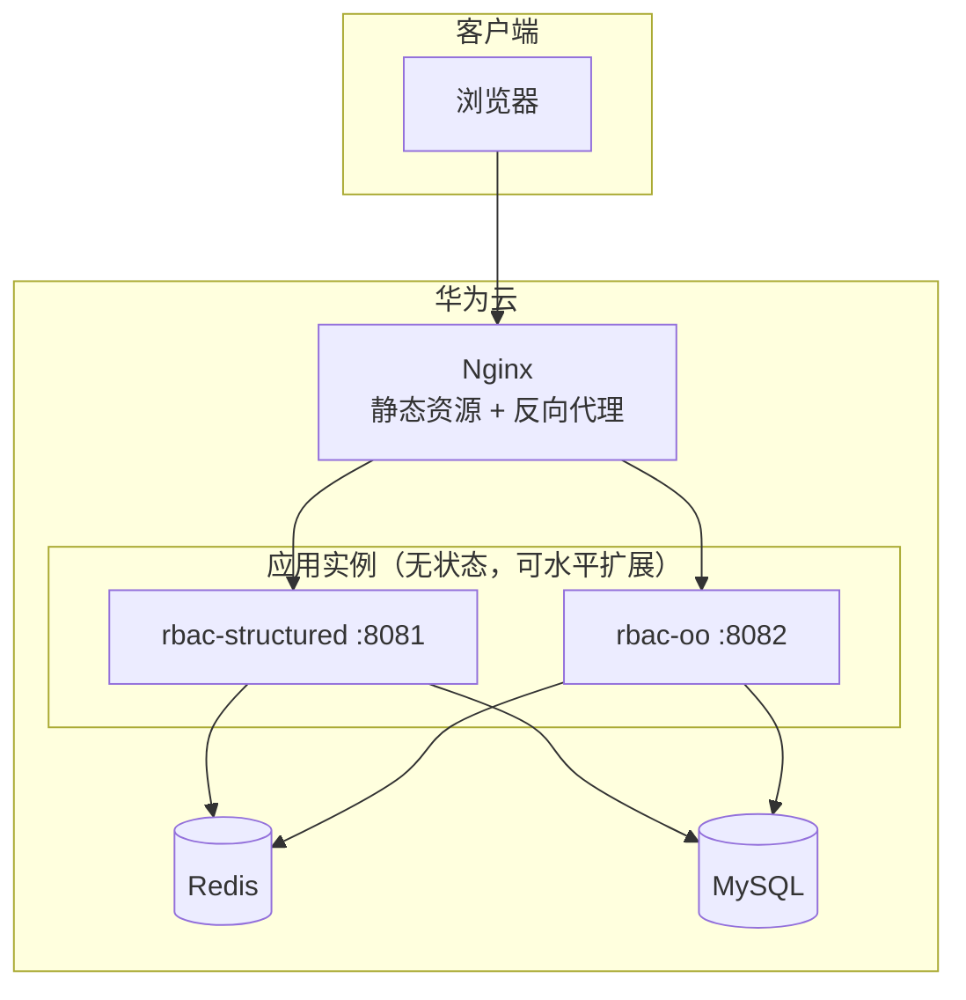

# 概要设计说明书

**版本 0.1 · 2026 年 9 月 20 日**

> 本文档描述系统的总体架构、模块划分与关键机制设计。详细到类与函数级别的设计见 `06/07/08` 三份详细设计文档。

---

## 1. 设计目标与约束回顾

| 来源 | 约束 | 对架构的影响 |
|---|---|---|
| 课程要求 | 同一需求需**分别用结构化与面向对象实现**，部分功能用函数式 | 必须支持多实现并存且可对比 → 多模块 + 统一契约 |
| 课程要求 | 「高负载大并发」 | 授权判定路径必须独立于 CRUD 并可缓存 |
| SRS §7.2 M-1 | 新增约束类型不得修改既有代码 | 约束求值需可插拔 |
| SRS §7.2 M-2 | 判定流程需可扩展 | 判定组织为管道 |
| SRS §2.1 | 读写比可达 10000:1 | 读路径与写路径分离设计 |
| SRS §5.3 | 数据库故障时失败关闭 | 判定不得有「查不到就放行」的分支 |

---

## 2. 架构总览

### 2.1 系统上下文



### 2.2 分层架构



**关键原则**：领域层（尤其是授权判定内核）**不依赖任何框架**。它是纯逻辑，输入是数据、输出是判定结果，不持有 Spring 注解、不直接访问数据库。

这条原则有三个理由：
1. 判定内核必须能被独立单元测试，这是 Jacoco 覆盖率达到 90% 的前提；
2. 三种范式的差异应当体现在**内核的组织方式**上，若内核与框架纠缠，对比就退化成「框架用法对比」而非「范式对比」；
3. 内核无 I/O 依赖，才能被纯函数化（迭代三函数式实现的前提）。

---

## 3. 模块划分

### 3.1 Maven 多模块结构

```
rbac-parent/                    父 POM，统一依赖版本与插件配置（含 Jacoco）
├── rbac-contract/              【共用】对外契约
│   ├── dto/                      请求与响应 DTO
│   ├── enums/                    错误码、约束类型、审计动作
│   ├── api/                      服务接口定义（两种实现共同实现之）
│   └── openapi/rbac-api.yaml     OpenAPI 3 规范（单一事实来源）
├── rbac-structured/            【实现一】结构化（面向功能）
├── rbac-oo/                    【实现二】面向对象
├── rbac-functional/            【实现三】函数式授权内核
├── rbac-test-suite/            【共用】契约一致性测试集，对三种实现统一执行
└── rbac-bench/                 压测脚本与对比基准
```

### 3.2 为什么这样切分

| 备选方案 | 评价 |
|---|---|
| A. 一个模块内用不同包区分范式 | 包之间难以强制隔离，结构化代码很容易「顺手」调用 OO 的类，范式边界形同虚设 |
| B. 三个独立仓库 | 契约无法共享，测试集需复制三份，对比数据不可信 |
| **C. 多模块 + 共用契约（采用）** | 编译期强制隔离（各实现模块互不依赖）；契约与测试集共用一份；同一套前端切 baseURL 即可对比两种后端 |

**选型理由**：方案 C 使「三种范式实现同一需求」从口号变成**可验证的事实**——`rbac-test-suite` 对三个实现跑完全相同的测试，全部通过才证明行为等价；等价之后，性能与可维护性的对比才有意义。这也是 `10-paradigm-comparison.md` 的实验基础。

### 3.3 功能域划分

后端不按 `UserController / RoleController` 这种「数据库表的镜像」切分，而是按**领域能力**切分：

```
Identity 身份域        用户、会话、登录认证
AccessControl 访问控制域  角色、资源、权限、指派与授予
Hierarchy 继承域       角色继承图、传递闭包
Constraint 约束域      互斥、基数、先决条件三类约束
Authorization 授权域   判定内核、缓存、解释
Audit 审计域          审计事件的记录与查询
Observability 可观测域  指标采集与监控面板
Biz 受保护业务桩域    发文稿件、考勤记录（权限验证载体）
```

> 这样切分的理由：如果只按表建 Controller，「授权判定」这一系统最核心的能力就会消失在若干 Service 的角落里，检查时也讲不出「这个系统的核心设计是什么」。按能力切分之后，每个域恰好对应一名组员的纵向职责（见 `00-charter.md` §2）。

---

## 4. 核心机制设计

### 4.1 授权判定管道

判定流程组织为一串**可插拔的阶段**，每个阶段接收上下文、产出决策或放行给下一阶段：



**阶段与迭代的对应**：

| 阶段 | 职责 | 启用迭代 |
|---|---|---|
| S1 主体有效性 | 用户存在、启用、未锁定 | 一 |
| S2 缓存查找 | 两级缓存 | 一（单级）/ 二（两级） |
| S3 有效角色解析 | 直接角色 + 继承闭包 | 一（仅直接）/ 二（含继承） |
| S4 有效权限计算 | 各角色权限并集 | 一 |
| S5 权限匹配 | 权限码是否在集合中 | 一 |
| **S5b 数据范围过滤** | 依据 `data_scope` 与 `context` 判定目标数据是否可访问 | **二** |
| S6 约束校验 | 互斥、基数、先决条件、DSD | 三 |

**管道化的理由**（对应 SRS M-2）：
- 迭代一只需要 S1、S2、S4、S5；迭代二加入 S3 与 **S5b**；迭代三加入 S6。**每个迭代是往管道里插阶段，而不是改已有代码**，这让三次检查之间的演进有清晰的可讲述性。
- **S5b 是权限清单「查看本人」直接导出的阶段**。它需要判定请求携带 `context`（目标数据的部门 / 归属人），因此 `context` 字段从迭代一就出现在 API 中（见 `04-api.md` §2.1），只是迭代一不使用。若等到迭代二才加这个字段，所有已接入的业务系统都要改调用方。
- 「权限解释」只是在管道中开启轨迹记录，不需要第二套判定逻辑——避免了「解释结果与实际判定不一致」这一常见缺陷。
- 未来扩展 ABAC、时间窗口约束，同样只是插入新阶段。

三种范式对管道的实现方式不同，这正是对比的重点：

| 范式 | 管道的表达 |
|---|---|
| 结构化 | 一个 `authorize()` 主函数，顺序调用各阶段函数，用返回码短路；阶段列表是写死的 `if` 序列 |
| 面向对象 | `AuthzStage` 接口 + 责任链模式，阶段可运行期组装 |
| 函数式 | 阶段是 `Context -> Either<Denial, Context>` 的函数，管道 = 函数的 `andThen` 组合（Kleisli 组合） |

### 4.2 两级缓存与失效

```mermaid
flowchart TD
    REQ[判定请求] --> L1{Caffeine<br/>进程内}
    L1 -- 命中 --> HIT[直接判定 O(1)]
    L1 -- 未命中 --> L2{Redis<br/>分布式}
    L2 -- 命中 --> FILL1[回填 L1] --> HIT
    L2 -- 未命中 --> DB[(MySQL)]
    DB --> CALC[计算有效权限]
    CALC --> FILL2[写入 L1 + L2] --> HIT
```

**缓存键与值**

| 键 | 值 | TTL |
|---|---|---|
| `rbac:user:perm:{userId}` | 有效权限码集合（`Set<String>`） | 30 min（兜底） |
| `rbac:role:closure:{roleId}` | 该角色的祖先角色集合 | 30 min |
| `rbac:role:perm:{roleId}` | 该角色的直接权限集合 | 30 min |

**失效策略**

写操作提交后发布 `PermissionChangedEvent`，按变更类型决定失效范围：

| 变更 | 失效范围 |
|---|---|
| 用户角色指派/撤销 | 该用户 |
| 角色权限授予/撤销 | 该角色的闭包缓存 + 持有该角色（含经继承持有）的全部用户 |
| 角色继承关系变更 | 受影响角色的闭包 + 这些角色下全部用户 |
| 角色禁用/删除 | 同上 |
| 用户禁用 | 该用户 + 其全部会话 |

**三条必须遵守的规则**（每一条对应一个真实缺陷）：

1. **事件在事务提交后发布**。若在事务内发布，事务回滚后缓存已被失效，会造成不必要的重建；更糟的是，若失效先于提交，其他线程可能在提交前重建出旧数据。
2. **失效用「删除」而非「更新」**。更新意味着写操作要计算所有受影响用户的新权限集合，一次角色权限变更可能牵连上万用户，会造成写放大；删除后按需重建把成本摊薄到读路径。
3. **继承存在时失效必须向下传播**。撤销父角色的权限，受影响的是所有**子角色**的持有者。漏掉这一步，是 RBAC1 引入后最容易出现的安全漏洞。

### 4.3 角色继承闭包

角色继承关系是**有向无环图**，不是树。需要解决两个问题：

**问题一：环检测**。管理员配置 A→B、B→C 后再配 C→A 会形成环，闭包计算将不终止。

在每次新增继承边时，先做检测：若从待定的父角色出发能够到达子角色，则加入该边会成环，拒绝之。三种范式给出不同实现（详见各详细设计文档），是范式对比的核心样本。

**问题二：闭包计算的时机**。

| 方案 | 说明 | 评价 |
|---|---|---|
| A. 每次判定时实时遍历 | 判定路径上做图遍历 | 违反性能需求，判定不再是 O(1) |
| B. 写时全量物化到闭包表 | 继承变更时重算并落库 | 读极快；但一次变更可能重算大量行 |
| **C. 写时失效 + 读时计算并缓存（采用）** | 继承变更只失效缓存，下次读时重算并缓存 | 读路径命中缓存时 O(1)；写路径开销小；与 §4.2 的失效机制统一 |

**选型理由**：本系统读写比约 10000:1，且角色规模仅 5～数百（闭包计算本身在毫秒级）。方案 C 让写路径保持轻量，把计算成本摊给首次读取，与整体缓存策略一致，不引入第二套一致性机制。

### 4.3.1 组织架构与角色继承：同一个算法，两种策略

系统中有**两处层次结构**：角色继承图与部门树。求「某角色的全部祖先」与求「某部门的全部下级」在数学上是同一个问题——**有向图上的传递闭包**。因此两处**复用同一个闭包算法实现**（`ClosureFunctions` / `ClosureResolver`），只是传入的邻接关系不同。

但两者的**物化策略不同**，这不是不一致，而是依据各自特性做的判断：

| | 角色继承图 | 部门树 |
|---|---|---|
| 结构 | DAG，可多父 | 严格树，单父 |
| 规模 | 5 ～ 500 节点 | 111 节点，**固定三层** |
| 变更频率 | 中（管理员调整角色体系） | 极低（组织调整以年计） |
| 是否可能成环 | **是**，必须检测 | 否（单父 + 层数固定） |
| 物化策略 | **读时计算 + 缓存**（方案 C） | **物化路径 `path` 字段** |
| 理由 | 结构可变、可能多父，物化的维护成本高 | 结构稳定且浅，物化后 `DEPT_AND_SUB` 退化为一次 `LIKE` 查询 |

> 这是一个值得在答辩中展开的点：**同一个算法，因为数据特性不同而选择了不同的物化策略**。如果对两者套用同一个模板，要么部门查询变成不必要的递归，要么角色继承背上沉重的物化维护成本。识别出「算法相同但特性不同」，正是设计工作本身。

### 4.4 约束求值的可扩展设计

对应 SRS §7.2 M-1：**新增一类约束不得修改已有代码**。



| 范式 | 约束求值的表达 |
|---|---|
| 结构化 | 约束类型枚举 + `switch` 分派到各检查函数。**新增类型必须修改 switch** —— 这正是结构化范式的局限，将作为对比结论的证据，而非缺陷 |
| 面向对象 | 策略模式 + 组合模式，`ConstraintEvaluator` 遍历规则集合；新增规则只需新增类并注册 |
| 函数式 | 约束是 `ConstraintContext -> Optional<Violation>` 谓词；求值 = 谓词列表的 `reduce`；新增约束只需新增一个函数 |

> **这是三范式对比最有说服力的样本**：同一条「可扩展性」需求，三种范式付出的代价截然不同，且差异可以用「新增一类约束需要修改几个已有文件」这个客观指标度量。迭代三将以新增「时间窗口约束」实地验证。

### 4.5 审计与可观测



审计**异步写入**，不阻塞主流程（对应 SRS §5.2 的延迟指标）；但队列满时降级为落盘，不能静默丢弃（对应 §5.1「不丢不重」）。

---

## 5. 三种范式的实现约定

为避免写成「披着过程外衣的面向对象」或「加了几个 Lambda 就叫函数式」，各范式必须满足下列**准入标准**。编码前评审，不达标的实现退回重写。

### 5.1 结构化（面向功能）实现准入标准

| # | 要求 |
|---|---|
| 1 | 数据与行为**彻底分离**：数据是贫血的 record / POJO，只有字段与访问器，**不含任何业务方法** |
| 2 | 逻辑全部在无状态的函数中，组织为 `XxxFunctions` 类的静态方法 |
| 3 | **禁止使用继承与多态**（实现契约接口除外），禁止策略模式一类以多态为基础的设计 |
| 4 | 模块划分依据是**功能分解**：自顶向下把「授权判定」拆成子功能，用结构图（Structure Chart）表达 |
| 5 | 分支分派使用 `switch` / `if-else`，不使用虚函数表 |
| 6 | 允许使用 Spring 做依赖注入与事务，但注入的是函数集合而非对象 |

### 5.2 面向对象实现准入标准

| # | 要求 |
|---|---|
| 1 | 领域对象是**充血**的：`Role` 自己知道如何计算有效权限，而不是被 `RoleService` 操作 |
| 2 | 遵循 GRASP：信息专家、创建者、低耦合、高内聚、控制器、多态、纯虚构、间接、防止变异 |
| 3 | 至少显式应用并说明 4 种设计模式（当前规划：策略、责任链、观察者、工厂；详见 `07-detail-oo.md`） |
| 4 | 每个模式的使用必须回答「**不用它会有什么问题**」，不得为用而用 |
| 5 | 依赖倒置：领域层定义仓储接口，基础设施层实现 |

### 5.3 函数式实现准入标准

| # | 要求 |
|---|---|
| 1 | 所有数据结构**不可变**（`record` + 持久化集合） |
| 2 | 核心计算为**纯函数**：无副作用、引用透明、相同输入必得相同输出 |
| 3 | I/O 推到边界：内核只接收已加载好的数据快照，自身不做任何查询 |
| 4 | 用**函数组合**而非控制流表达逻辑：`map` / `filter` / `reduce` / `andThen` |
| 5 | 错误用 `Either` / `Result` 类型表达，不用异常做控制流 |
| 6 | 关键性质可用基于属性的测试验证（如：有效权限计算满足幂等性与单调性） |

有效权限的计算在函数式下可直接写成定义本身：

```java
// EffectivePermissions(u) = ⋃ { Permissions(r) | r ∈ EffectiveRoles(u) }
Set<String> effectivePermissions(UserSnapshot u, RoleGraph g) {
    return u.directRoles().stream()
            .filter(Role::isEnabled)
            .flatMap(r -> g.closureOf(r).stream())   // 继承闭包
            .flatMap(r -> r.permissions().stream())  // 各角色权限
            .collect(toUnmodifiableSet());
}
```

> 这段代码与 SRS §3.2.2 的数学定义逐行对应。**「规格说明即实现」是函数式范式最有力的论据**，也是答辩时最容易讲清楚的一点。

---

## 6. 部署视图



两种实现**同时部署在不同端口**，前端通过配置切换 baseURL。检查时可以现场切换后端实现，用同一套界面、同一套操作演示两种范式的运行结果一致——这是「分别实现」最直观的证据。

---

## 7. 本文档对应的答辩设计点

| 设计点 | 章节 | 需求是什么 | 存在什么问题 | 采用什么方法与理由 |
|---|---|---|---|---|
| **DP-1 三范式并行架构** | §3 | 同一需求要用三种范式实现并可对比 | 若不隔离，范式边界会被侵蚀；若完全独立，对比不可信 | 多模块 + 共用契约 + 共用测试集，使「行为等价」可验证 |
| **DP-2 判定管道与两级缓存** | §4.1 §4.2 | 万级 QPS 判定，且权限变更须立即生效 | 缓存与一致性天然冲突；漏失效即安全漏洞 | 事件驱动的删除式失效 + 继承向下传播 |
| **DP-3 继承闭包与环检测** | §4.3 | 角色可继承多个角色（DAG） | 环导致计算不终止；实时遍历违反性能需求 | 写时检测环 + 写时失效读时重算 |
| **DP-4 约束可扩展设计** | §4.4 | 新增约束类型不得改既有代码 | 结构化的 switch 分派天然违反开闭原则 | 策略/谓词组合，并以新增时间窗口约束作为验收实验 |
