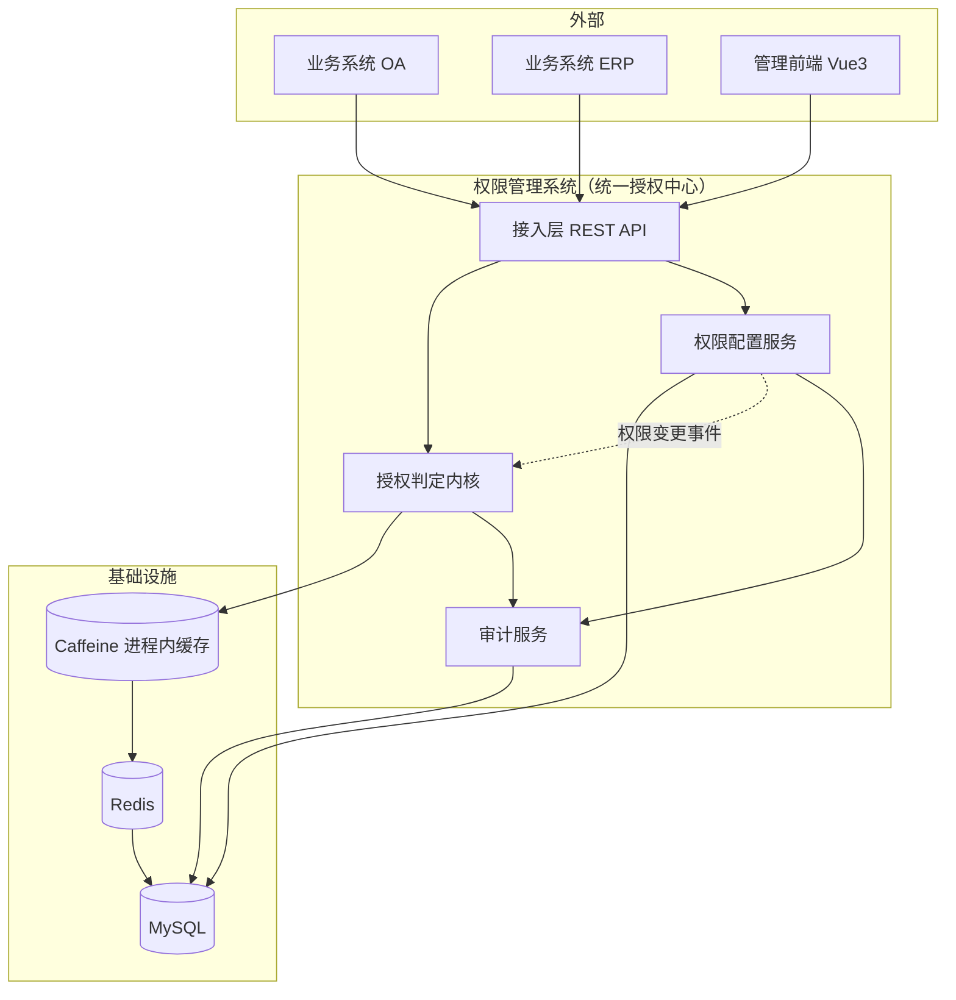
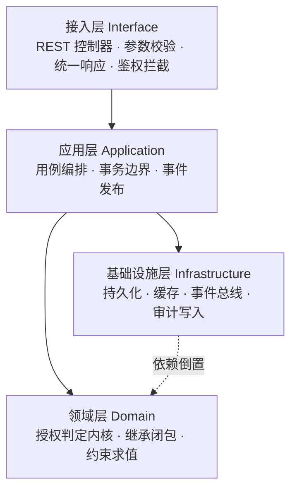
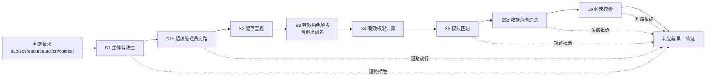
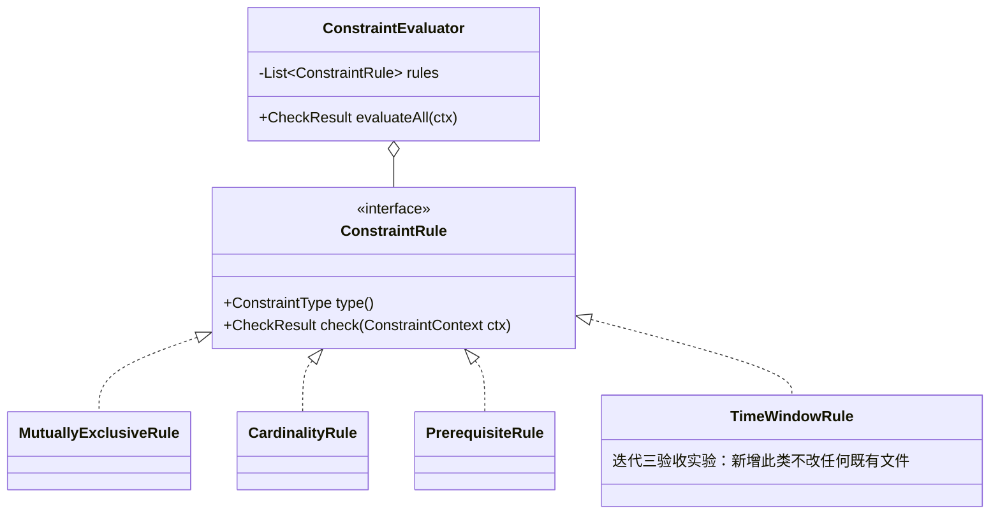
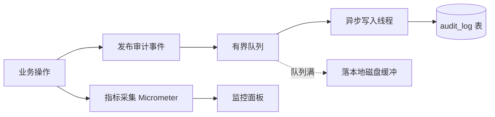
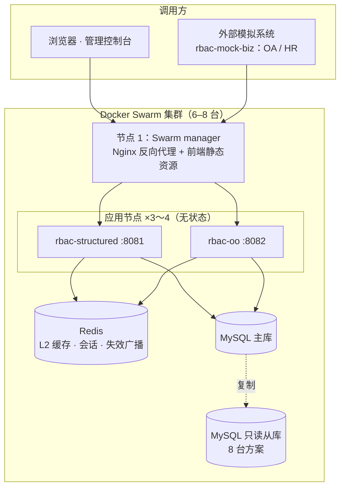

# 概要设计说明书

**版本 0.1 · 2026 年 9 月 20 日**

> 本文档描述系统的总体架构、模块划分与关键机制设计。详细到类与函数级别的设计见 `06/07/08` 三份详细设计文档。

---

## 1. 设计目标与约束回顾

| 来源 | 约束 | 对架构的影响 |
|---|---|---|
| 课程要求 | 同一需求需**分别用结构化与面向对象实现**，部分功能用函数式 | 必须支持多实现并存且可对比 → 多模块 + 统一契约 |
| 课程要求 | 「高负载大并发」 | 授权判定路径必须独立于 CRUD 并可缓存 |
| SRS §7.2 M-1 | 新增约束类型不得修改既有代码 | 约束求值需可插拔 |
| SRS §7.2 M-2 | 判定流程需可扩展 | 判定组织为管道 |
| SRS §2.1 | 读写比可达 10000:1 | 读路径与写路径分离设计 |
| SRS §5.3 | 数据库故障时失败关闭 | 判定不得有「查不到就放行」的分支 |
| 课程进度 | **10 月底交付可自动测试、可部署的后端**；老师国庆后发布测试 | 可测试性与可部署性从第一行代码起就要设计，不能检查前补 |
| 9/29 需求清单 | 鉴权 > 10,000 QPS、P95 < 20 ms、P99 < 50 ms；**6–8 台一般性能服务器** | 指标按集群计；应用无状态、可水平扩展；Docker Swarm 编排（§6） |
| 9/29 教师强调 | **所有后端 API 都要控制权限** | 每个接口在契约中声明所需权限，集中拦截、默认拒绝、CI 检查无遗漏（§4.7） |
| 9/29 需求清单 | 超级管理员越过权限引擎；权限一律人工分配和回收 | 判定管道增加旁路阶段 S1b（§4.1）；系统不含任何自动授权或自动回收的定时任务 |

### 1.1 质量属性与架构战术

性能、可用性、安全、可修改性不是编码完成后再补上的功能，必须在架构层面给出战术。下表把六个质量属性逐一落到本系统**已有的**设计上。

| 质量属性 | 本系统的具体要求 | 采用的战术 | 落在哪里 |
|---|---|---|---|
| **性能** | 集群 ≥ 10,000 QPS、P95 < 20 ms、P99 < 50 ms（9/29 需求清单，SRS §5.2）；按真实负载推算的峰值约 400 QPS | 两级缓存；读写路径分离；角色与权限全量常驻内存；批量判定接口；应用无状态、多节点水平扩展；鉴权日志批量异步写 | §4.2、§6、SRS §5.0 |
| **可用性** | ≥ 99.9%；单个组件故障不导致越权 | 应用无状态、多实例；Redis 故障时绕过缓存直读数据库；数据库故障时失败关闭；健康检查 `/actuator/health` | §4.2.1、§6 |
| **安全性** | 最小权限；撤销立即生效；操作可追溯 | 每次请求都授权（§4.6）；数据范围；授权上界；失败关闭；审计哈希链；手机号加密脱敏 | §4.1、§4.5、SRS §7.1 |
| **可修改性** | 新增约束类型不改既有代码（M-1）；判定流程可扩展（M-2） | 判定管道；约束策略可插拔；契约模块作为稳定接口；岗位→角色映射用配置表 | §4.1、§4.4 |
| **可测试性** | 每次提交自动跑完全部测试；能接入老师发布的测试 | 判定内核无 I/O（输入数据、输出结论）；仓储接口依赖注入；契约测试对三种实现执行同一套用例；Testcontainers；老师测试走适配层 | §3、`09-test-plan.md` |
| **可部署性** | 10 月底交付可部署的后端；一条命令拉起完整环境 | 应用无状态；Flyway 启动时自动建表；`docker compose up` 一键启动；配置外置到环境变量 | §6 |

**优先级**

质量属性之间会冲突，架构设计要先定优先级。本系统的排序是：

**安全性 > 可测试性 > 性能 > 可修改性 > 可部署性 > 可用性**

- **安全性第一**：这是权限系统。放行错误的代价（越权访问）不可逆，拒绝错误的代价（业务暂停）可恢复。
- **可测试性第二**：老师国庆后发布测试，检查以测试结果为准；Jacoco 报告是每次检查的必交物。测不了的设计等于没做。
- **性能第三**：10,000 QPS 是需求清单的硬指标，正常运行时必须达到；但它是**正常态**指标——组件故障时让位于安全（T-3），降级期间暂停适用。
- **可修改性第四**：三个迭代逐级加需求，会议上需求还在增补，元模型必须稳定。
- **可部署性第五**：应用无状态 + Flyway + compose，成本很低，基本不与其他属性冲突。
- **可用性最后**：课程环境单机部署，99.9% 无法真实验证；与安全冲突时一律让位（见下）。

**已识别的冲突与取舍**

| # | 冲突 | 场景 | 取舍 | 理由 |
|---|---|---|---|---|
| T-1 | 安全 ↔ 可用 | 数据库不可用 | **失败关闭**：拒绝一切判定 | 放行错误不可逆，拒绝错误可恢复 |
| T-2 | 性能 ↔ 一致性（安全） | 撤销权限后，缓存里还是旧权限 | 事件驱动失效 + 版本号兜底，把不一致窗口压到 ≤ 1 秒；**不**靠 30 分钟 TTL 自然过期 | 撤销后仍能访问是安全漏洞，不是性能问题 |
| T-3 | 性能 ↔ 一致性（安全） | Redis 不可用，实例间收不到失效消息 | **绕过进程内缓存**，直读数据库；降级期间 10,000 QPS 指标暂停适用 | 继续用本地缓存会让已撤销的权限在其他实例上存活到 TTL 结束。数据库直读撑不住万级 QPS，但按真实负载推算峰值约 400 QPS，业务仍能运转；错误放行不可逆，变慢可恢复 |
| T-4 | 性能 ↔ 可修改性 | 判定管道每个阶段是一次间接调用 | 接受管道开销 | 阶段调用是纳秒级，网络往返是毫秒级，管道开销在总延迟中可忽略 |
| T-5 | 性能 ↔ 可测试性 | 内核不直接查缓存和数据库，由外层装载数据后传入 | 接受多一层数据组装 | 内核可以不起容器、不用 Mock 直接测，这是 90% 内核覆盖率门槛的前提 |
| T-6 | 性能 ↔ 可追溯（安全） | 需求要求记录每一次 `AUTH_SUCCESS`，10,000 QPS 下每天最多约 8.6 亿行 | 鉴权日志与管理审计**分表**：鉴权日志批量异步插入、按天分区、不进哈希链；积压时成功记录降级为按分钟聚合计数，**拒绝记录不丢** | 每条都同步写库会把判定延迟拖到数据库写入的水平。成功记录的价值在统计与热力图，聚合后不损失；拒绝记录是安全事件，必须逐条保留 |
| T-7 | 可追溯（安全） ↔ 需求 | 需求要求超级管理员越过权限引擎 | 旁路放在主体有效性之后的单独阶段 S1b，每次放行都审计 | 需求必须满足；把旁路限制在一个阶段里，停用超管仍然有效，审计仍能回答「凭什么放行」（SRS §3.2.3） |

---

## 2. 架构总览

### 2.1 系统上下文


```mermaid
flowchart TB
    subgraph EXT["外部"]
        BIZ1[业务系统 OA]
        BIZ2[业务系统 ERP]
        WEB[管理前端 Vue3]
    end
    subgraph SYS["权限管理系统（统一授权中心）"]
        API[接入层 REST API]
        AUTHZ[授权判定内核]
        ADMIN[权限配置服务]
        AUDIT[审计服务]
    end
    subgraph INFRA["基础设施"]
        MySQL[(MySQL)]
        Redis[(Redis)]
        Local[(Caffeine 进程内缓存)]
    end

    WEB --> API
    BIZ1 --> API
    BIZ2 --> API
    API --> AUTHZ
    API --> ADMIN
    AUTHZ --> Local --> Redis --> MySQL
    ADMIN --> MySQL
    ADMIN -. 权限变更事件 .-> AUTHZ
    ADMIN --> AUDIT
    AUTHZ --> AUDIT
    AUDIT --> MySQL
```

### 2.2 分层架构


```mermaid
flowchart TD
    L1["接入层 Interface<br/>REST 控制器 · 参数校验 · 统一响应 · 鉴权拦截"]
    L2["应用层 Application<br/>用例编排 · 事务边界 · 事件发布"]
    L3["领域层 Domain<br/>授权判定内核 · 继承闭包 · 约束求值"]
    L4["基础设施层 Infrastructure<br/>持久化 · 缓存 · 事件总线 · 审计写入"]
    L1 --> L2 --> L3
    L2 --> L4
    L4 -. 依赖倒置 .-> L3
```

**关键原则**：领域层（尤其是授权判定内核）**不依赖任何框架**。它是纯逻辑，输入是数据、输出是判定结果，不持有 Spring 注解、不直接访问数据库。

这条原则有三个理由：
1. 判定内核必须能被独立单元测试，这是 Jacoco 覆盖率达到 90% 的前提；
2. 三种范式的差异应当体现在**内核的组织方式**上，若内核与框架纠缠，对比就退化成「框架用法对比」而非「范式对比」；
3. 内核无 I/O 依赖，才能被纯函数化（迭代三函数式实现的前提）。

### 2.3 技术架构：三层 × 功能模块

9/29 课上老师板书了技术架构：纵向是 **Controller / Service / Mapper** 三层，横向是若干功能模块，部署在 **Docker Swarm** 上。这里区分两个概念：

- **架构**（§2.1、§2.2）：系统由哪些部分组成、依赖朝哪个方向。与具体技术无关。
- **技术架构**（本节）：每一层用什么技术实现。

**纵向：三层与技术选型**

| 板书的层 | 职责 | 对应 §2.2 的层 | 技术 |
|---|---|---|---|
| Controller | 输入、输出：参数绑定与校验、统一响应、鉴权拦截 | 接入层 | Spring MVC（`@RestController`、`HandlerInterceptor`） |
| Service | 业务逻辑、事务边界 | 应用层 + 领域层 | Spring Bean（`@Service`、`@Transactional`）；授权判定内核是**不依赖 Spring 的纯 Java** |
| Mapper | 数据持久 | 基础设施层 | 结构化实现用 **MyBatis**；面向对象实现用 **Spring Data JPA**；都连 MySQL 8 |
| — | 缓存与消息 | 基础设施层 | Caffeine、Redis、Redis Pub/Sub |
| — | 部署 | — | Docker 镜像 + Docker Swarm（§6） |

**与板书的差别只有一处**：我们把授权判定内核从 Service 层剥出来，单独作为领域层。理由见 §2.2：内核要被三种范式分别实现并对比，还要能不启动 Spring 直接单测。

**持久化技术随范式选择**：结构化实现用 MyBatis——SQL 显式写在 Mapper 里，一个函数对应一条查询，数据以记录的形式在函数之间传递，契合面向功能的分解。面向对象实现用 Spring Data JPA——以实体和聚合为中心，仓储接口隔离领域层与持久化（`07-detail-oo.md`）。两者共用同一套 Flyway 脚本，表结构只有一份。持久化方式的差异本身也是 `10-paradigm-comparison.md` 的一个对比维度。

**横向：功能模块（板书的竖列）**

组内记下的板书竖列是「用户、用户权限、用户部门、用户管理员」，对应本系统的功能域（§3.3）：

| 板书竖列 | 功能域 | 主要接口 |
|---|---|---|
| 用户 | Identity 身份域 | `/users`、`/auth` |
| 用户权限 | AccessControl、Hierarchy、Constraint、Authorization | `/roles`、`/permissions`、`/hierarchy`、`/constraints`、`/authz` |
| 用户部门 | Org 组织域 | `/departments`、`/org/import`、`/sync/users` |
| 用户管理员 | 分级管理——**不是独立模块**，是数据范围作用于管理接口（§4.1） | 全部管理接口的 `x-required-permission`（§4.7） |

每个竖列都贯穿三层。**模块之间只允许 Service 调 Service，禁止跨模块直接调用别的模块的 Mapper**：跨模块读别人的表，等于两个模块共享同一份数据结构（公共耦合），一方改表另一方跟着坏；经由对方 Service 接口，就降为只传所需参数的数据耦合。这条规则是 11 月检查「耦合与内聚的理由」的直接素材（`06-detail-structured.md` §5）。

**事件驱动**

板书的第二幅图（取消订单 → 事件总线 → 退款 / 返还库存 / 会员积分 / 优惠券）讲的是同一种解耦：发布者不知道有哪些订阅者，新增订阅者不改发布者。本系统的「权限变更」就是这样一个事件：

```
权限配置服务 ──发布 PermissionChangedEvent──▶ 事件总线
                                              ├─▶ 缓存失效（§4.2）
                                              ├─▶ 审计记录（§4.5）
                                              ├─▶ 「待复核」标记（SRS S-12）
                                              └─▶ 指标与热力图聚合（OBSV-001/002）
```

以后新增一个订阅者（例如权限变更通知），不需要修改权限配置服务的任何代码。

---

## 3. 模块划分

### 3.1 Maven 多模块结构

```
rbac-parent/                    父 POM，统一依赖版本与插件配置（含 Jacoco）
├── rbac-contract/              【共用】对外契约
│   ├── dto/                      请求与响应 DTO
│   ├── enums/                    错误码、约束类型、审计动作
│   ├── api/                      服务接口定义（两种实现共同实现之）
│   └── openapi/rbac-api.yaml     OpenAPI 3 规范（单一事实来源）
├── rbac-structured/            【实现一】结构化（面向功能）
├── rbac-oo/                    【实现二】面向对象
├── rbac-functional/            【实现三】函数式授权内核
├── rbac-test-suite/            【共用】契约一致性测试集，对三种实现统一执行
├── rbac-acceptance/            【共用】老师发布的验收测试，原样保存，CI 中单独一个阶段
├── rbac-acceptance-adapter/    验收测试与我方契约的格式适配；内核与契约不因测试而改动
├── rbac-mock-biz/              两个外部模拟系统（OA 公文、HR 考勤），独立进程，经 HTTP 调用 /authz/check
└── rbac-bench/                 压测脚本与对比基准
```

### 3.2 为什么这样切分

| 备选方案 | 评价 |
|---|---|
| A. 一个模块内用不同包区分范式 | 包之间难以强制隔离，结构化代码很容易「顺手」调用 OO 的类，范式边界形同虚设 |
| B. 三个独立仓库 | 契约无法共享，测试集需复制三份，对比数据不可信 |
| **C. 多模块 + 共用契约（采用）** | 编译期强制隔离（各实现模块互不依赖）；契约与测试集共用一份；同一套前端切 baseURL 即可对比两种后端 |

**选型理由**：方案 C 使「三种范式实现同一需求」从口号变成**可验证的事实**——`rbac-test-suite` 对三个实现跑完全相同的测试，全部通过才证明行为等价；等价之后，性能与可维护性的对比才有意义。这也是 `10-paradigm-comparison.md` 的实验基础。

### 3.3 功能域划分

后端不按 `UserController / RoleController` 这种「数据库表的镜像」切分，而是按**领域能力**切分：

```
Identity 身份域        用户、会话、登录认证
AccessControl 访问控制域  角色、资源、权限、指派与授予
Hierarchy 继承域       角色继承图、传递闭包
Constraint 约束域      互斥、基数、先决条件三类约束
Authorization 授权域   判定内核、缓存、解释
Audit 审计域          审计事件的记录与查询
Observability 可观测域  指标采集与监控面板
Biz 受保护业务桩域    发文稿件、考勤记录（权限验证载体；独立部署为 rbac-mock-biz）
```

> 这样切分的理由：如果只按表建 Controller，「授权判定」这一系统最核心的能力就会消失在若干 Service 的角落里，检查时也讲不出「这个系统的核心设计是什么」。按能力切分之后，每个域恰好对应一个可独立陈述的设计点（见 `00-charter.md` §2）。

---

## 4. 核心机制设计

### 4.1 授权判定管道

判定流程组织为一串**可插拔的阶段**，每个阶段接收上下文、产出决策或放行给下一阶段：


```mermaid
flowchart LR
    IN[判定请求<br/>subject/resource/action/context] --> S1[S1 主体有效性]
    S1 --> S1b[S1b 超级管理员旁路]
    S1b --> S2[S2 缓存查找]
    S2 --> S3[S3 有效角色解析<br/>含继承闭包]
    S3 --> S4[S4 有效权限计算]
    S4 --> S5[S5 权限匹配]
    S5 --> S5b[S5b 数据范围过滤]
    S5b --> S6[S6 约束校验]
    S6 --> OUT[判定结果 + 轨迹]
    S1 -.短路拒绝.-> OUT
    S1b -.短路放行.-> OUT
    S5 -.短路拒绝.-> OUT
    S5b -.短路拒绝.-> OUT
    S6 -.短路拒绝.-> OUT
```

**阶段与迭代的对应**：

| 阶段 | 职责 | 启用迭代 |
|---|---|---|
| S1 主体有效性 | 用户存在、状态为启用、未锁定、未过期 | 一 |
| **S1b 超级管理员旁路** | 持有 `SUPER_ADMIN` 则直接放行，`reason = SUPER_ADMIN_BYPASS`，记审计 | **一** |
| S2 缓存查找 | 两级缓存 | 一（单级）/ 二（两级） |
| S3 有效角色解析 | 直接角色 + 继承闭包；迭代三起过滤不在有效期或可用时段内的指派（时间约束） | 一（仅直接）/ 二（含继承）/ 三（时间约束） |
| S4 有效权限计算 | 各角色权限并集 | 一 |
| S5 权限匹配 | 权限码是否在集合中 | 一 |
| **S5b 数据范围过滤** | 依据 `data_scope` 与 `context` 判定目标数据是否可访问 | **二** |
| S6 约束校验 | 会话级约束 DSD（SSD、基数、先决条件在**写路径**上校验，不进判定管道） | 三 |

**管道化的理由**（对应 SRS M-2）：
- 迭代一只需要 S1、S1b、S2、S4、S5；迭代二加入 S3 与 **S5b**；迭代三加入 S6 与 S3 的时间过滤。**每个迭代是往管道里插阶段，而不是改已有代码**，这让三次检查之间的演进有清晰的可讲述性。
- **S5b 是权限清单「查看本人」直接导出的阶段**。它需要判定请求携带 `context`（目标数据的部门 / 归属人），因此 `context` 字段从迭代一就出现在 API 中（见 `04-api.md` §2.1），只是迭代一不使用。若等到迭代二才加这个字段，所有已接入的业务系统都要改调用方。
- 「权限解释」只是在管道中开启轨迹记录，不需要第二套判定逻辑——避免了「解释结果与实际判定不一致」这一常见缺陷。
- 未来扩展 ABAC，同样只是插入新阶段。
- **S1b 为什么放在 S1 之后、S2 之前**：放在 S1 之前，停用的超管账号照样放行，停用操作就失去意义；放在 S2 之后，超管的每次请求都要白白装载一次有效权限。需求要求「越过权限引擎」，越过的是 S2 起的全部阶段，账号状态不在其列。

**分级管理不需要第二套机制**

公司要求分公司、部门两级管理员。一个容易走错的设计是为此新增「管理范围」字段与一条独立的校验链路。本系统不这样做：**管理台自身的功能（用户管理、角色管理、权限配置）也是权限清单中的功能点**（`sys:account:*`、`sys:org:*`），因此 S5b 数据范围阶段对它们天然适用。

管理台的每次写操作，都带 `context.targetDeptId = 目标用户所属部门` 调用同一个判定入口。分公司管理员 = 持有 `sys:*` 权限且 `data_scope = DEPT_AND_SUB` 的用户。**一套机制、一条路径**，不存在两份需要保持同步的实现。

唯一新增的是一条**写路径**规则——授权上界：管理员只能授予自己拥有、且范围不超过自己的权限。它**不进判定管道**：它约束的是「能不能配」而非「能不能用」，而配置操作的调用量只有鉴权的万分之一，放进管道只会让每次鉴权多一次无谓计算。

三种范式对管道的实现方式不同，这正是对比的重点：

| 范式 | 管道的表达 |
|---|---|
| 结构化 | 一个 `authorize()` 主函数，顺序调用各阶段函数，用返回码短路；阶段列表是写死的 `if` 序列 |
| 面向对象 | `AuthzStage` 接口 + 责任链模式，阶段可运行期组装 |
| 函数式 | 阶段是 `Context -> Either<Denial, Context>` 的函数，管道 = 函数的 `andThen` 组合（Kleisli 组合） |

### 4.2 两级缓存与失效

```mermaid
flowchart TD
    REQ[判定请求] --> L1{Caffeine<br/>进程内}
    L1 -- 命中 --> HIT[直接判定 O(1)]
    L1 -- 未命中 --> L2{Redis<br/>分布式}
    L2 -- 命中 --> FILL1[回填 L1] --> HIT
    L2 -- 未命中 --> DB[(MySQL)]
    DB --> CALC[计算有效权限]
    CALC --> FILL2[写入 L1 + L2] --> HIT
```

**缓存键与值**

| 键 | 值 | TTL |
|---|---|---|
| `rbac:user:perm:{userId}` | 有效权限：权限码 → {(数据范围, 授权部门)}。迭代一只用键集合 | 30 min（兜底） |
| `rbac:role:closure:{roleId}` | 该角色的祖先角色集合 | 30 min |
| `rbac:role:perm:{roleId}` | 该角色的直接权限集合 | 30 min |

**失效策略**

写操作提交后发布 `PermissionChangedEvent`，按变更类型决定失效范围：

| 变更 | 失效范围 |
|---|---|
| 用户角色指派/撤销 | 该用户 |
| 角色权限授予/撤销 | 该角色的闭包缓存 + 持有该角色（含经继承持有）的全部用户 |
| 角色继承关系变更 | 受影响角色的闭包 + 这些角色下全部用户 |
| 角色禁用/删除 | 同上 |
| 用户停用 / 删除 | 该用户 + 其全部会话 |
| 批量授权（按分公司/部门） | 逐个失效目标用户；目标超过 1,000 人时改为 INCR 全局版本号，各实例整体清空 L1（逐键删除上万个键比整体清空更慢） |

**三条必须遵守的规则**（每一条对应一个真实缺陷）：

1. **事件在事务提交后发布**。若在事务内发布，事务回滚后缓存已被失效，会造成不必要的重建；更糟的是，若失效先于提交，其他线程可能在提交前重建出旧数据。
2. **失效用「删除」而非「更新」**。更新意味着写操作要计算所有受影响用户的新权限集合，一次角色权限变更可能牵连上万用户，会造成写放大；删除后按需重建把成本摊薄到读路径。
3. **继承存在时失效必须向下传播**。撤销父角色的权限，受影响的是所有**子角色**的持有者。漏掉这一步，是 RBAC1 引入后最容易出现的安全漏洞。

#### 4.2.1 多实例下的失效广播与降级

§6 部署两个以上的应用实例，每个实例有自己的 Caffeine。一个实例上发生的权限变更，必须让**所有实例**的进程内缓存失效，否则用户换一个实例访问就会拿到旧权限。

**失效通道：Redis Pub/Sub**

```
写操作事务提交
  → 删除 Redis 中受影响的键（L2）
  → 向频道 rbac:invalidate 发布失效消息（受影响的 userId / roleId 列表）
  → INCR rbac:perm:version（全局权限版本号）
每个实例订阅 rbac:invalidate → 删除本地 Caffeine 中对应条目（L1）
```

**Pub/Sub 会丢消息**：它不持久化，实例在断线重连期间发布的消息就收不到了。补救办法是版本号：

- 每个实例记住自己已处理到的版本号 `localVersion`，收到失效消息时更新。
- 后台线程**每 500 ms** 读一次 `rbac:perm:version`。若全局版本号大于 `localVersion`，说明有消息漏收，**清空整个 L1**。
- 这把最坏情况下的不一致窗口限制在 500 ms 内，满足 A-12 的 ≤ 1 秒。一次清空的代价是 L1 冷启动，由 L2 快速回填。

**降级规则**

| 故障 | 行为 | 理由 |
|---|---|---|
| Redis 不可用 | **绕过 L1，每次判定直读数据库** | 此时收不到失效消息、也读不到版本号，L1 里的数据无法判断是否过期。继续使用 L1 = 已撤销的权限在其他实例上存活到 TTL 结束。真实峰值 400 QPS，数据库可以承受；性能下降，但正确性不变 |
| 数据库不可用 | 失败关闭，判定一律拒绝 | T-1 |
| 两者都可用但失效消息投递失败 | 版本号轮询兜底，≤ 500 ms 内清空 L1 | 见上 |

> 这一条是设计复查时发现并改正的：最初写的是「Redis 不可用时降级为仅使用进程内缓存，功能不中断」，在单实例下成立，在多实例下会破坏一致性。改正记录见 `12-design-log.md` #4。

### 4.3 角色继承闭包

角色继承关系是**有向无环图**，不是树。需要解决两个问题：

**问题一：环检测**。管理员配置 A→B、B→C 后再配 C→A 会形成环，闭包计算将不终止。

在每次新增继承边时，先做检测：若从待定的父角色出发能够到达子角色，则加入该边会成环，拒绝之。三种范式给出不同实现（详见各详细设计文档），是范式对比的核心样本。

**问题二：闭包计算的时机**。

| 方案 | 说明 | 评价 |
|---|---|---|
| A. 每次判定时实时遍历 | 判定路径上做图遍历 | 违反性能需求，判定不再是 O(1) |
| B. 写时全量物化到闭包表 | 继承变更时重算并落库 | 读极快；但一次变更可能重算大量行 |
| **C. 写时失效 + 读时计算并缓存（采用）** | 继承变更只失效缓存，下次读时重算并缓存 | 读路径命中缓存时 O(1)；写路径开销小；与 §4.2 的失效机制统一 |

**选型理由**：本系统读写比约 10000:1，且角色规模仅 5～数百（闭包计算本身在毫秒级）。方案 C 让写路径保持轻量，把计算成本摊给首次读取，与整体缓存策略一致，不引入第二套一致性机制。

### 4.3.1 组织架构与角色继承：同一个算法，两种策略

系统中有**两处层次结构**：角色继承图与部门树。求「某角色的全部祖先」与求「某部门的全部下级」在数学上是同一个问题——**有向图上的传递闭包**。因此两处**复用同一个闭包算法实现**（`ClosureFunctions` / `ClosureResolver`），只是传入的邻接关系不同。

但两者的**物化策略不同**，这不是不一致，而是依据各自特性做的判断：

| | 角色继承图 | 部门树 |
|---|---|---|
| 结构 | DAG，可多父 | 严格树，单父 |
| 规模 | 5 ～ 500 节点 | 111 节点，**固定三层** |
| 变更频率 | 中（管理员调整角色体系） | 极低（组织调整以年计） |
| 是否可能成环 | **是**，必须检测 | 否（单父 + 层数固定） |
| 物化策略 | **读时计算 + 缓存**（方案 C） | **物化路径 `path` 字段** |
| 理由 | 结构可变、可能多父，物化的维护成本高 | 结构稳定且浅，物化后 `DEPT_AND_SUB` 退化为一次 `LIKE` 查询 |

> 这是一个值得在答辩中展开的点：**同一个算法，因为数据特性不同而选择了不同的物化策略**。如果对两者套用同一个模板，要么部门查询变成不必要的递归，要么角色继承背上沉重的物化维护成本。识别出「算法相同但特性不同」，正是设计工作本身。

### 4.4 约束求值的可扩展设计

对应 SRS §7.2 M-1：**新增一类约束不得修改已有代码**。


```mermaid
classDiagram
    class ConstraintRule {
        <<interface>>
        +ConstraintType type()
        +CheckResult check(ConstraintContext ctx)
    }
    class MutuallyExclusiveRule
    class CardinalityRule
    class PrerequisiteRule
    class TimeWindowRule {
        迭代三验收实验：新增此类不改任何既有文件
    }
    class ConstraintEvaluator {
        -List~ConstraintRule~ rules
        +CheckResult evaluateAll(ctx)
    }
    ConstraintRule <|.. MutuallyExclusiveRule
    ConstraintRule <|.. CardinalityRule
    ConstraintRule <|.. PrerequisiteRule
    ConstraintRule <|.. TimeWindowRule
    ConstraintEvaluator o-- ConstraintRule
```

| 范式 | 约束求值的表达 |
|---|---|
| 结构化 | 约束类型枚举 + `switch` 分派到各检查函数。**新增类型必须修改 switch** —— 这正是结构化范式的局限，将作为对比结论的证据，而非缺陷 |
| 面向对象 | 策略模式 + 组合模式，`ConstraintEvaluator` 遍历规则集合；新增规则只需新增类并注册 |
| 函数式 | 约束是 `ConstraintContext -> Optional<Violation>` 谓词；求值 = 谓词列表的 `reduce`；新增约束只需新增一个函数 |

> **这是三范式对比最有说服力的样本**：同一条「可扩展性」需求，三种范式付出的代价截然不同，且差异可以用「新增一类约束需要修改几个已有文件」这个客观指标度量。迭代三将以新增「时间窗口约束」实地验证。

### 4.5 审计与可观测


```mermaid
flowchart LR
    OP[业务操作] --> EV[发布审计事件]
    EV --> Q[有界队列]
    Q --> W[异步写入线程]
    W --> DB[(audit_log 表)]
    Q -. 队列满 .-> FALLBACK[落本地磁盘缓冲]
    OP --> MT[指标采集 Micrometer]
    MT --> DASH[监控面板]
```

审计**异步写入**，不阻塞主流程（对应 SRS §5.2 的延迟指标）；但队列满时降级为落盘，不能静默丢弃（对应 §5.1「不丢不重」）。

**两类日志分开存放**（取舍见 §1.1 T-6）：

| | 管理审计 `sys_audit_log` | 鉴权日志 `sys_authz_log` |
|---|---|---|
| 内容 | 登录登出、角色与权限变更、约束变更、停用删除等 | 每一次判定的 `AUTH_SUCCESS` / `AUTH_FAILED` |
| 量级 | 每天数百到数千条 | 10,000 QPS 下每天最多约 8.6 亿行 |
| 写入 | 单条异步，队列满落盘 | 每 1,000 条或每 200 ms 批量插入一次 |
| 防篡改 | 哈希链（S-11） | 不做：哈希链要求串行计算，与批量并行写入冲突 |
| 积压时 | 落盘，不丢 | 拒绝记录落盘不丢；成功记录降级为按「用户 × 权限 × 分钟」聚合计数 |
| 保留 | 长期 | 按天分区，保留 30 天；热力图用聚合结果 |

两类日志都只追加，不回滚、不版本化（SRS §5.1）。

### 4.6 认证一次、授权每次：鉴权发生在哪里

组内提出过一个问题：**能不能只在登录时鉴权一次，之后只在权限变更时由权限中心向业务系统推送？** 这里的关键是区分两件事：

| | 认证（Authentication） | 授权（Authorization） |
|---|---|---|
| 回答的问题 | 你是谁 | 你能不能做这件事 |
| 发生时机 | **登录时一次**，颁发令牌（JWT，2 小时） | **每次受保护操作**都要回答 |
| 为什么 | 身份在会话内不变 | 权限随时可能被撤销、账号随时可能被停用，数据范围随目标对象而变 |

「登录时鉴权一次」对认证成立，对授权不成立。授权必须每次判定，有两个原因：

1. **撤销要立即生效**（A-12，≤ 1 秒）。登录时一次性下发的权限，在令牌过期前无法收回。
2. **数据范围依赖目标对象**。「能否查看许禄的考勤」取决于许禄在哪个部门，登录时无从预知用户会访问谁的数据。

**三种方案**

| | A. 登录时下发权限快照 | B. 每次请求调用权限中心（**采用**） | C. 业务系统本地缓存 + 中心推送变更 |
|---|---|---|---|
| 做法 | 有效权限写进 JWT，业务系统自己校验 | 业务系统每次调 `/authz/check`，权限中心查自己的缓存后判定 | 业务系统缓存该用户权限，权限变更时中心推送失效消息 |
| 撤销生效 | 令牌过期才生效（最长 2 小时） | ≤ 1 秒 | 取决于推送是否送达 |
| 数据范围 | 做不到（不知道目标对象） | 能做 | 业务系统要复制一份组织架构才能做 |
| 令牌大小 | 部门经理有数百条权限，令牌膨胀到数十 KB | 小 | 小 |
| 网络开销 | 无 | 每次一个内网往返（约 1 ms）；页面加载用批量判定接口合并 | 无 |
| 新增复杂度 | 低 | 低 | 高：18 个业务系统各需一个订阅端；推送丢失要补偿；需要版本号对账 |

**缓存在哪里**：两级缓存（Caffeine + Redis）**全部在权限中心内部**。业务系统不缓存权限，每次都调用中心；中心收到请求后命中自己的缓存，不查数据库。所以「每次调用中心」和「有缓存」并不矛盾——缓存省掉的是中心到数据库的开销，不是业务系统到中心的开销。

**为什么选 B**：撤销立即生效和数据范围两条硬需求，A 都做不到；C 能做到，但把一致性问题分散到 18 个业务系统，且老师明确不要求推送（A-12）。B 的代价是一次内网往返（约 1 ms），在 P95 20 ms 的预算中占比很小；页面加载时多个按钮的判定用批量接口合并成一次往返。

**C 保留为演进方向**：判定内核无 I/O 依赖（§5），将来可以直接打包成 SDK 嵌入业务系统，配合 §4.2.1 的版本号机制即可实现 C，而不改动判定逻辑本身。

> 管理前端登录时一次性拉取权限列表（`05-ui.md`），属于方案 A 的做法——但只用于菜单和按钮的显示，**不构成安全边界**，后端每个接口仍然独立判定。两处做法不同，是因为目的不同。

### 4.7 所有后端接口都受权限控制

9/29 课上老师强调：**所有的后端 API 权限都要控制**。这不只是「管理接口要鉴权」，而是**没有一个接口可以只靠「已登录」就放行**。

**接口分三类**

| 类别 | 接口 | 契约中的声明 | 运行时校验 |
|---|---|---|---|
| 匿名 | `POST /auth/login`、`GET /actuator/health` | `security: []` | 不鉴权。只有这两个 |
| 本人自助 | `GET /auth/me`、`POST /auth/logout`、`POST /auth/change-password`、`GET /menus/mine` | `x-required-permission: "@self"` | 令牌有效、账号为启用状态；接口**不接受用户 ID 参数**，只能作用于令牌主体本人 |
| 其余全部 | 管理接口、授权接口、业务桩接口 | 具体权限码，如 `system:role:assign` | 调用判定内核 |

**实现：集中声明、集中拦截、默认拒绝**

1. 所需权限的**唯一来源是 OpenAPI 契约**中的 `x-required-permission`。应用启动时加载为「路由 → 权限码」表。
2. 一个拦截器（结构化实现中是一个前置函数）按表取出权限码、调用判定内核。接口代码里不写任何鉴权逻辑。
3. **表里查不到的路由一律拒绝**。新加了接口却忘了在契约里声明，结果是这个接口谁都调不通，而不是谁都能调。
4. **CI 检查无遗漏**：一个测试枚举 Spring 注册的全部路由，逐一与契约比对。有路由没有声明、或声明了不存在的路由，测试失败，构建不通过（`09-test-plan.md` 用例 18）。

**为什么不用 `@PreAuthorize` 注解逐个标注**

| 方案 | 问题 |
|---|---|
| 每个方法上写 `@PreAuthorize("hasAuthority('...')")` | 注解散落在几十个方法上，漏写一个就多一个不受控接口，编译器和测试都发现不了；且权限码与 OpenAPI 文档是两份，会不一致 |
| 只在网关上校验「已登录」 | 正是老师强调要避免的：已登录 ≠ 有权限 |
| **契约集中声明 + 拦截器 + 默认拒绝 + CI 比对（采用）** | 「有没有漏」变成一个可以自动检查的事实；权限码只有一份，文档与实现不会不一致 |

---

## 5. 三种范式的实现约定

为避免写成「披着过程外衣的面向对象」或「加了几个 Lambda 就叫函数式」，各范式必须满足下列**准入标准**。编码前评审，不达标的实现退回重写。

### 5.1 结构化（面向功能）实现准入标准

| # | 要求 |
|---|---|
| 1 | 数据与行为**彻底分离**：数据是贫血的 record / POJO，只有字段与访问器，**不含任何业务方法** |
| 2 | 逻辑全部在无状态的函数中，组织为 `XxxFunctions` 类的静态方法 |
| 3 | **禁止使用继承与多态**（实现契约接口除外），禁止策略模式一类以多态为基础的设计 |
| 4 | 模块划分依据是**功能分解**：自顶向下把「授权判定」拆成子功能，用结构图（Structure Chart）表达 |
| 5 | 分支分派使用 `switch` / `if-else`，不使用虚函数表 |
| 6 | 允许使用 Spring 做依赖注入与事务，但注入的是函数集合而非对象 |

### 5.2 面向对象实现准入标准

| # | 要求 |
|---|---|
| 1 | 领域对象是**充血**的：`Role` 自己知道如何计算有效权限，而不是被 `RoleService` 操作 |
| 2 | 遵循 GRASP：信息专家、创建者、低耦合、高内聚、控制器、多态、纯虚构、间接、防止变异 |
| 3 | 至少显式应用并说明 4 种设计模式（当前规划：策略、责任链、观察者、工厂；详见 `07-detail-oo.md`） |
| 4 | 每个模式的使用必须回答「**不用它会有什么问题**」，不得为用而用 |
| 5 | 依赖倒置：领域层定义仓储接口，基础设施层实现 |

### 5.3 函数式实现准入标准

| # | 要求 |
|---|---|
| 1 | 所有数据结构**不可变**（`record` + 持久化集合） |
| 2 | 核心计算为**纯函数**：无副作用、引用透明、相同输入必得相同输出 |
| 3 | I/O 推到边界：内核只接收已加载好的数据快照，自身不做任何查询 |
| 4 | 用**函数组合**而非控制流表达逻辑：`map` / `filter` / `reduce` / `andThen` |
| 5 | 错误用 `Either` / `Result` 类型表达，不用异常做控制流 |
| 6 | 关键性质可用基于属性的测试验证（如：有效权限计算满足幂等性与单调性） |

有效权限的计算在函数式下可直接写成定义本身：

```java
// EffectivePermissions(u) = ⋃ { Permissions(r) | r ∈ EffectiveRoles(u) }
Set<String> effectivePermissions(UserSnapshot u, RoleGraph g) {
    return u.directRoles().stream()
            .filter(Role::isEnabled)
            .flatMap(r -> g.closureOf(r).stream())   // 继承闭包
            .flatMap(r -> r.permissions().stream())  // 各角色权限
            .collect(toUnmodifiableSet());
}
```

> 这段代码与 SRS §3.2.2 的数学定义逐行对应。**「规格说明即实现」是函数式范式最有力的论据**，也是答辩时最容易讲清楚的一点。

---

## 6. 部署视图

9/29 需求清单给定 **6–8 台一般性能的服务器**；老师板书的部署方式是 **Docker Swarm**。


```mermaid
flowchart TB
    subgraph CLIENT["调用方"]
        B[浏览器 · 管理控制台]
        MOCK[外部模拟系统<br/>rbac-mock-biz：OA / HR]
    end
    subgraph SWARM["Docker Swarm 集群（6–8 台）"]
        N[节点 1：Swarm manager<br/>Nginx 反向代理 + 前端静态资源]
        subgraph APP["应用节点 ×3～4（无状态）"]
            A1[rbac-structured :8081]
            A2[rbac-oo :8082]
        end
        R[(Redis<br/>L2 缓存 · 会话 · 失效广播)]
        M[(MySQL 主库)]
        MR[(MySQL 只读从库<br/>8 台方案)]
    end
    B --> N
    MOCK --> N
    N --> A1
    N --> A2
    A1 --> R
    A2 --> R
    A1 --> M
    A2 --> M
    M -. 复制 .-> MR
```

**节点分配**

| 节点 | 6 台方案 | 8 台方案 | 说明 |
|---|---|---|---|
| Swarm manager + Nginx | 1 | 1 | 反向代理、负载均衡、前端静态资源 |
| 应用节点 | 3 | 4 | 无状态，每个节点运行两种实现各一个副本 |
| Redis | 1 | 1 | L2 缓存、会话、失效广播与全局版本号 |
| MySQL | 1（主） | 2（主 + 只读从库） | 从库承担审计查询与热力图聚合，与判定读写隔离 |
| **合计** | **6** | **8** | |

**容量推算**：集群目标 10,000 QPS。8 台方案有 4 个应用节点，单节点目标 3,500 QPS，任意一个节点宕机，剩余 3 个仍 ≥ 10,000 QPS。6 台方案只有 3 个应用节点，同样的单节点目标下满载正好达标，但没有冗余。**推荐 8 台方案**。

**两种实现同时部署**：`rbac-structured` 与 `rbac-oo` 是两个 Swarm service，端口 8081 / 8082，前端通过配置切换 baseURL。检查时可以现场切换后端实现，用同一套界面、同一套操作演示两种范式的运行结果一致——这是「分别实现」最直观的证据。压测时只启用被测的那一个，避免两者争抢资源。

**一份编排文件，两种用法**

```
docker compose up -d                              # 单机：开发、CI、检查演示
docker stack deploy -c docker-compose.yml rbac    # Swarm 集群：6–8 台

docker-compose.yml
  ├── mysql:8.0             数据卷持久化；首次启动为空库
  ├── redis:7
  ├── rbac-structured :8081  启动时 Flyway 自动执行 V1–V3 建表；deploy.replicas = 4
  ├── rbac-oo         :8082  （迭代二起）deploy.replicas = 4
  ├── rbac-mock-biz   :8090  两个外部模拟系统
  └── nginx           :80    前端静态资源 + 反向代理
```

编排文件中的 `deploy:` 段（副本数、节点放置）只在 Swarm 下生效，单机 `docker compose up` 时忽略。因此单机与集群用同一份文件，不会出现「本地能跑、集群跑不起来」的两套配置。

- 所有环境差异（数据库地址、Redis 地址、密钥）通过**环境变量**注入，镜像本身不区分开发与部署环境。
- 基础数据导入（三份 xlsx）是**独立的一次性命令**，不在应用启动时自动执行——导入含一万条真实人员信息，必须由管理员显式触发，且原始文件不进镜像。
- 「可部署」的验收标准：在一台只装了 Docker 的机器上，`git clone` 后执行 `docker compose up -d`，`/actuator/health` 返回 UP。集群部署另在检查三之前的压测中验证。

---

## 7. 本文档对应的答辩设计点

| 设计点 | 章节 | 需求是什么 | 存在什么问题 | 采用什么方法与理由 |
|---|---|---|---|---|
| **DP-1 三范式并行架构** | §3 | 同一需求要用三种范式实现并可对比 | 若不隔离，范式边界会被侵蚀；若完全独立，对比不可信 | 多模块 + 共用契约 + 共用测试集，使「行为等价」可验证 |
| **DP-2 判定管道与两级缓存** | §4.1 §4.2 §4.6 §4.7 | 万级 QPS 判定，且权限变更须立即生效 | 缓存与一致性天然冲突；漏失效即安全漏洞；多实例下失效消息会丢 | 每次请求授权、缓存只在中心；事件驱动的删除式失效 + 继承向下传播 + Pub/Sub 广播 + 版本号兜底 |
| **DP-3 继承闭包与环检测** | §4.3 | 角色可继承多个角色（DAG） | 环导致计算不终止；实时遍历违反性能需求 | 写时检测环 + 写时失效读时重算 |
| **DP-4 约束可扩展设计** | §4.4 | 新增约束类型不得改既有代码 | 结构化的 switch 分派天然违反开闭原则 | 策略/谓词组合，并以新增时间窗口约束作为验收实验 |
