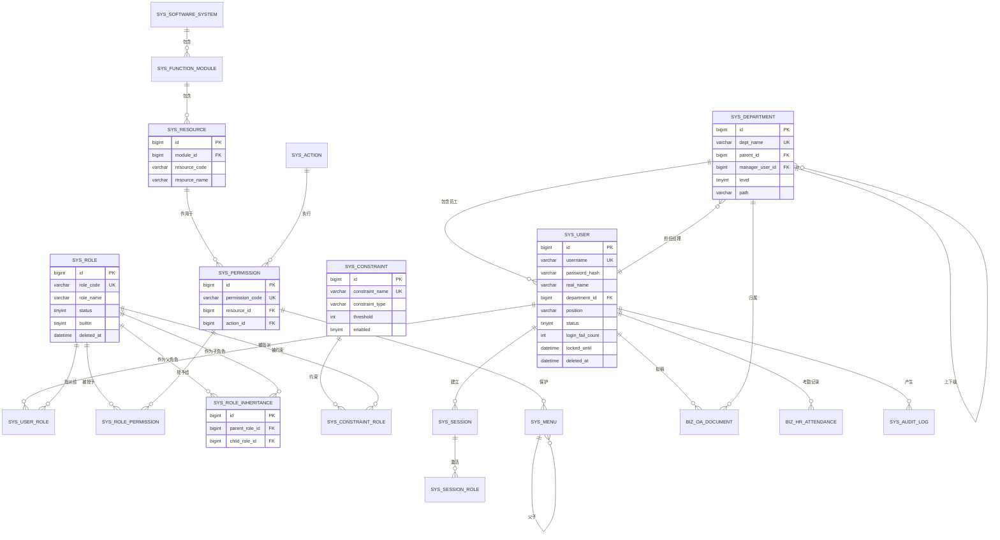
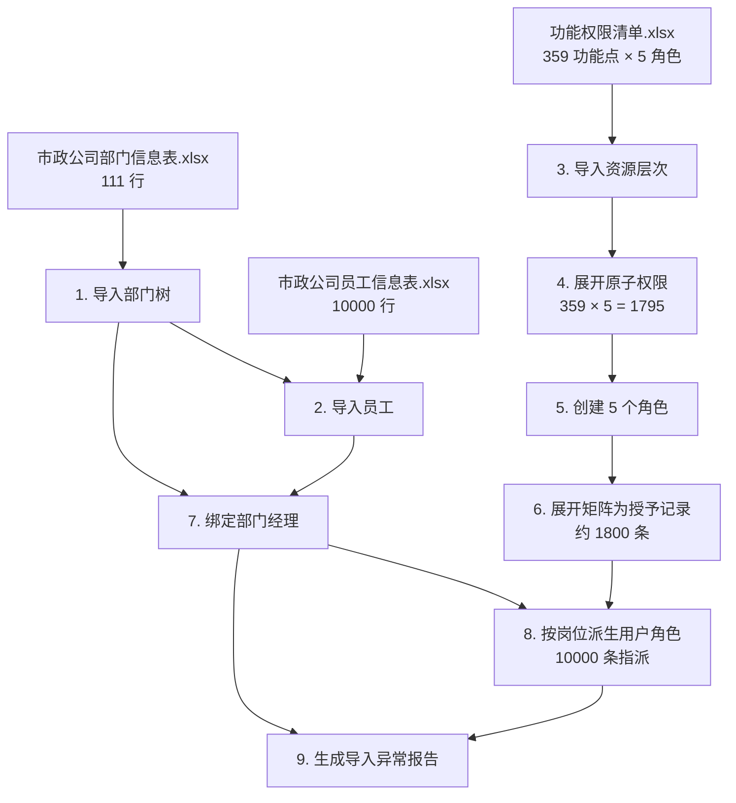

# 数据库设计说明书

**版本 0.1 · 2026 年 9 月 20 日** · 目标数据库：MySQL 8.0 / InnoDB / utf8mb4

> 三种范式实现**共用这一份 schema**。这是它们行为可对比的前提之一（见 `02-architecture.md` §3.2）。

---

## 1. 设计原则

| # | 原则 | 理由 |
|---|---|---|
| 1 | 所有表带 `id BIGINT AUTO_INCREMENT` 代理主键 | 业务键（如 `role_code`）可能需要变更，不适合做外键引用 |
| 2 | 业务唯一键加唯一索引（如 `role_code`） | 在数据库层兜住唯一性，不依赖应用层检查（并发下不可靠） |
| 3 | 关联表用 `(a_id, b_id)` 联合唯一索引 | 保证幂等指派：重复分配同一角色不会产生重复行 |
| 4 | 用户、角色用**逻辑删除** `deleted_at`；关联表用物理删除 | 用户与角色被审计日志引用，物理删除会丢失追溯；关联关系本身不需要历史 |
| 5 | 审计日志表**只插入不更新不删除** | 可篡改的审计等于没有审计（SRS S-8） |
| 6 | 所有表带 `created_at` / `updated_at` | 排查问题的基本信息 |
| 7 | 金额用 `DECIMAL(18,2)`，绝不用浮点 | SRS §5.1 |
| 8 | 不使用数据库外键约束，改由应用层保证 | 外键在高并发写入下产生行锁竞争；且分库分表时无法使用。**但索引照常建立** |

> 第 8 条需要在答辩时讲清楚：不建外键**不等于**不要引用完整性，而是把它移到应用层显式处理（见 SRS 中 ROLE-003「已被引用的角色不得删除」）。这是有意识的取舍，不是疏漏。

---

## 2. ER 图



---

## 3. 表结构定义

### 3.1 迭代一（RBAC0）

#### sys_user 用户表

| 字段 | 类型 | 约束 | 说明 |
|---|---|---|---|
| id | BIGINT | PK, AUTO_INCREMENT | |
| username | VARCHAR(64) | NOT NULL, UNIQUE | 登录名，全局唯一 |
| password_hash | VARCHAR(100) | NOT NULL | BCrypt 哈希，含盐。**不得存明文** |
| real_name | VARCHAR(64) | | 真实姓名 |
| department_id | BIGINT | NULL | 所属部门。**数据范围判定的依据** |
| position | VARCHAR(32) | | 岗位（董事长/部长/主任/主管/专员/干事…）。**仅用于导入时派生初始角色，不参与鉴权** |
| phone | VARCHAR(20) | | 员工表的电话号码列 |
| email | VARCHAR(128) | | 员工表未提供，留空 |
| status | TINYINT | NOT NULL DEFAULT 1 | 1=启用 0=禁用 |
| login_fail_count | INT | NOT NULL DEFAULT 0 | 连续登录失败次数 |
| locked_until | DATETIME | NULL | 锁定截止时间，NULL 表示未锁定 |
| must_change_pwd | TINYINT | NOT NULL DEFAULT 0 | 首次登录强制改密 |
| created_at | DATETIME | NOT NULL | |
| updated_at | DATETIME | NOT NULL | |
| deleted_at | DATETIME | NULL | 逻辑删除标记 |

索引：`uk_username(username)`、`idx_status(status)`、`idx_deleted(deleted_at)`

#### sys_role 角色表

| 字段 | 类型 | 约束 | 说明 |
|---|---|---|---|
| id | BIGINT | PK | |
| role_code | VARCHAR(64) | NOT NULL, UNIQUE | 角色编码，创建后不可修改 |
| role_name | VARCHAR(64) | NOT NULL | 显示名，可修改 |
| description | VARCHAR(255) | | |
| status | TINYINT | NOT NULL DEFAULT 1 | 1=启用 0=禁用 |
| builtin | TINYINT | NOT NULL DEFAULT 0 | 1=系统内置，不可删除 |
| created_at / updated_at / deleted_at | DATETIME | | |

索引：`uk_role_code(role_code)`、`idx_status(status)`

#### sys_department 部门表

对应「市政公司部门信息表」，111 行，单根三层树。

| 字段 | 类型 | 说明 |
|---|---|---|
| id | BIGINT PK | |
| dept_name | VARCHAR(128) NOT NULL UNIQUE | 如「道路工程分公司-财务部」 |
| parent_id | BIGINT NOT NULL DEFAULT 0 | 0 表示根节点（总公司） |
| manager_user_id | BIGINT NULL | 部门经理。**非唯一**——数据中「薛峰」同时管理总公司与公司领导两个部门 |
| level | TINYINT NOT NULL | 1/2/3，冗余存储，避免递归求深度 |
| path | VARCHAR(255) NOT NULL | 物化路径，如 `/1/13/15/`。用于一次查询取出整棵子树 |
| sort_order | INT NOT NULL DEFAULT 0 | |
| created_at / updated_at / deleted_at | DATETIME | |

索引：`uk_dept_name`、`idx_parent(parent_id)`、`idx_manager(manager_user_id)`、`idx_path(path)`

> **为什么同时存 `parent_id` 和 `path`**：`parent_id` 表达结构、保证一致性；`path` 是为 `DEPT_AND_SUB` 数据范围服务的——「本部门及所有下属」用 `WHERE path LIKE '/1/13/%'` 一次查询即可，而用 `parent_id` 递归需要多次往返。111 个部门、三层，`path` 的维护成本可忽略（部门调整极少），收益是数据范围过滤不再是递归查询。这与角色继承选择「读时计算 + 缓存」的取舍不同，因为部门树比角色图更稳定、更浅。

#### sys_software_system 软件系统表 / sys_function_module 功能模块表 / sys_resource 资源（功能点）表

资源层次为三层，对应权限清单的「软件系统 / 功能模块 / 功能点」。采用**三张表**而非单表自引用，理由：三层层数固定且各层语义不同（系统有编码前缀、模块只是分组、功能点才承载权限），单表自引用会让每层的必填字段都变成可空。

| sys_software_system | 类型 | 说明 |
|---|---|---|
| id | BIGINT PK | |
| system_code | VARCHAR(32) NOT NULL UNIQUE | 权限码第一段，如 `oa`、`hr`、`pmis` |
| system_name | VARCHAR(64) NOT NULL | 如「OA协同办公系统」 |
| sort_order | INT | |

共 **18** 行。

| sys_function_module | 类型 | 说明 |
|---|---|---|
| id | BIGINT PK | |
| system_id | BIGINT NOT NULL | |
| module_code | VARCHAR(32) NOT NULL | 权限码第二段，如 `doc`、`attendance` |
| module_name | VARCHAR(64) NOT NULL | 如「公文管理」 |

索引：`uk_sys_module(system_id, module_code)`。共 **115** 行。

| sys_resource（功能点） | 类型 | 说明 |
|---|---|---|
| id | BIGINT PK | |
| module_id | BIGINT NOT NULL | |
| resource_code | VARCHAR(64) NOT NULL | 权限码第三段，如 `draft`、`record` |
| resource_name | VARCHAR(128) NOT NULL | 如「发文拟稿与审核」 |
| description | VARCHAR(512) | 清单的「功能说明」列，原样保留 |

索引：`uk_module_resource(module_id, resource_code)`。共 **359** 行。

#### sys_action 操作表

| 字段 | 类型 | 说明 |
|---|---|---|
| id | BIGINT PK | |
| action_code | VARCHAR(32) NOT NULL UNIQUE | 见下表 |
| action_name | VARCHAR(32) NOT NULL | |
| risk_weight | INT NOT NULL DEFAULT 1 | 风险权重，用于附录 B 的权限风险评分 |

**操作词汇表由权限清单归纳得出，共 5 条**（不是自行设计的 CRUD）：

| action_code | 中文 | 清单中出现次数 | risk_weight |
|---|---|---|---|
| `view` | 查看 | 878 | 1 |
| `create` | 新增 | 109 | 2 |
| `edit` | 编辑 | 235 | 3 |
| `export` | 导出 | 66 | 5 |
| `approve` | 审批 | 99 | 8 |

> 把 Resource 与 Action 独立建表而不是只存一个 `permission_code` 字符串，理由是：权限的增长是 `资源数 × 操作数` 的笛卡尔积（359 × 5 = 1795），独立建表后新增一个功能点可自动派生出全套权限；且监控面板可按资源维度、操作维度分别聚合。清单中的「全部」正是展开为这 5 个操作。

#### sys_permission 权限表

| 字段 | 类型 | 说明 |
|---|---|---|
| id | BIGINT PK | |
| permission_code | VARCHAR(128) NOT NULL UNIQUE | `系统:模块:功能点:操作`，冗余存储便于热路径直接匹配 |
| resource_id | BIGINT NOT NULL | |
| action_id | BIGINT NOT NULL | |
| description | VARCHAR(255) | |
| created_at / updated_at | DATETIME | |

索引：`uk_permission_code`、`idx_resource(resource_id)`、`uk_resource_action(resource_id, action_id)`

> `permission_code` 与 `(resource_id, action_id)` 是冗余的。保留冗余的理由：授权判定的热路径上需要按字符串直接匹配，避免联表；而 `uk_resource_action` 保证冗余不会产生二义。

#### sys_user_role 用户角色关联表

| 字段 | 类型 | 说明 |
|---|---|---|
| id | BIGINT PK | |
| user_id | BIGINT NOT NULL | |
| role_id | BIGINT NOT NULL | |
| granted_by | BIGINT | 授予人，用于审计 |
| granted_at | DATETIME NOT NULL | |
| expires_at | DATETIME NULL | **预留**：临时授权（附录 B），NULL 表示永久 |

索引：`uk_user_role(user_id, role_id)`、`idx_role(role_id)`

> `idx_role(role_id)` 是必须的：缓存失效时要反查「持有某角色的全部用户」，没有这个索引会全表扫描，而这正好发生在权限变更的关键路径上。

#### sys_role_permission 角色权限关联表

| 字段 | 类型 | 说明 |
|---|---|---|
| id | BIGINT PK | |
| role_id | BIGINT NOT NULL | |
| permission_id | BIGINT NOT NULL | |
| **data_scope** | VARCHAR(16) NOT NULL DEFAULT 'ALL' | **数据范围**：`ALL` / `DEPT_AND_SUB` / `DEPT` / `SELF` |
| granted_by | BIGINT | |
| granted_at | DATETIME NOT NULL | |

索引：`uk_role_perm(role_id, permission_id)`、`idx_permission(permission_id)`

> **`data_scope` 挂在这张关联表上，而不是挂在 `sys_role` 上。** 理由：同一个角色对不同功能点的数据范围可以不同——「部门经理」对考勤管理是本部门范围，但对公司制度查阅是全部范围。若挂在角色上，就只能一刀切。
>
> **该字段在迭代一即建立并正确导入**（清单中的「查看本人」导入为 `SELF`，其余为 `ALL`），但**判定引擎在迭代一不执行范围过滤**——第一次检查的要求是 RBAC0 功能级权限。这样安排的理由：加字段是廉价的，改字段是昂贵的。等到迭代二才发现需要这个字段，就要改 schema、改导入、改接口、重跑数据。

#### sys_audit_log 审计日志表

| 字段 | 类型 | 说明 |
|---|---|---|
| id | BIGINT PK | |
| actor_id | BIGINT | 操作人；系统触发时为 NULL |
| actor_name | VARCHAR(64) | **冗余存名字**：用户可能被删除，审计须保留当时的名字 |
| action | VARCHAR(32) NOT NULL | LOGIN / ROLE_ASSIGN / AUTH_FAILED 等 |
| target_type | VARCHAR(32) | USER / ROLE / PERMISSION / CLAIM |
| target_id | VARCHAR(64) | |
| target_name | VARCHAR(128) | 同样冗余存名 |
| result | VARCHAR(16) NOT NULL | SUCCESS / DENIED / FAILED |
| reason | VARCHAR(255) | 失败或拒绝的原因码 |
| detail | JSON | 变更明细，如新增/移除的角色 |
| client_ip | VARCHAR(45) | 兼容 IPv6 |
| occurred_at | DATETIME(3) NOT NULL | 毫秒精度 |

索引：`idx_actor_time(actor_id, occurred_at)`、`idx_action_time(action, occurred_at)`、`idx_target(target_type, target_id)`、`idx_time(occurred_at)`

> 按 `occurred_at` 做 RANGE 分区（按月），便于归档与清理。审计日志预期每日千万级，不分区会在三个月内拖垮查询。

#### biz_oa_document 发文稿件表（受保护业务桩一）

对应权限清单 `OA协同办公系统 > 公文管理 > 发文拟稿与审核`。**仅实现权限验证所需的最小字段**，不是一个真正的公文系统。

| 字段 | 类型 | 说明 |
|---|---|---|
| id | BIGINT PK | |
| doc_no | VARCHAR(32) NOT NULL UNIQUE | 文号 |
| title | VARCHAR(255) NOT NULL | 标题 |
| content | TEXT | 正文 |
| drafted_by | BIGINT NOT NULL | 拟稿人 |
| owner_dept_id | BIGINT NOT NULL | **归属部门**，数据范围过滤的依据 |
| status | VARCHAR(16) NOT NULL | DRAFT / SUBMITTED / APPROVED / REJECTED |
| approved_by | BIGINT NULL | 审批人 |
| approved_at | DATETIME NULL | |
| created_at / updated_at | DATETIME | |

索引：`uk_doc_no`、`idx_drafted_by(drafted_by)`、`idx_dept_status(owner_dept_id, status)`

> `idx_dept_status` 是为数据范围服务的：部门经理查「本部门待审稿件」是最频繁的查询，`WHERE owner_dept_id IN (...) AND status='SUBMITTED'` 正好走这个联合索引。**数据范围不只是鉴权问题，它会直接进入业务 SQL 的 WHERE 子句**——这是数据权限与功能权限最本质的区别，也是它必须在设计期就确定的原因。

#### biz_hr_attendance 考勤记录表（受保护业务桩二）

对应权限清单 `人力资源管理系统 > 考勤与休假管理 > 考勤管理`，普通员工的取值为「查看/编辑**本人**」。

| 字段 | 类型 | 说明 |
|---|---|---|
| id | BIGINT PK | |
| user_id | BIGINT NOT NULL | 员工。**`SELF` 数据范围的判定依据** |
| dept_id | BIGINT NOT NULL | 冗余存部门，避免过滤时联表 |
| attend_date | DATE NOT NULL | |
| check_in / check_out | DATETIME NULL | |
| status | VARCHAR(16) NOT NULL | NORMAL / LATE / ABSENT / LEAVE |
| remark | VARCHAR(255) | |

索引：`uk_user_date(user_id, attend_date)`、`idx_dept_date(dept_id, attend_date)`

> 两个索引对应两种数据范围：`SELF` 走 `uk_user_date`，`DEPT` / `DEPT_AND_SUB` 走 `idx_dept_date`。**数据范围的每一种取值都需要有对应的索引支撑**，否则「部门经理查本部门考勤」会变成全表扫描。

### 3.2 迭代二（RBAC1）新增

#### sys_role_inheritance 角色继承表

| 字段 | 类型 | 说明 |
|---|---|---|
| id | BIGINT PK | |
| parent_role_id | BIGINT NOT NULL | 父角色（被继承者，权限的提供方） |
| child_role_id | BIGINT NOT NULL | 子角色（继承者，获得父角色权限） |
| created_by | BIGINT | |
| created_at | DATETIME NOT NULL | |

索引：`uk_inherit(parent_role_id, child_role_id)`、`idx_child(child_role_id)`、`idx_parent(parent_role_id)`

> **两个方向的索引都必须建**：`idx_child` 用于「求某角色的祖先」（闭包计算），`idx_parent` 用于「求某角色的后代」（缓存失效向下传播）。少建一个就会在对应路径上全表扫描。
>
> **语义约定**：`child` 继承 `parent`，因此 `child` 拥有 `parent` 的全部权限。经理（child）继承员工（parent）。这一条必须在代码注释与文档中反复明确——父子方向搞反是本表最常见的缺陷来源。

#### sys_menu 菜单表

| 字段 | 类型 | 说明 |
|---|---|---|
| id | BIGINT PK | |
| parent_id | BIGINT NOT NULL DEFAULT 0 | 0 表示根节点 |
| name | VARCHAR(64) NOT NULL | |
| path | VARCHAR(128) | 前端路由 |
| icon | VARCHAR(64) | |
| permission_id | BIGINT NULL | 保护该菜单的权限；NULL 表示公开 |
| sort_order | INT NOT NULL DEFAULT 0 | |
| visible | TINYINT NOT NULL DEFAULT 1 | |

索引：`idx_parent(parent_id)`、`idx_permission(permission_id)`

### 3.3 迭代三（RBAC2/3）新增

#### sys_constraint 约束规则表

| 字段 | 类型 | 说明 |
|---|---|---|
| id | BIGINT PK | |
| constraint_name | VARCHAR(64) NOT NULL UNIQUE | 如「审计独立性」 |
| constraint_type | VARCHAR(32) NOT NULL | 见下表 |
| threshold | INT | 阈值，语义随类型而异 |
| target_role_id | BIGINT NULL | 单角色类约束的目标 |
| description | VARCHAR(255) | |
| enabled | TINYINT NOT NULL DEFAULT 1 | |
| legacy_exempt | TINYINT NOT NULL DEFAULT 0 | 1=存量豁免，仅拦截新增 |
| created_at / updated_at | DATETIME | |

**constraint_type 取值与 threshold 语义：**

| 取值 | 含义 | threshold 语义 | 关联表用法 |
|---|---|---|---|
| `SSD_MUTEX` | 静态互斥角色 | 最多可同时拥有的数量 | `sys_constraint_role` 存互斥角色集合 |
| `DSD_MUTEX` | 动态互斥角色（会话级） | 同一会话最多激活数量 | 同上 |
| `CARD_ROLE_USER_MAX` | 单角色可分配用户数上限 | 用户数上限 | `target_role_id` 指定角色 |
| `CARD_USER_ROLE_MAX` | 单用户可拥有角色数上限 | 角色数上限 | `target_role_id` 为 NULL（全局规则） |
| `CARD_ROLE_PERM_MAX` | 单角色可关联权限数上限 | 权限数上限 | `target_role_id` 指定角色 |
| `PREREQUISITE` | 先决条件角色 | 不使用 | `target_role_id` 为目标角色，关联表存前置角色 |

> 三类基数约束**全部实现**，对应课程课件明确列出的三项要求。用单表 + 类型字段而非每类约束一张表，理由是约束的检查流程高度同构（加载规则 → 求值 → 返回违规），单表使 `ConstraintEvaluator` 可以统一加载；差异被推到求值策略中，而非数据模型中。

#### sys_constraint_role 约束角色关联表

| 字段 | 类型 | 说明 |
|---|---|---|
| id | BIGINT PK | |
| constraint_id | BIGINT NOT NULL | |
| role_id | BIGINT NOT NULL | |
| role_position | VARCHAR(16) | `MEMBER`（互斥集合成员）/ `PREREQUISITE`（前置角色） |

索引：`uk_constraint_role(constraint_id, role_id)`、`idx_role(role_id)`

#### sys_session 会话表 / sys_session_role 会话激活角色表

| sys_session 字段 | 类型 | 说明 |
|---|---|---|
| session_id | VARCHAR(64) PK | |
| user_id | BIGINT NOT NULL | |
| client_ip | VARCHAR(45) | |
| created_at | DATETIME NOT NULL | |
| expires_at | DATETIME NOT NULL | |
| revoked | TINYINT NOT NULL DEFAULT 0 | 用户被禁用时置 1 |

| sys_session_role 字段 | 类型 | 说明 |
|---|---|---|
| session_id | VARCHAR(64) | |
| role_id | BIGINT | 本次会话激活的角色（DSD 用） |

> 会话的**权威存储在 Redis**（性能需求），本表仅用于审计与「强制下线」等管理操作的持久化记录。两者不一致时以 Redis 为准，本表为最终一致。

---

## 4. 索引设计说明

授权判定热路径涉及的查询与对应索引：

| 查询 | 频率 | 索引 |
|---|---|---|
| 按 userId 查直接角色 | 极高（缓存未命中时） | `sys_user_role.uk_user_role(user_id, role_id)` 前缀 |
| 按 roleId 查权限 | 极高 | `sys_role_permission.uk_role_perm(role_id, permission_id)` 前缀 |
| 按 childRoleId 查父角色（闭包） | 高 | `sys_role_inheritance.idx_child` |
| 按 roleId 反查持有用户（失效） | 中（写路径） | `sys_user_role.idx_role` |
| 按 parentRoleId 查子角色（失效传播） | 中 | `sys_role_inheritance.idx_parent` |
| 按 username 查用户（登录） | 中 | `sys_user.uk_username` |
| 审计日志多维过滤 | 低 | 见 §3.1 |

**覆盖索引**：`uk_user_role(user_id, role_id)` 与 `uk_role_perm(role_id, permission_id)` 均为覆盖索引——查询只需要索引中的两列，不需要回表。这两条是判定路径上最频繁的查询，覆盖索引可显著降低 I/O。

---

## 5. 初始化数据与导入设计

> 本系统的初始数据**不是编造的**，而是从课程提供的三份 xlsx 导入。这是一项真实的工作量，独立列为需求 `RBAC-REQ-ORG-005`，由数据负责人（M6）承担。

### 5.1 导入总览



### 5.2 各步骤规则

**步骤 1：导入部门树**

- 按「上级部门」列建立 `parent_id`；「总公司」为根（`parent_id = 0`, `level = 1`）。
- 分两轮：先插入全部部门取得 ID，再回填 `parent_id`、`level`、`path`。原因是 xlsx 中子部门可能先于父部门出现。
- 校验：必须是**单根、无环、恰好三层**。违反则中止导入。

**步骤 2：导入员工**

- `username` 取「用户名」列（`SG000001` 形式），`real_name` 取「姓名」，`phone` 取「电话号码」，`position` 取「岗位」。
- `department_id` 按「部门」列**精确匹配**部门表的 `dept_name`。
- 「分公司」列用于**交叉校验**：若该部门的二级祖先名与分公司列不符，记入异常报告（数据疑点 C-9）。
- 初始口令统一生成，`must_change_pwd = 1`。

**步骤 3–4：导入资源层次并展开权限**

- 「软件系统」→ `sys_software_system`（18 行），`system_code` 按下表映射。
- 「功能模块」→ `sys_function_module`（115 行）。
- 「功能点」→ `sys_resource`（359 行），「功能说明」存入 `description`。
- 每个功能点 × 5 个操作 → `sys_permission`（1795 行）。

| 软件系统 | system_code | 功能点数 |
|---|---|---|
| OA协同办公系统 | `oa` | 18 |
| 企业即时通讯系统 | `im` | 12 |
| 企业知识库管理系统 | `kb` | 12 |
| 人力资源管理系统 | `hr` | 21 |
| 财务管理系统 | `fin` | 27 |
| 工程项目管理系统(PMIS) | `pmis` | 35 |
| 招投标管理系统 | `bid` | 18 |
| 物资设备管理系统 | `mat` | 24 |
| 移动巡检APP | `insp` | 18 |
| 工地AI视频监控系统 | `cctv` | 19 |
| GIS地下管线管理系统 | `gis` | 19 |
| 企业档案管理系统 | `arch` | 18 |
| 车辆管理系统 | `veh` | 18 |
| 企业宣传平台 | `pub` | 18 |
| 安全生产管理系统 | `safe` | 22 |
| 合同全生命周期管理系统 | `ctr` | 21 |
| 成本管控系统 | `cost` | 18 |
| 系统管理后台 | `sys` | 21 |

**步骤 5–6：创建角色并展开授予矩阵**

共创建 **7 个角色**：前五个直接取自权限清单的列，后两个为我方增设的系统级角色。

| # | role_code | role_name | builtin | 来源 |
|---|---|---|---|---|
| 1 | `SYS_ADMIN` | 系统管理员 | 1 | 清单列 1 |
| 2 | `COMPANY_LEADER` | 公司领导 | 1 | 清单列 2 |
| 3 | `DEPT_MANAGER` | 部门经理 | 1 | 清单列 3 |
| 4 | `PROJECT_MANAGER` | 项目经理 | 1 | 清单列 4 |
| 5 | `EMPLOYEE` | 普通员工 | 1 | 清单列 5 |
| 6 | `SEC_ADMIN` | 安全管理员 | 1 | **我方增设**：管理角色继承与约束规则 |
| 7 | `AUDITOR` | 审计员 | 1 | **我方增设**：只读访问审计与监控 |

增设理由见 `01-srs.md` §4.1.2：若「配置权限」与「配置约束」「审计监督」三项职责全部归于系统管理员，一个角色权力过大，且无法演示 RBAC2 的职责分离。`AUDITOR` 与 `SYS_ADMIN` 之间的互斥约束正是迭代三 SSD 的演示对象。

单元格解析规则：

```
"无"              → 不产生任何授予记录
"全部"            → 产生 5 条授予（view/create/edit/approve/export），data_scope = ALL
"查看"            → 1 条：view, ALL
"查看/编辑"       → 2 条：view + edit, ALL
"查看/编辑/审批"  → 3 条：view + edit + approve, ALL
"查看本人"        → 1 条：view, data_scope = SELF
"查看/编辑本人"   → 2 条：view + edit, data_scope = SELF
""（空）          → 按「无」处理，并记入异常报告
"view/新增"       → 归一化后按「查看/新增」处理，并记入异常报告
```

归一化字典（应对数据疑点 C-1、C-2）：

```
查看 → view      view → view
新增 → create
编辑 → edit
审批 → approve
导出 → export
```

**「本人」后缀的处理**：`查看/编辑本人` 中的「本人」修饰的是**整个单元格**而非最后一个操作。即该角色对该功能点的所有操作都是 `SELF` 范围，而非「查看全部 + 只能编辑本人」。这是我们的解读，已列入需向老师确认的疑点。

`SEC_ADMIN` 与 `AUDITOR` 的权限不来自清单矩阵，单独授予：`SEC_ADMIN` 获得 `sys:*:hierarchy:*` 与 `sys:*:constraint:*`；`AUDITOR` 获得 `sys:audit:*:view` 与 `sys:monitor:*:view`（**只读，无任何写权限**）。

**步骤 7：绑定部门经理**

- 部门表的「部门经理」列只给姓名。按 **姓名 + 该部门或其祖先部门** 联合匹配员工表。
- 同名冲突（如「钟晓」）无法唯一确定时，列入异常报告人工确认（数据疑点 C-12）。
- 一人可管理多个部门（「薛峰」即如此，数据疑点 C-7），模型允许。
- 匹配结果写入 `sys_department.manager_user_id`，**这是下一步派生角色的依据**。

**步骤 8：按岗位派生用户角色**

员工表只有岗位没有角色，需要建立映射。派生规则（写入 `sys_position_role_mapping` 配置表，便于调整）：

| 优先级 | 条件 | 派生角色 |
|---|---|---|
| 1 | 部门 = 「公司领导」 | `COMPANY_LEADER` |
| 2 | 该员工是某个「第 N 项目经理部」的部门经理 | `PROJECT_MANAGER` |
| 3 | 该员工是任一部门的部门经理（`sys_department.manager_user_id` 指向他） | `DEPT_MANAGER` |
| 4 | 岗位 ∈ {部长, 副部长, 主任, 副主任, 经理, 副经理} | `DEPT_MANAGER` |
| 5 | 其余（主管、专员、干事、薪酬专员、招聘专员…） | `EMPLOYEE` |

> ⚠️ **这套映射是我们自行设计的**，员工表中并没有角色列（数据疑点 C-10）。若老师另有既定映射，导入结果会与预期不符。**这是最需要在答疑课确认的一条**。映射做成配置表而非硬编码，正是为了老师给出不同答案时能低成本调整。
>
> ⚠️ **本步骤必须在步骤 7（绑定部门经理）之后执行**：优先级 2、3 都依赖 `sys_department.manager_user_id` 已经填好。顺序颠倒会导致所有部门经理与项目经理被误判为普通员工。
>
> `SYS_ADMIN` 不派生给任何真实员工，单独创建 `admin` 账号，符合「系统管理员是运维角色而非业务岗位」的常识。

**步骤 9：导入异常报告**

导入完成后输出报告，至少包含：部门层级校验结果、部门匹配失败的员工、分公司列与部门树不一致的记录、同名无法唯一确定的部门经理、权限清单中的非法单元格取值、各表最终行数。

> **这份报告本身就是检查时的展示材料**：它证明我们不是把数据草草塞进数据库，而是逐条校验并记录了每一处异常。

### 5.3 导入结果预期行数

| 表 | 预期行数 |
|---|---|
| `sys_department` | 111 |
| `sys_user` | 10,001（10000 员工 + admin） |
| `sys_software_system` | 18 |
| `sys_function_module` | 115 |
| `sys_resource` | 359 |
| `sys_action` | 5 |
| `sys_permission` | 1,795 |
| `sys_role` | **7**（5 个清单角色 + 安全管理员 + 审计员） |
| `sys_role_permission` | 约 1,800 |
| `sys_user_role` | 约 10,001 |

### 5.4 压测数据

性能需求（SRS §5.2）要求万级 QPS。真实数据的规模（1 万用户、1800 条授予）已足够作为压测基准，**无需另造数据**——这比用三条测试数据跑出来的性能数字有说服力得多。

`rbac-bench` 模块按真实用户分布随机生成鉴权请求，热点分布按 Zipf 模拟（少数用户高频访问），以检验缓存命中率是否达到 95% 的目标。

---


## 6. 数据迁移与版本管理

- 使用 **Flyway** 管理 schema 版本，脚本置于 `rbac-contract/src/main/resources/db/migration/`。
- 三个实现模块**共用同一套迁移脚本**，保证 schema 绝对一致。
- 命名：`V1__rbac0_baseline.sql`、`V2__rbac1_hierarchy.sql`、`V3__rbac2_constraints.sql`，与三个迭代一一对应。
- 迁移脚本只增不改：已发布的脚本不得修改，修正须通过新版本脚本。

> 这样安排的额外好处：三次检查时，`V1` `V2` `V3` 三个脚本本身就清晰展示了数据模型随 RBAC0→RBAC1→RBAC2 的演进过程，可直接作为答辩材料。

---

## 7. 本文档对应的答辩设计点

**DP-6 组织架构、数据范围与数据模型设计**

| 项 | 内容 |
|---|---|
| **需求是什么** | 支撑 RBAC0/1/2 三级模型；承载 111 个部门、1 万名员工、359 个功能点的真实数据；授权判定路径要足够快；且权限清单中出现的「查看本人」要求系统支持数据范围 |
| **存在什么问题** | ① 权限清单只给功能权限，但「部门经理」「项目经理」「查看本人」都隐含数据范围，仅有 `User→Role→Permission` 无法表达；② 数据范围一旦后加，会同时改动 schema、导入、接口与鉴权算法；③ 角色继承是 DAG 不是树；④ 判定热路径多次联表；⑤ 员工表没有角色列，1 万人的初始角色无从得来；⑥ 数据本身有缺陷（中英文混用、空单元格、同名经理） |
| **采用什么方法与理由** | ① `data_scope` 挂在 `role_permission` 边上而非角色上——同一角色对不同功能点范围可不同；② **迭代一即建字段并正确导入，迭代二才启用执行**，加字段廉价、改字段昂贵；③ 部门用 `parent_id` + 物化路径 `path`，`DEPT_AND_SUB` 退化为一次 `LIKE` 查询，而角色继承因图更复杂改用读时计算+缓存——**两种层次结构按各自特性选不同策略，而非套同一个模板**；④ `permission_code` 冗余 + 覆盖索引；⑤ 岗位→角色派生规则做成**配置表**而非硬编码，因为这是我方推断，老师可能另有答案；⑥ 导入流程产出**异常报告**，异常显式化而非静默吞掉 |
| **实现效果** | 真实数据完整导入，各表行数可验证（111 / 10001 / 359 / 1795 / ~1800）；判定路径走覆盖索引；数据范围的四种取值各有对应索引支撑；导入异常报告列出全部 12 条数据疑点，成为向老师提问的依据；Flyway 三个脚本对应三个迭代，演进可视 |

> 答辩时的关键一句：**我们从数据里读出了一条需求——「查看本人」——而它在课程的 RBAC0/1/2 框架里并不存在。** 我们的处理是：现在就把字段和接口留好，但不提前实现执行逻辑。这样既没有超出第一次检查的范围，又不会在第二次检查时返工。
