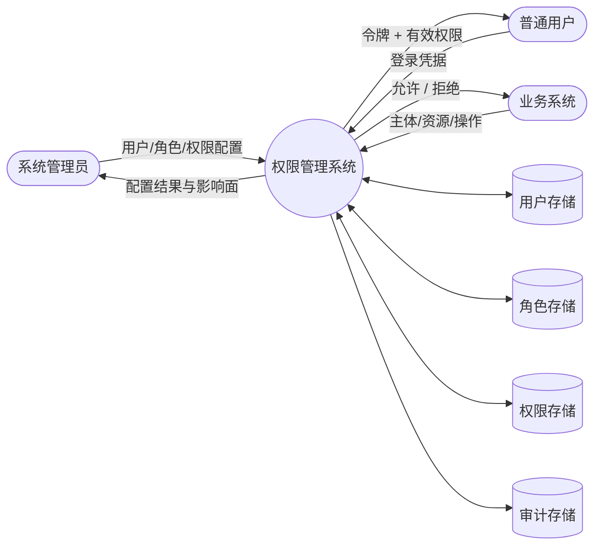
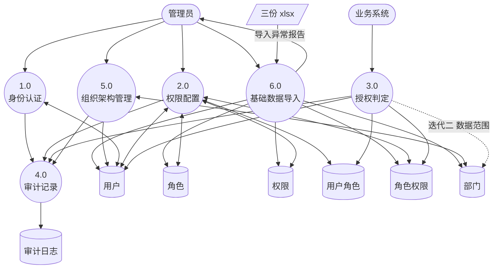
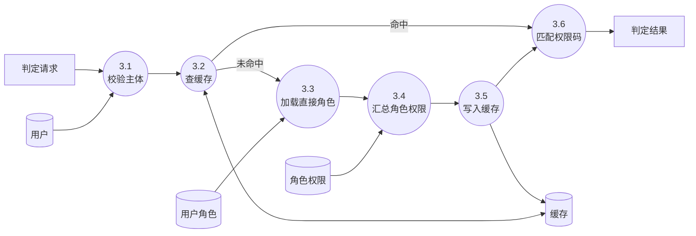

# 详细设计说明书 · 结构化（面向功能）实现

**版本 0.1 · 2026 年 9 月 20 日** · 模块：`rbac-structured` · 对应迭代一（RBAC0）

> 课程《成绩计算办法》写作「面向功能」，《课程介绍》写作「结构化」，本文档视为同一范式，统一称**结构化设计（面向功能）**。
>
> 本文档是第一次检查（10/27–10/29）的主要提交物之一。

---

## 1. 范式定义与准入标准

在动手之前必须先明确：什么样的代码才算「结构化」。否则最常见的结果是写出一堆 `XxxService` 类，内部仍然是面向对象的思路，与 `rbac-oo` 模块的差异只剩包名——那样三范式对比就没有任何意义。

### 1.1 结构化设计的本质

结构化设计的核心是**功能分解（Functional Decomposition）**：

```
自顶向下：把一个大功能反复拆成子功能，直到每个子功能足够简单可直接编码
数据与过程分离：数据是被动的记录，过程是主动的加工者
模块间通过参数传递数据，而非通过对象状态
```

与面向对象的根本区别：

| 维度 | 结构化 | 面向对象 |
|---|---|---|
| 分解依据 | **功能**（做什么） | **数据与职责**（谁负责） |
| 数据与行为 | 分离 | 封装在一起 |
| 复用手段 | 函数调用 | 继承与组合 |
| 应对变化 | 修改函数内部 / 增加分支 | 增加子类 / 新实现 |
| 主要图示 | 数据流图 DFD、结构图 SC | 类图、时序图 |

### 1.2 本模块的准入标准

| # | 要求 | 违反示例 |
|---|---|---|
| 1 | 数据类型是**贫血**的 `record`，只有字段与访问器 | `User.hasPermission(code)` ← 行为跑到数据里了 |
| 2 | 逻辑全在**无状态静态函数**中，组织为 `XxxFunctions` | `class UserService { private User current; }` ← 有状态 |
| 3 | **禁止继承与多态**（实现 contract 接口除外） | `abstract class AbstractConstraintChecker` ← 多态 |
| 4 | 分支分派用 `switch` / `if-else` | 策略模式、访问者模式 ← 以多态为基础 |
| 5 | 模块划分依据是功能分解，用**结构图**表达 | 按「实体」建包 ← 那是 OO 的划分方式 |
| 6 | 函数参数显式传递所需数据，不依赖隐式上下文 | 从 ThreadLocal 里掏数据 |

> 第 3、4 条是最重要的。**结构化范式在面对「新增一类约束」时必须修改 switch 语句，这是它的固有局限，不是我们实现得不好。** 我们要如实地呈现这个局限，并在 `10-paradigm-comparison.md` 中把它作为对比结论的证据。刻意用多态去「优化」结构化实现，反而破坏了实验的有效性。

---

## 2. 功能分解

### 2.1 顶层数据流图（DFD Level 0）



### 2.2 一层分解（DFD Level 1）



> 加工 **6.0 基础数据导入**是一次性的，但它是系统能够运行的前提，且工作量不小（三份 xlsx、约 12 类校验、异常报告），因此在 DFD 中显式建模，而不是当作「初始化脚本」隐去。加工 **5.0 组织架构管理**在迭代一只提供查询与维护；它与加工 3.0 的虚线连接是迭代二的数据范围过滤所需。

### 2.3 授权判定的功能分解（DFD Level 2，加工 3.0）



### 2.4 结构图（Structure Chart）

结构图表达模块的**调用层次与参数传递**，是结构化设计的核心图示：

```
                        authorize(subject, resource, action)
                                      │
        ┌──────────────┬──────────────┼──────────────┬──────────────┐
        │              │              │              │              │
        ▼              ▼              ▼              ▼              ▼
  validateSubject  lookupCache  loadEffective   matchPermission  recordMetric
  (userId)         (userId)     Permissions     (permSet, code)  (result)
        │              │         (userId)            │              │
        ▼              ▼              │              ▼              ▼
  findUserById    cacheGet/Put        │        containsCode    appendAudit
  (userId)        (key, value)        │        (set, code)     (event)
                                      │
                    ┌─────────────────┼─────────────────┐
                    ▼                 ▼                 ▼
            loadDirectRoleIds   loadRolePermissions  unionAll
            (userId)            (roleIds)            (sets)
                    │                 │
                    ▼                 ▼
            queryUserRole       queryRolePermission
            (userId)            (roleIds)

   数据耦合：所有模块间只传递简单数据（ID、字符串集合），无控制耦合与公共耦合
```

| 耦合类型 | 本设计中的情况 |
|---|---|
| 数据耦合（最好） | ✅ 全部模块间只传 ID、集合、布尔等简单数据 |
| 标记耦合 | ⚠️ `loadEffectivePermissions` 接收 `userId` 返回 `Set<String>`，属可接受范围 |
| 控制耦合 | ❌ 避免：不传「标志位控制被调方走哪个分支」的参数 |
| 公共耦合 | ❌ 避免：无全局可变状态，缓存通过参数传入句柄 |
| 内容耦合（最差） | ❌ 无 |

> 结构图与耦合分析是结构化设计**特有的**分析工具。答辩时展示这张图 + 耦合分析表，比展示一堆类图更能证明「我们确实是用结构化方法做的设计」。

---

## 3. 模块结构

```
rbac-structured/src/main/java/com/xmu/rbac/structured/
├── data/                        【数据定义层】贫血记录，无任何行为
│   ├── UserRecord.java
│   ├── RoleRecord.java
│   ├── PermissionRecord.java
│   ├── UserRoleRecord.java
│   ├── RolePermissionRecord.java
│   ├── AuditRecord.java
│   └── AuthzContext.java
├── func/                        【功能层】全部为静态函数，按功能而非实体分包
│   ├── AuthenticationFunctions.java     1.0 身份认证
│   ├── UserAdminFunctions.java          2.1 用户配置
│   ├── RoleAdminFunctions.java          2.2 角色配置
│   ├── PermissionAdminFunctions.java    2.3 权限配置
│   ├── AssignmentFunctions.java         2.4 指派与授予
│   ├── AuthorizationFunctions.java      3.0 授权判定 ★核心
│   ├── PermissionSetFunctions.java      3.4 权限集合运算
│   ├── ClosureFunctions.java            3.3 传递闭包（角色继承与部门树共用，迭代二）
│   ├── OrgFunctions.java                5.0 组织架构
│   ├── ImportFunctions.java             6.0 xlsx 数据导入
│   ├── CacheFunctions.java              3.2/3.5 缓存读写
│   └── AuditFunctions.java              4.0 审计记录
├── dao/                         【数据访问层】纯 SQL 执行，返回记录
│   ├── UserDao.java
│   ├── RoleDao.java
│   ├── PermissionDao.java
│   ├── AssignmentDao.java
│   ├── DepartmentDao.java
│   └── AuditDao.java
└── web/                         【接入层】只做参数转换与结果包装，不含业务逻辑
    ├── AuthController.java
    ├── UserController.java
    ├── RoleController.java
    ├── PermissionController.java
    ├── AuthorizationController.java
    ├── DepartmentController.java
    ├── OaDocumentController.java
    └── AttendanceController.java
```

> **注意包的划分依据**：`func` 包下不是 `UserFunctions / RoleFunctions / PermissionFunctions` 这种按实体划分，而是按**功能**划分——`AssignmentFunctions` 同时处理用户-角色与角色-权限两种指派，因为它们是同一类功能（建立关联关系）。这正是结构化与面向对象在模块划分上的分歧点。

---

## 4. 核心模块详细设计

### 4.1 数据定义

```java
package com.xmu.rbac.structured.data;

/** 用户记录。贫血：只有数据，没有任何业务方法。 */
public record UserRecord(
        Long id,
        String username,
        String passwordHash,
        String realName,
        Long departmentId,       // 数据范围判定依据
        String position,         // 岗位，仅导入时派生角色用
        int status,              // 1=启用 0=禁用
        int loginFailCount,
        LocalDateTime lockedUntil,
        LocalDateTime deletedAt
) {}

/** 授权判定的上下文。在各加工之间传递，等价于结构图中模块间流动的数据。 */
public record AuthzContext(
        Long subjectId,
        String resource,
        String action,
        String permissionCode,          // 由 resource + action 拼成，形如 oa:doc:draft:approve
        Long subjectDeptId,             // 迭代二数据范围用
        Long targetDeptId,              // 来自请求的 context，迭代一恒为 null
        Long targetUserId,              // 同上
        Set<Long> directRoleIds,
        Set<String> effectivePermissions,
        boolean cacheHit,
        long startNanos
) {}
```

注意 `UserRecord` **没有** `isEnabled()`、`isLocked()` 这类方法。判断状态是**功能层**的事：

```java
// func/AuthenticationFunctions.java
public static boolean isEnabled(UserRecord u) {
    return u != null && u.status() == 1 && u.deletedAt() == null;
}
```

> 这种写法在 OO 视角下是「贫血模型反模式」。但在结构化范式下它是**正确的**——数据与过程本就应当分离。这个差异会在 `10-paradigm-comparison.md` 中作为核心对比点：同一个判断，OO 放在 `User` 类里（信息专家原则），结构化放在函数里（数据过程分离原则），两者各自内部自洽。

### 4.2 授权判定主函数

```java
package com.xmu.rbac.structured.func;

public final class AuthorizationFunctions {

    private AuthorizationFunctions() {}   // 纯函数集合，禁止实例化

    /**
     * 授权判定主函数。对应结构图顶层模块、DFD 加工 3.0。
     * 严格按 3.1 → 3.2 → 3.3 → 3.4 → 3.5 → 3.6 的顺序调用子模块。
     */
    public static AuthzResult authorize(String subject,
                                        String resource,
                                        String action,
                                        UserDao userDao,
                                        AssignmentDao assignmentDao,
                                        CacheHandle cache) {
        long start = System.nanoTime();
        String permissionCode = buildPermissionCode(resource, action);

        // ---- 3.1 校验主体 ----
        Long userId = parseSubjectId(subject);
        if (userId == null) {
            return AuthzResult.deny("SUBJECT_INVALID", permissionCode, elapsed(start));
        }
        UserRecord user = userDao.findById(userId);
        if (!AuthenticationFunctions.isEnabled(user)) {
            return AuthzResult.deny("SUBJECT_DISABLED", permissionCode, elapsed(start));
        }

        // ---- 3.2 查缓存 ----
        Set<String> effective = CacheFunctions.getUserPermissions(cache, userId);
        boolean cacheHit = (effective != null);

        if (!cacheHit) {
            // ---- 3.3 加载直接角色 ----
            Set<Long> roleIds = assignmentDao.findEnabledRoleIdsByUser(userId);

            // 迭代二在此处插入：roleIds = HierarchyFunctions.expandClosure(roleIds, ...);

            // ---- 3.4 汇总角色权限 ----
            effective = PermissionSetFunctions.unionRolePermissions(assignmentDao, roleIds);

            // ---- 3.5 写入缓存 ----
            CacheFunctions.putUserPermissions(cache, userId, effective);
        }

        // ---- 3.6 匹配权限码 ----
        boolean allowed = PermissionSetFunctions.contains(effective, permissionCode);

        // ---- 3.7 数据范围过滤（迭代二插入） ----
        // if (allowed) { allowed = ScopeFunctions.check(userDao, userId, permissionCode, ctx); }

        // ---- 3.8 约束校验（迭代三插入） ----
        // if (allowed) { allowed = ConstraintFunctions.checkAll(...); }

        return allowed
                ? AuthzResult.allow(cacheHit, elapsed(start))
                : AuthzResult.deny("MISSING_PERMISSION", permissionCode, elapsed(start));
    }

    static String buildPermissionCode(String resource, String action) {
        return resource + ":" + action;
    }

    static Long parseSubjectId(String subject) {
        try {
            return Long.parseLong(subject.startsWith("user_") ? subject.substring(5) : subject);
        } catch (NumberFormatException e) {
            return null;
        }
    }

    static long elapsed(long startNanos) {
        return (System.nanoTime() - startNanos) / 1000;   // 微秒
    }
}
```

**设计说明**

| 项 | 说明 |
|---|---|
| 依赖传递方式 | DAO 与缓存句柄**作为参数传入**，而非通过字段注入。这保证函数是无状态的、可独立测试的（测试时传入内存实现即可，无需 Mock 框架） |
| 短路返回 | 用提前 `return` 表达短路，而非异常。异常在结构化范式中属于「非局部跳转」，会破坏结构图的调用层次 |
| 迭代扩展点 | 注释标出了迭代二、三的插入位置。**注意：扩展意味着修改这个函数本身**——这正是结构化范式的固有代价，将在对比分析中如实记录 |
| 圈复杂度 | 当前为 6。迭代三加入约束校验后预计升至 10 以上，接近可维护性阈值——这个数字本身就是对比数据 |

### 4.3 权限集合运算

```java
public final class PermissionSetFunctions {

    private PermissionSetFunctions() {}

    /** 3.4 汇总：多个角色的权限并集。 */
    public static Set<String> unionRolePermissions(AssignmentDao dao, Set<Long> roleIds) {
        if (roleIds == null || roleIds.isEmpty()) {
            return Collections.emptySet();
        }
        // 一次批量查询，避免 N+1
        List<String> codes = dao.findPermissionCodesByRoleIds(roleIds);
        return new HashSet<>(codes);
    }

    /** 3.6 匹配：O(1) 集合查找。 */
    public static boolean contains(Set<String> effective, String permissionCode) {
        return effective != null && effective.contains(permissionCode);
    }
}
```

> `contains` 是整个系统调用频率最高的一行代码。用 `HashSet` 而非 `List` 是性能需求 P99 < 50ms 的直接来源：`List.contains` 是 O(n)，一个拥有 200 条权限的用户，每秒万次判定会产生每秒两百万次字符串比较。

### 4.4 为用户分配角色

```java
public final class AssignmentFunctions {

    private AssignmentFunctions() {}

    public static AssignResult assignRolesToUser(Long userId,
                                                 List<Long> roleIds,
                                                 Long operatorId,
                                                 UserDao userDao,
                                                 RoleDao roleDao,
                                                 AssignmentDao assignmentDao,
                                                 CacheHandle cache,
                                                 AuditSink audit) {
        // 1. 校验目标用户
        UserRecord user = userDao.findById(userId);
        if (!AuthenticationFunctions.isEnabled(user)) {
            return AssignResult.fail(ErrorCode.USER_DISABLED);
        }

        // 2. 校验角色存在且启用
        List<RoleRecord> roles = roleDao.findByIds(roleIds);
        if (roles.size() != roleIds.size()) {
            return AssignResult.fail(ErrorCode.ROLE_NOT_FOUND);
        }
        for (RoleRecord r : roles) {
            if (r.status() != 1) {
                return AssignResult.fail(ErrorCode.ROLE_DISABLED);
            }
        }

        // 3. 迭代三在此插入约束校验：
        //    ConstraintCheckResult cr = ConstraintFunctions.checkAssignment(...);
        //    if (!cr.passed()) return AssignResult.fail(cr.errorCode(), cr.detail());

        // 4. 计算变更前的有效权限（用于返回 diff）
        Set<String> before = loadEffectivePermissions(userId, assignmentDao);

        // 5. 幂等写入
        Set<Long> existing = assignmentDao.findRoleIdsByUser(userId);
        List<Long> toInsert = roleIds.stream().filter(id -> !existing.contains(id)).toList();
        if (!toInsert.isEmpty()) {
            assignmentDao.insertUserRoles(userId, toInsert, operatorId);
        }

        // 6. 失效缓存（事务提交后由调用方触发，见 §4.5）
        CacheFunctions.invalidateUser(cache, userId);

        // 7. 审计
        AuditFunctions.record(audit, operatorId, "ROLE_ASSIGN", "USER", userId,
                              toInsert.isEmpty() ? "SUCCESS_NOOP" : "SUCCESS", null);

        // 8. 返回权限变更 diff
        Set<String> after = loadEffectivePermissions(userId, assignmentDao);
        return AssignResult.ok(toInsert, diffAdded(before, after), diffRemoved(before, after));
    }
}
```

### 4.5 缓存失效的事务边界

结构化范式下没有领域事件机制，缓存失效由**接入层在事务提交后显式调用**：

```java
// web/RoleController.java
@PostMapping("/users/{userId}/roles")
public ApiResponse<AssignResult> assign(@PathVariable Long userId,
                                        @RequestBody AssignRequest req) {
    AssignResult result = txTemplate.execute(status ->
            AssignmentFunctions.assignRolesToUser(userId, req.roleIds(), currentUserId(),
                                                  userDao, roleDao, assignmentDao,
                                                  cache, auditSink));
    // ★ 事务已提交，此时才失效缓存
    if (result.success()) {
        CacheFunctions.invalidateUser(cache, userId);
    }
    return ApiResponse.ok(result);
}
```

> **这是结构化实现的一个真实痛点，必须在答辩中如实说明。** `02-architecture.md` §4.2 规定「事件在事务提交后发布」。面向对象实现用观察者模式 + Spring 的 `@TransactionalEventListener(AFTER_COMMIT)` 可以声明式地保证这一点；而结构化实现没有事件机制，只能靠**每个调用点手动记得在事务外再调一次失效**。
>
> 这意味着：新增任何一个修改权限的接口，开发者都必须记得加这行代码，编译器不会提醒。**这是一个由范式带来的、可量化的可维护性风险**，将作为对比分析的重要证据（见 `10-paradigm-comparison.md`）。

---

## 5. 模块内聚性分析

按 Myers 的内聚度等级评估本模块划分（从高到低）：

| 模块 | 内聚类型 | 评价 |
|---|---|---|
| `PermissionSetFunctions` | **功能内聚**（最高） | 只做权限集合运算，单一明确功能 ✅ |
| `CacheFunctions` | 功能内聚 | 只做缓存读写 ✅ |
| `AuthorizationFunctions` | 功能内聚 | 只做授权判定 ✅ |
| `AuthenticationFunctions` | 功能内聚 | 登录、登出、状态校验，围绕同一功能 ✅ |
| `AssignmentFunctions` | **顺序内聚** | 指派流程的各步骤前后相继，输出即下一步输入 ✅ |
| `AuditFunctions` | 功能内聚 | ✅ |
| `UserAdminFunctions` | **通信内聚** | 各函数操作同一数据（用户表），但功能相互独立 ⚠️ 可接受 |

> 没有出现偶然内聚、逻辑内聚或时间内聚的模块。内聚性分析同样是结构化设计特有的分析工具，与 §2.4 的耦合分析构成完整的「高内聚低耦合」论证。

---

## 6. 关键算法

### 6.1 有效权限计算（迭代一版本）

```
输入：userId
输出：Set<String> 有效权限码

1. roleIds ← SELECT role_id FROM sys_user_role
              JOIN sys_role ON ... WHERE user_id = ? AND sys_role.status = 1
2. IF roleIds 为空 THEN RETURN 空集
3. codes  ← SELECT p.permission_code
              FROM sys_role_permission rp JOIN sys_permission p ON ...
              WHERE rp.role_id IN (roleIds)
4. RETURN new HashSet<>(codes)

时间复杂度：两次索引查询，O(k) k=权限条数
空间复杂度：O(k)
```

迭代二将在步骤 1 与 2 之间插入继承闭包展开。

### 6.2 环检测（迭代二预留）

结构化实现采用**显式栈的深度优先搜索**，不使用递归（递归在深继承链下有栈溢出风险，且不便于记录路径）：

```
函数 detectCycle(newChildId, newParentId, edges) -> List<Long> 或 null

1. 若 newChildId == newParentId 则返回 [newChildId, newChildId]   // 自环
2. stack ← [newParentId]；path ← []；visited ← {}
3. WHILE stack 非空:
4.     node ← stack.peek()
5.     IF node 未访问:
6.         标记 visited；path.push(node)
7.         IF node == newChildId THEN RETURN path + [newChildId]   // 找到环
8.         将 node 的全部父角色压栈
9.     ELSE:
10.        stack.pop()；path.pop()
11. RETURN null   // 无环

说明：从「拟定的父角色」出发向上遍历，若能到达「拟定的子角色」，
      则加入这条边后会成环。返回完整 path 供前端高亮（见 04-api.md §5.1）。
```

---

## 7. 异常与错误处理策略

结构化范式下**不用异常做控制流**，业务失败通过返回值表达：

```java
public record AuthzResult(boolean allowed, String reason, String requiredPermission,
                          boolean cacheHit, long elapsedMicros) {
    public static AuthzResult allow(boolean cacheHit, long micros) { ... }
    public static AuthzResult deny(String reason, String perm, long micros) { ... }
}

public record AssignResult(boolean success, ErrorCode errorCode, Object detail, ...) { }
```

异常只用于**真正的意外情况**：数据库连接失败、序列化错误等。这类异常由接入层的 `@RestControllerAdvice` 统一转为 `10006 SYSTEM_UNAVAILABLE` + HTTP 503。

> 对应 SRS §5.3「数据库不可用时失败关闭」：捕获到 `DataAccessException` 时，授权判定**必须返回拒绝**，绝不能因为「查不到数据」就放行。这一条在代码审查中列为必查项。

---

## 8. 单元测试设计

因为所有函数都是无状态静态函数且依赖通过参数传入，测试**不需要 Spring 容器，也不需要 Mockito**：

```java
class AuthorizationFunctionsTest {

    @Test
    void 有权限时应当允许() {
        var userDao = new InMemoryUserDao(enabledUser(1001L));
        var assignDao = new InMemoryAssignmentDao()
                .withUserRoles(1001L, Set.of(3L))
                .withRolePermissions(3L, Set.of("oa:doc:draft:approve"));
        var cache = new InMemoryCache();

        var r = AuthorizationFunctions.authorize(
                "SG000013", "oa:doc:draft", "approve", userDao, assignDao, cache);

        assertTrue(r.allowed());
        assertFalse(r.cacheHit());
    }

    @Test
    void 用户被禁用时应当拒绝且不查询角色() {
        var assignDao = new CountingAssignmentDao();
        var r = AuthorizationFunctions.authorize("SG000013", "oa:doc:draft", "approve",
                new InMemoryUserDao(disabledUser(1001L)), assignDao, new InMemoryCache());

        assertFalse(r.allowed());
        assertEquals("SUBJECT_DISABLED", r.reason());
        assertEquals(0, assignDao.queryCount());   // 短路，不应产生查询
    }

    @Test
    void 第二次调用应当命中缓存() { ... }

    @Test
    void 数据库异常时应当拒绝而非放行() { ... }   // 失败关闭
}
```

> **「不需要 Mock 框架就能测试」本身就是结构化范式的一个优点**，应当在对比分析中记录：纯函数 + 参数注入使测试成本极低，这也是本模块能达到 90% 覆盖率目标的原因。

目标覆盖率见 `09-test-plan.md`。

---

## 9. 本文档对应的答辩设计点

**DP-1 的结构化侧论据 + 结构化范式本身的陈述**

| 项 | 内容 |
|---|---|
| **需求是什么** | 用面向功能（结构化）方法实现 RBAC0 的完整后端：用户/角色/权限配置 + 授权判定 |
| **存在什么问题** | ① 「结构化」极易写成「用过程语法写的面向对象」，导致与 OO 实现无实质差异，三范式对比失效；② 授权判定要在万级 QPS 下 O(1) 完成；③ 没有事件机制，缓存失效的事务边界只能靠人工保证；④ 后续迭代的扩展点会不断修改主函数 |
| **采用什么方法与理由** | ① 先定义 6 条**准入标准**（§1.2），禁用继承与多态，编码前评审；② 按功能而非实体分解，用 DFD + 结构图表达，并做耦合与内聚分析；③ 权限集合用 `HashSet`，判定退化为一次 O(1) 查找；④ 依赖通过参数传入，使函数无状态、可独立测试 |
| **实现效果** | 授权判定主函数圈复杂度 6，调用层次清晰对应结构图；单元测试无需 Spring 与 Mockito，覆盖率易于达标；**同时如实暴露了两个范式局限**——缓存失效需人工保证事务边界、每次迭代都要修改主函数——这两点将作为 `10-paradigm-comparison.md` 的实测证据 |

> 答辩时的关键一句：**我们没有把结构化实现写得「尽量好」，而是写得「尽量标准」。** 它暴露出的局限不是实现缺陷，而是范式特征，正是这门课要求做三范式对比的意义所在。
