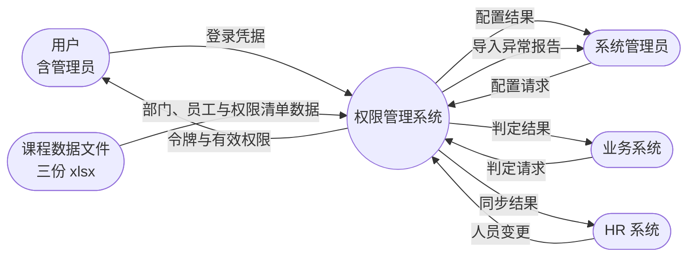
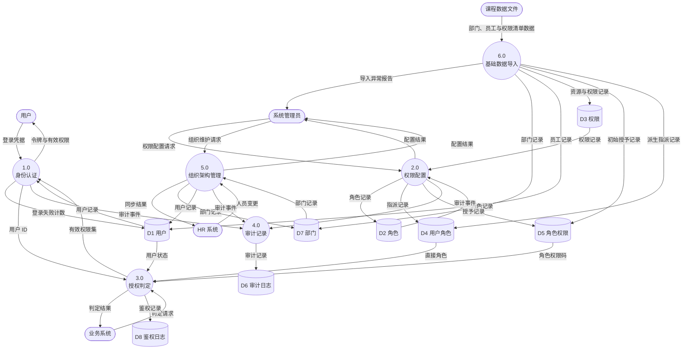
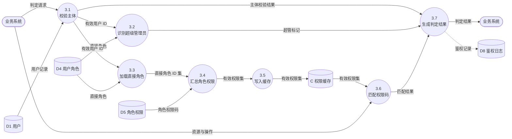

# 详细设计说明书 · 结构化（面向功能）实现

**版本 0.2 · 2026 年 10 月 1 日** · 模块：`rbac-structured` · 对应迭代一（RBAC0）

> 0.2 按邱明课件 3「结构化软件设计」复查：数据流图改为遵守课件的画法规则（不画控制、父子图平衡、数据流全部命名），耦合与内聚分析改为对照已落地的代码逐条给出，新增变换分析、事务分析、按决策设计与深模块检查。复查中发现的问题记入 `12-design-log.md` #11–#13。

> 课程《成绩计算办法》写作「面向功能」，《课程介绍》写作「结构化」，本文档视为同一范式，统一称**结构化设计（面向功能）**。
>
> 本文档是第一次检查（10/27–10/29）的主要提交物之一。

---

## 1. 范式定义与准入标准

在动手之前必须先明确：什么样的代码才算「结构化」。否则最常见的结果是写出一堆 `XxxService` 类，内部仍然是面向对象的思路，与 `rbac-oo` 模块的差异只剩包名——那样三范式对比就没有任何意义。

### 1.1 结构化设计的本质

结构化设计的核心是**功能分解（Functional Decomposition）**：

```
自顶向下：把一个大功能反复拆成子功能，直到每个子功能足够简单可直接编码
数据与过程分离：数据是被动的记录，过程是主动的加工者
模块间通过参数传递数据，而非通过对象状态
```

与面向对象的根本区别：

| 维度 | 结构化 | 面向对象 |
|---|---|---|
| 分解依据 | **功能**（做什么） | **数据与职责**（谁负责） |
| 数据与行为 | 分离 | 封装在一起 |
| 复用手段 | 函数调用 | 继承与组合 |
| 应对变化 | 修改函数内部 / 增加分支 | 增加子类 / 新实现 |
| 主要图示 | 数据流图 DFD、结构图 SC | 类图、时序图 |

### 1.2 本模块的准入标准

| # | 要求 | 违反示例 |
|---|---|---|
| 1 | 数据类型是**贫血**的 `record`，只有字段与访问器 | `User.hasPermission(code)` ← 行为跑到数据里了 |
| 2 | 逻辑全在**无状态静态函数**中，组织为 `XxxFunctions` | `class UserService { private User current; }` ← 有状态 |
| 3 | **禁止继承与多态**（实现 contract 接口除外） | `abstract class AbstractConstraintChecker` ← 多态 |
| 4 | 分支分派用 `switch` / `if-else` | 策略模式、访问者模式 ← 以多态为基础 |
| 5 | 模块划分依据是功能分解，用**结构图**表达 | 按「实体」建包 ← 那是 OO 的划分方式 |
| 6 | 函数参数显式传递所需数据，不依赖隐式上下文 | 从 ThreadLocal 里掏数据 |

> 第 3、4 条是最重要的。**结构化范式在面对「新增一类约束」时必须修改 switch 语句，这是它的固有局限，不是我们实现得不好。** 我们要如实地呈现这个局限，并在 `10-paradigm-comparison.md` 中把它作为对比结论的证据。刻意用多态去「优化」结构化实现，反而破坏了实验的有效性。

---

## 2. 功能分解

### 2.1 顶层数据流图（DFD Level 0，上下文图）

0 级图只画系统边界：外部实体与系统之间的数据流。数据存储属于系统内部，放到 1 级图再展开。


```mermaid
flowchart LR
    USER([用户<br/>含管理员])
    ADMIN([系统管理员])
    BIZ([业务系统])
    HR([HR 系统])
    XLSX([课程数据文件<br/>三份 xlsx])

    P0((权限管理系统))

    USER -->|登录凭据| P0
    P0 -->|令牌与有效权限| USER
    ADMIN -->|配置请求| P0
    P0 -->|配置结果| ADMIN
    P0 -->|导入异常报告| ADMIN
    BIZ -->|判定请求| P0
    P0 -->|判定结果| BIZ
    HR -->|人员变更| P0
    P0 -->|同步结果| HR
    XLSX -->|部门、员工与权限清单数据| P0
```

### 2.2 一层分解（DFD Level 1）


```mermaid
flowchart TB
    USER([用户])
    ADMIN([系统管理员])
    BIZ([业务系统])
    HR([HR 系统])
    XLSX([课程数据文件])

    P1((1.0<br/>身份认证))
    P2((2.0<br/>权限配置))
    P3((3.0<br/>授权判定))
    P4((4.0<br/>审计记录))
    P5((5.0<br/>组织架构管理))
    P6((6.0<br/>基础数据导入))

    D1[(D1 用户)]
    D2[(D2 角色)]
    D3[(D3 权限)]
    D4[(D4 用户角色)]
    D5[(D5 角色权限)]
    D6[(D6 审计日志)]
    D7[(D7 部门)]
    D8[(D8 鉴权日志)]

    USER -->|登录凭据| P1
    P1 -->|令牌与有效权限| USER
    ADMIN -->|权限配置请求| P2
    P2 -->|配置结果| ADMIN
    ADMIN -->|组织维护请求| P5
    P5 -->|配置结果| ADMIN
    HR -->|人员变更| P5
    P5 -->|同步结果| HR
    BIZ -->|判定请求| P3
    P3 -->|判定结果| BIZ
    XLSX -->|部门、员工与权限清单数据| P6
    P6 -->|导入异常报告| ADMIN

    D1 -->|用户记录| P1
    P1 -->|登录失败计数| D1
    P1 -->|用户 ID| P3
    P3 -->|有效权限集| P1
    D2 -->|角色记录| P2
    P2 -->|角色记录| D2
    D3 -->|权限记录| P2
    P2 -->|指派记录| D4
    P2 -->|授予记录| D5
    D1 -->|用户状态| P3
    D4 -->|直接角色| P3
    D5 -->|角色权限码| P3
    P3 -->|鉴权记录| D8
    D7 -->|部门记录| P5
    P5 -->|部门记录| D7
    P5 -->|用户记录| D1
    P6 -->|部门记录| D7
    P6 -->|员工记录| D1
    P6 -->|资源与权限记录| D3
    P6 -->|初始授予记录| D5
    P6 -->|派生指派记录| D4
    P1 -->|审计事件| P4
    P2 -->|审计事件| P4
    P5 -->|审计事件| P4
    P4 -->|审计记录| D6
```

**父子图平衡检查**（课件 3：子图边界数据流必须与父图一致）：

| 0 级图的数据流 | 1 级图中的对应 |
|---|---|
| 登录凭据 / 令牌与有效权限 | 用户 ↔ 1.0 |
| 配置请求 | = 权限配置请求（→ 2.0）+ 组织维护请求（→ 5.0），组成见 §2.5 数据字典 |
| 配置结果 | 2.0 → 管理员、5.0 → 管理员 |
| 导入异常报告 | 6.0 → 管理员 |
| 判定请求 / 判定结果 | 业务系统 ↔ 3.0 |
| 人员变更 / 同步结果 | HR 系统 ↔ 5.0 |
| 部门、员工与权限清单数据 | 课程数据文件 → 6.0 |

0.1 版的 1 级图漏了「用户」和「HR 系统」两个外部实体，却多出一个 0 级图里没有的 xlsx 数据源，两级不平衡；现已补齐（`12-design-log.md` #11）。

> 加工 **6.0 基础数据导入**是一次性的，但它是系统能够运行的前提，且工作量不小（三份 xlsx、约 12 类校验、异常报告），因此在 DFD 中显式建模，而不是当作「初始化脚本」隐去。D7 部门到 3.0 的数据流（数据范围过滤）在迭代二加入，本图按迭代一绘制。

### 2.3 授权判定的功能分解（DFD Level 2，加工 3.0）


```mermaid
flowchart LR
    IN([业务系统]) -->|判定请求| P31((3.1<br/>校验主体))
    D1[(D1 用户)] -->|用户记录| P31
    P31 -->|主体校验结果| P37((3.7<br/>生成判定结果))
    P31 -->|有效用户 ID| P32((3.2<br/>识别超级管理员))
    D4[(D4 用户角色)] -->|直接角色| P32
    P32 -->|超管标记| P37
    P31 -->|有效用户 ID| P33((3.3<br/>加载直接角色))
    D4 -->|直接角色| P33
    P33 -->|直接角色 ID 集| P34((3.4<br/>汇总角色权限))
    D5[(D5 角色权限)] -->|角色权限码| P34
    P34 -->|有效权限集| P35((3.5<br/>写入缓存))
    P35 -->|有效权限集| C[(C 权限缓存)]
    C -->|有效权限集| P36((3.6<br/>匹配权限码))
    IN -->|资源与操作| P36
    P36 -->|匹配结果| P37
    P37 -->|判定结果| OUT([业务系统])
    P37 -.->|鉴权记录| D8[(D8 鉴权日志)]
```

这张图只描述**数据怎样被加工**，不描述**先做哪步、什么条件下跳过**——课件 3 明确要求 DFD 不画执行顺序、决策条件和循环。0.1 版在「查缓存」处画了「命中 / 未命中」两个分支，那是控制流，已删除（#11）。「缓存命中时不执行 3.3–3.5」「主体无效时直接出结果」这类控制决策，由 §2.4 的结构图表达。

3.7 到 D8 为虚线：鉴权日志在迭代一尚未实现（`09-test-plan.md` §0）。

### 2.4 结构图（Structure Chart）

结构图表达模块的**调用层次与参数传递**，是结构化设计的核心图示。下图按**已落地的代码**绘制，模块名即函数名：

```
                     authorize(subject, resource, action, now, userDao, assignmentDao, cache)
                                                   │
       ┌────────────────────┬──────────────────────┼──────────────────────┬──────────────────┐
       │ 输入分支            │                      │ 输入分支              │ 变换中心          │ 输出分支
       ▼                    ▼                      ▼                      ▼                  ▼
 resolveSubject     subjectDenyReason        isSuperAdmin          getUserPermissions   contains     AuthzResult
 (subject, dao)     (UserRecord, now)        (cache, dao, id)      (cache, id)          (set, code)  .allow/.deny/.bypass
   ↓ UserRecord       ↓ 拒绝原因               ↓ 布尔                ↓ 权限集 或 null      ↓ 布尔
       │                                           │                      │ 未命中时
       ▼                                           ▼                      ▼
 findById / findByUsername                  holdsSuperAdmin       findEnabledRoleIdsByUser(id) → unionRolePermissions(dao, ids)
                                                                   → putUserPermissions(cache, id, set)
```

#### 2.4.1 变换分析：从 DFD 3.0 到结构图

加工 3.0 是典型的**变换型**数据流：一端流入判定请求，经过一连串加工，另一端流出判定结果。按变换分析的步骤：

| 步骤 | 在 3.0 上的结果 |
|---|---|
| ① 划定输入流（传入分支） | 判定请求 → 3.1 校验主体 → 有效用户 ID → 3.2 / 3.3 / 3.4 / 3.5 → 有效权限集。这一段在把外部数据**整理成内部可用的形式** |
| ② 找出变换中心 | **3.6 匹配权限码**：输入是整理好的有效权限集与权限码，输出是一个布尔。系统的核心计算只有这一处 |
| ③ 划定输出流（传出分支） | 3.7 生成判定结果 → 判定结果、鉴权记录 |
| ④ 映射为结构图 | 顶层 `authorize` 是总控；左侧是输入分支（`resolveSubject`、`subjectDenyReason`、`isSuperAdmin`、`getUserPermissions` 及其下层）；中间是变换中心 `contains`；右侧是输出分支 `AuthzResult` 的三个工厂方法 |

变换中心只有一行集合查找，输入分支却占了绝大部分代码——这说明判定的成本几乎全在「备齐数据」上，也正是缓存要放在输入分支（3.5）的原因。

#### 2.4.2 事务分析：权限拦截器

每个 HTTP 请求进入系统时，拦截器先看契约里这个接口声明了什么，再分派到三条完全不同的处理路径。这是**事务型**数据流：一个事务中心按事务类型分派。

```
                     PermissionInterceptor.preHandle(request)
                                   │
                     事务中心：按契约声明分派（ContractRoutes.find）
          ┌───────────────┬────────┴─────────┬────────────────────┬──────────────────┐
          ▼               ▼                  ▼                    ▼                  ▼
   未声明 → 拒绝      security: []        @self               具体权限码          （无令牌/令牌无效）
   403 / 10003       直接放行       subjectDenyReason     AuthorizationFunctions   401 / 10002
                                    （只校验本人可用）       .authorize
```

五条路径互不相关，各自独立，新增一类声明（例如迭代三的会话级接口）只需在事务中心加一个分支。代价是事务中心本身是一个 `if` 链——结构化范式下分派只能这样写（§1.2 第 4 条）。

#### 2.4.3 耦合分析（按课件 3 的六类，对照代码逐条给出）

| 耦合类型（强 → 弱） | 本模块是否存在 | 具体位置 | 处理与理由 |
|---|---|---|---|
| 内容耦合 | 无 | — | 任何函数都不访问其他函数的内部实现；Java 也没有 goto |
| **公共耦合** | **存在，两处** | ① **数据库表**：`AuthenticationFunctions` 与 `AuthorizationFunctions` 都经 `UserDao` 读 `sys_user`；② **缓存**：同一个 `CacheHandle` 被 `authorize`、`effectivePermissions` 以及将来的失效函数共同读写 | 这两处是系统本身的需求（数据要持久、判定要缓存），无法消除，只能限制：表只经本模块的 DAO 访问，禁止跨模块直接读别人的表（`02-architecture.md` §2.3）；缓存不是静态全局变量，而是经接口、以**参数**传入——对比课件中 `Mall.GLOBAL` 这类所有模块直接改的全局对象，谁在用缓存在函数签名上一目了然。0.1 版写「无公共耦合」是错的（#12） |
| 控制耦合 | 无 | 逐一检查过：没有任何参数是「告诉被调函数走哪个分支」的布尔或枚举 | `login` 返回错误码、由调用方决定提示语，这是被调方**返回**状态，不是调用方**传入**控制标志，不属于控制耦合 |
| **标记耦合** | **存在** | `subjectDenyReason(UserRecord u, now)` 只用了记录 13 个字段中的 `status`、`deletedAt`、`expiresAt` | **有意接受**。这个函数同时被登录和鉴权两处调用；若改为三个标量参数，两个调用点都要拆字段，以后账号可用性再加一个条件（例如锁定），所有调用点都得改。接受标记耦合，换来「账号是否可用」的规则只写在一处。0.1 版把 `loadEffectivePermissions(userId)` 列为标记耦合，是术语误用——它只传一个 ID，是数据耦合（#12） |
| 数据耦合 | 主体 | `contains(set, code)`、`buildPermissionCode(resource, action)`、`parseUserId(key, token)`、`unionRolePermissions(dao, roleIds)` | 只传完成功能所需的简单数据 |
| 非直接耦合 | 存在 | 外部模拟系统与权限中心只通过 HTTP 契约交互；权限变更事件（`02-architecture.md` §2.3）将经事件总线，发布者不认识订阅者 | 最弱的耦合，用在跨进程边界上 |

> 结构图与耦合分析是结构化设计**特有的**分析工具。答辩时展示这张图 + 耦合分析表，比展示一堆类图更能证明「我们确实是用结构化方法做的设计」。**如实承认公共耦合与标记耦合、并讲清为什么接受**，比声称「全部是数据耦合」更经得起追问。

### 2.5 数据字典（加工 3.0 的数据流）

需求层面的数据项定义见 SRS §3；这里只列 3.0 内部流动的数据。记法：`=` 由…组成，`+` 与，`[ | ]` 选一，`{ }` 重复，`( )` 可选。

| 数据流 | 组成 |
|---|---|
| 判定请求 | 主体标识 + 资源 + 操作 + (上下文) |
| 主体标识 | [ `user_` + 用户 ID \| 用户名 ] |
| 主体校验结果 | 用户 ID + (拒绝原因) |
| 拒绝原因 | [ SUBJECT_INVALID \| SUBJECT_DISABLED \| SUBJECT_DELETED \| SUBJECT_EXPIRED \| MISSING_PERMISSION ] |
| 超管标记 | 布尔 |
| 直接角色 ID 集 | { 角色 ID } |
| 有效权限集 | { 权限码 } |
| 权限码 | 资源 + `:` + 操作，如 `oa:doc:draft:approve` |
| 匹配结果 | 布尔 |
| 判定结果 | 是否允许 + (原因) + 所需权限码 + 是否命中缓存 + 耗时（微秒） |
| 配置请求（0 级） | 权限配置请求 + 组织维护请求 |

---

## 3. 模块结构

```
rbac-structured/src/main/java/com/xmu/rbac/structured/
├── data/                        【数据定义层】贫血记录，无任何行为
│   ├── UserRecord.java
│   ├── RoleRecord.java
│   ├── PermissionRecord.java
│   ├── UserRoleRecord.java
│   ├── RolePermissionRecord.java
│   ├── AuditRecord.java
│   └── AuthzContext.java
├── func/                        【功能层】全部为静态函数，按功能而非实体分包
│   ├── AuthenticationFunctions.java     1.0 身份认证
│   ├── UserAdminFunctions.java          2.1 用户配置
│   ├── RoleAdminFunctions.java          2.2 角色配置
│   ├── PermissionAdminFunctions.java    2.3 权限配置
│   ├── AssignmentFunctions.java         2.4 指派与授予
│   ├── AuthorizationFunctions.java      3.0 授权判定 ★核心
│   ├── PermissionSetFunctions.java      3.4 权限集合运算
│   ├── ClosureFunctions.java            3.3 传递闭包（角色继承与部门树共用，迭代二）
│   ├── OrgFunctions.java                5.0 组织架构
│   ├── ImportFunctions.java             6.0 xlsx 数据导入
│   ├── CacheFunctions.java              3.2/3.5 缓存读写
│   └── AuditFunctions.java              4.0 审计记录
├── dao/                         【数据访问层】纯 SQL 执行，返回记录
│   ├── UserDao.java
│   ├── RoleDao.java
│   ├── PermissionDao.java
│   ├── AssignmentDao.java
│   ├── DepartmentDao.java
│   └── AuditDao.java
└── web/                         【接入层】只做参数转换与结果包装，不含业务逻辑
    ├── AuthController.java
    ├── UserController.java
    ├── RoleController.java
    ├── PermissionController.java
    ├── AuthorizationController.java
    ├── DepartmentController.java
    ├── OaDocumentController.java
    └── AttendanceController.java
```

> **代码已落地（2026-10-01）**：`data`、`func`、`dao`、`web` 四个包按本节结构建立，另有 `config` 包负责装配（不计覆盖率）。与下文草图的差别：`authorize()` 多一个 `now` 参数（时间由调用方传入，测试可固定时钟）；主体既可是 `user_<id>` 也可是用户名；主体校验拆成 `AuthenticationFunctions.subjectDenyReason()`，一次返回停用、删除、过期三种原因。缓存句柄 `CacheHandle` 是 `func` 包里的接口，当前实现只有 L1。

> **注意包的划分依据**：`func` 包下不是 `UserFunctions / RoleFunctions / PermissionFunctions` 这种按实体划分，而是按**功能**划分——`AssignmentFunctions` 同时处理用户-角色与角色-权限两种指派，因为它们是同一类功能（建立关联关系）。这正是结构化与面向对象在模块划分上的分歧点。

---

## 4. 核心模块详细设计

### 4.1 数据定义

```java
package com.xmu.rbac.structured.data;

/** 用户记录。贫血：只有数据，没有任何业务方法。 */
public record UserRecord(
        Long id,
        String username,
        String passwordHash,
        String realName,
        Long departmentId,       // 数据范围判定依据
        String position,         // 岗位，仅首次导入时派生角色用
        int status,              // 1=启用 0=停用 2=删除
        int loginFailCount,
        LocalDateTime lockedUntil,
        LocalDateTime deletedAt
) {}

/** 授权判定的上下文。在各加工之间传递，等价于结构图中模块间流动的数据。 */
public record AuthzContext(
        Long subjectId,
        String resource,
        String action,
        String permissionCode,          // 由 resource + action 拼成，形如 oa:doc:draft:approve
        Long subjectDeptId,             // 迭代二数据范围用
        Long targetDeptId,              // 来自请求的 context，迭代一恒为 null
        Long targetUserId,              // 同上
        Set<Long> directRoleIds,
        Set<String> effectivePermissions,
        boolean cacheHit,
        long startNanos
) {}
```

注意 `UserRecord` **没有** `isEnabled()`、`isLocked()` 这类方法。判断状态是**功能层**的事：

```java
// func/AuthenticationFunctions.java
public static boolean isEnabled(UserRecord u) {
    return u != null && u.status() == 1 && u.deletedAt() == null;
}
```

> 这种写法在 OO 视角下是「贫血模型反模式」。但在结构化范式下它是**正确的**——数据与过程本就应当分离。这个差异会在 `10-paradigm-comparison.md` 中作为核心对比点：同一个判断，OO 放在 `User` 类里（信息专家原则），结构化放在函数里（数据过程分离原则），两者各自内部自洽。

### 4.2 授权判定主函数

```java
package com.xmu.rbac.structured.func;

public final class AuthorizationFunctions {

    private AuthorizationFunctions() {}   // 纯函数集合，禁止实例化

    /**
     * 授权判定主函数。对应结构图顶层模块、DFD 加工 3.0。
     * 严格按 3.1 → 3.2 → 3.3 → 3.4 → 3.5 → 3.6 的顺序调用子模块。
     */
    public static AuthzResult authorize(String subject,
                                        String resource,
                                        String action,
                                        UserDao userDao,
                                        AssignmentDao assignmentDao,
                                        CacheHandle cache) {
        long start = System.nanoTime();
        String permissionCode = buildPermissionCode(resource, action);

        // ---- 3.1 校验主体 ----
        Long userId = parseSubjectId(subject);
        if (userId == null) {
            return AuthzResult.deny("SUBJECT_INVALID", permissionCode, elapsed(start));
        }
        UserRecord user = userDao.findById(userId);
        if (!AuthenticationFunctions.isEnabled(user)) {
            return AuthzResult.deny("SUBJECT_DISABLED", permissionCode, elapsed(start));
        }

        // ---- 3.1（续）超级管理员旁路 ----
        // 需求「越过权限引擎」。排在状态校验之后：停用的超管照样被拒。
        // 放行时带原因码，审计里能看出这是旁路而非命中某条权限。见 02-architecture.md §4.1 S1b
        if (CacheFunctions.isSuperAdmin(cache, assignmentDao, userId)) {
            return AuthzResult.bypass("SUPER_ADMIN_BYPASS", permissionCode, elapsed(start));
        }

        // ---- 3.2 查缓存 ----
        Set<String> effective = CacheFunctions.getUserPermissions(cache, userId);
        boolean cacheHit = (effective != null);

        if (!cacheHit) {
            // ---- 3.3 加载直接角色 ----
            Set<Long> roleIds = assignmentDao.findEnabledRoleIdsByUser(userId);

            // 迭代二在此处插入：roleIds = HierarchyFunctions.expandClosure(roleIds, ...);

            // ---- 3.4 汇总角色权限 ----
            effective = PermissionSetFunctions.unionRolePermissions(assignmentDao, roleIds);

            // ---- 3.5 写入缓存 ----
            CacheFunctions.putUserPermissions(cache, userId, effective);
        }

        // ---- 3.6 匹配权限码 ----
        boolean allowed = PermissionSetFunctions.contains(effective, permissionCode);

        // ---- 3.7 数据范围过滤（迭代二插入） ----
        // if (allowed) { allowed = ScopeFunctions.check(userDao, userId, permissionCode, ctx); }

        // ---- 3.8 约束校验（迭代三插入） ----
        // if (allowed) { allowed = ConstraintFunctions.checkAll(...); }

        return allowed
                ? AuthzResult.allow(cacheHit, elapsed(start))
                : AuthzResult.deny("MISSING_PERMISSION", permissionCode, elapsed(start));
    }

    static String buildPermissionCode(String resource, String action) {
        return resource + ":" + action;
    }

    static Long parseSubjectId(String subject) {
        try {
            return Long.parseLong(subject.startsWith("user_") ? subject.substring(5) : subject);
        } catch (NumberFormatException e) {
            return null;
        }
    }

    static long elapsed(long startNanos) {
        return (System.nanoTime() - startNanos) / 1000;   // 微秒
    }
}
```

**设计说明**

| 项 | 说明 |
|---|---|
| 依赖传递方式 | DAO 与缓存句柄**作为参数传入**，而非通过字段注入。这保证函数是无状态的、可独立测试的（测试时传入内存实现即可，无需 Mock 框架） |
| 短路返回 | 用提前 `return` 表达短路，而非异常。异常在结构化范式中属于「非局部跳转」，会破坏结构图的调用层次 |
| 迭代扩展点 | 注释标出了迭代二、三的插入位置。**注意：扩展意味着修改这个函数本身**——这正是结构化范式的固有代价，将在对比分析中如实记录 |
| 圈复杂度 | 当前为 6。迭代三加入约束校验后预计升至 10 以上，接近可维护性阈值——这个数字本身就是对比数据 |

### 4.3 权限集合运算

```java
public final class PermissionSetFunctions {

    private PermissionSetFunctions() {}

    /** 3.4 汇总：多个角色的权限并集。 */
    public static Set<String> unionRolePermissions(AssignmentDao dao, Set<Long> roleIds) {
        if (roleIds == null || roleIds.isEmpty()) {
            return Collections.emptySet();
        }
        // 一次批量查询，避免 N+1
        List<String> codes = dao.findPermissionCodesByRoleIds(roleIds);
        return new HashSet<>(codes);
    }

    /** 3.6 匹配：O(1) 集合查找。 */
    public static boolean contains(Set<String> effective, String permissionCode) {
        return effective != null && effective.contains(permissionCode);
    }
}
```

> `contains` 是整个系统调用频率最高的一行代码。用 `HashSet` 而非 `List` 是性能需求 P99 < 50ms 的直接来源：`List.contains` 是 O(n)，一个拥有 200 条权限的用户，每秒万次判定会产生每秒两百万次字符串比较。

### 4.4 为用户分配角色

```java
public final class AssignmentFunctions {

    private AssignmentFunctions() {}

    public static AssignResult assignRolesToUser(Long userId,
                                                 List<Long> roleIds,
                                                 Long operatorId,
                                                 UserDao userDao,
                                                 RoleDao roleDao,
                                                 AssignmentDao assignmentDao,
                                                 CacheHandle cache,
                                                 AuditSink audit) {
        // 1. 校验目标用户
        UserRecord user = userDao.findById(userId);
        if (!AuthenticationFunctions.isEnabled(user)) {
            return AssignResult.fail(ErrorCode.USER_DISABLED);
        }

        // 2. 校验角色存在且启用
        List<RoleRecord> roles = roleDao.findByIds(roleIds);
        if (roles.size() != roleIds.size()) {
            return AssignResult.fail(ErrorCode.ROLE_NOT_FOUND);
        }
        for (RoleRecord r : roles) {
            if (r.status() != 1) {
                return AssignResult.fail(ErrorCode.ROLE_DISABLED);
            }
        }

        // 3. 迭代三在此插入约束校验：
        //    ConstraintCheckResult cr = ConstraintFunctions.checkAssignment(...);
        //    if (!cr.passed()) return AssignResult.fail(cr.errorCode(), cr.detail());

        // 4. 计算变更前的有效权限（用于返回 diff）
        Set<String> before = loadEffectivePermissions(userId, assignmentDao);

        // 5. 幂等写入
        Set<Long> existing = assignmentDao.findRoleIdsByUser(userId);
        List<Long> toInsert = roleIds.stream().filter(id -> !existing.contains(id)).toList();
        if (!toInsert.isEmpty()) {
            assignmentDao.insertUserRoles(userId, toInsert, operatorId);
        }

        // 6. 失效缓存（事务提交后由调用方触发，见 §4.5）
        CacheFunctions.invalidateUser(cache, userId);

        // 7. 审计
        AuditFunctions.record(audit, operatorId, "ROLE_ASSIGN", "USER", userId,
                              toInsert.isEmpty() ? "SUCCESS_NOOP" : "SUCCESS", null);

        // 8. 返回权限变更 diff
        Set<String> after = loadEffectivePermissions(userId, assignmentDao);
        return AssignResult.ok(toInsert, diffAdded(before, after), diffRemoved(before, after));
    }
}
```

### 4.5 缓存失效的事务边界

结构化范式下没有领域事件机制，缓存失效由**接入层在事务提交后显式调用**：

```java
// web/RoleController.java
@PostMapping("/users/{userId}/roles")
public ApiResponse<AssignResult> assign(@PathVariable Long userId,
                                        @RequestBody AssignRequest req) {
    AssignResult result = txTemplate.execute(status ->
            AssignmentFunctions.assignRolesToUser(userId, req.roleIds(), currentUserId(),
                                                  userDao, roleDao, assignmentDao,
                                                  cache, auditSink));
    // ★ 事务已提交，此时才失效缓存
    if (result.success()) {
        CacheFunctions.invalidateUser(cache, userId);   // 删本地 L1 + Redis L2
        CacheFunctions.broadcastInvalidation(redis, List.of(userId));
        // ↑ 向 rbac:invalidate 发布消息并 INCR rbac:perm:version，
        //   让其他实例清掉各自的 L1。见 02-architecture.md §4.2.1
    }
    return ApiResponse.ok(result);
}
```

> **这是结构化实现的一个真实痛点，必须在答辩中如实说明。** `02-architecture.md` §4.2 规定「事件在事务提交后发布」。面向对象实现用观察者模式 + Spring 的 `@TransactionalEventListener(AFTER_COMMIT)` 可以声明式地保证这一点；而结构化实现没有事件机制，只能靠**每个调用点手动记得在事务外再调一次失效**。
>
> 这意味着：新增任何一个修改权限的接口，开发者都必须记得加这两行代码（本地失效 + 跨实例广播），编译器不会提醒；漏掉第二行在单实例测试中完全发现不了。**这是一个由范式带来的、可量化的可维护性风险**，将作为对比分析的重要证据（见 `10-paradigm-comparison.md`）。

---

## 5. 模块内聚性分析

按课件 3 的七级内聚（偶然 < 逻辑 < 时间 < 过程 < 通信 < 顺序 < 功能），对照**已实现的代码**逐个评估。0.1 版的表是按规划写的，列了三个还不存在的模块、漏了四个已存在的模块（#12），现分成两张表。

**已实现**

| 模块 | 内聚类型 | 判断依据 |
|---|---|---|
| `PermissionSetFunctions` | 功能内聚 | 只做权限集合的汇总与匹配 |
| `CacheFunctions` | 功能内聚 | 只做缓存读写与失效 |
| `TokenFunctions` | 功能内聚 | 只做令牌的签发与解析 |
| `AuthorizationFunctions` | 功能内聚 | `authorize` 与 `effectivePermissions` 都服务于「求有效权限并判定」这一个功能 |
| `AuthenticationFunctions` | **通信内聚** ⚠️ | 登录、改口令、口令策略、账号可用性四个函数围绕同一份用户凭据与状态数据，但功能彼此独立。其中 `subjectDenyReason` 还被授权判定调用——授权模块因此依赖了一个也装着登录逻辑的模块 |
| `ContractRoutes` | 功能内聚 | 只做契约路由表的加载与查询 |
| `PermissionInterceptor` | 顺序内聚 | 取路由 → 解析令牌 → 判定 → 写拒绝响应，前一步的输出是后一步的输入 |
| `AuthController` | 通信内聚 | 四个接口围绕同一个用户会话 |
| `config.AppConfig` | **时间内聚** ⚠️ | 各个 `@Bean` 方法之间没有业务关联，只是都在启动时执行——课件中「应用启动初始化」的反例正是这一类 |

两处 ⚠️ 的处理：

- `AppConfig` 的时间内聚**接受**。装配代码天然只因「启动时要做」而聚在一起；它被限制在 `config` 包里、不含任何业务逻辑、不计入覆盖率。把它拆开只会产生一堆只有一个方法的类（课件 3：拆分应让整体复杂度下降）。
- `AuthenticationFunctions` **计划在迭代二拆分**。按课件 3「合并还是分开」的标准：口令相关的规则随安全策略变化，账号可用性规则随账号状态模型变化（9/20 和 9/29 各改过一次三态），两者变化原因不同；而且拆出 `SubjectFunctions.subjectDenyReason` 之后，授权模块就不再依赖登录逻辑。见 #13。

**规划中**（尚未实现，内聚类型为设计意图）

| 模块 | 预期内聚类型 |
|---|---|
| `AssignmentFunctions` | 顺序内聚：校验 → 写入 → 失效 → 审计，前后相继 |
| `AuditFunctions` | 功能内聚 |
| `UserAdminFunctions` | 通信内聚：各函数操作同一张用户表，功能相互独立 ⚠️ 可接受 |

### 5.1 按功能设计与按决策设计

课件 3 对比了两种划分模块的依据：**按功能设计**（按输入、处理、输出等步骤拆分）和**按决策设计**（每个模块封装一个可能变化的设计决策，即信息隐藏）。判断标准是：「未来哪些选择会变化？变化时希望影响几个模块？」

本模块整体是按功能分解的（§2），但在函数一级有意识地隐藏了以下决策：

| 可能变化的设计决策 | 隐藏在哪里 | 变化时要改几处 |
|---|---|---|
| 缓存拓扑（只有 L1 → L1 + Redis L2） | `CacheHandle` 接口 | 新增一个实现类，改 `AppConfig` 一处 |
| 令牌格式（JWT HS256 → 其他格式、加吊销） | `TokenFunctions` | 1 |
| 口令哈希算法与强度 | 以函数参数注入，算法只在 `AppConfig` 出现 | 1 |
| 接口所需权限存放在哪里 | `ContractRoutes`（现在读 YAML） | 1 |
| 账号可用性规则（三态、临时人员过期） | `subjectDenyReason` | 1 |
| 表结构 | `dao` 包内的 SQL | 每张表对应的 DAO |
| **权限码格式**（`资源:操作`） | `AuthorizationFunctions.buildPermissionCode` 拼接，**但** `PermissionInterceptor` 又按最后一个冒号拆分 | **2** ⚠️ |

**没有隐藏住的决策**：

1. **权限码格式**：知道「权限码 = 资源 + 冒号 + 操作」的地方有两处。若格式改变（例如操作改用 `#` 分隔），两处要同步改，漏一处编译器不会提醒。已记入 #13，随迭代二把拆分函数移到 `PermissionSetFunctions`、与拼接放在一起。
2. **判定管道的阶段顺序**：写死在 `authorize` 函数体内（§4.2）。迭代二加继承闭包、迭代三加约束，都要修改这个函数。这是**按功能设计的固有代价**：模块边界来自「判定要做哪几步」，而「步骤会增加」恰恰是最可能的变化。面向对象实现将把每个阶段做成独立对象（按决策设计），两者的差异是 `10-paradigm-comparison.md` 的核心证据。

### 5.2 深模块检查：`authorize`

课件 3 给出了「深模块」的检查清单（小接口、大能力）。对 `authorize` 逐项检查：

| 检查项 | 目标 | `authorize` 的情况 |
|---|---|---|
| 常见调用需要几个参数 | 越少越好 | **7 个**：3 个业务参数（主体、资源、操作）+ 1 个时间 + 3 个依赖（两个 DAO、缓存） ⚠️ |
| 调用者是否需要了解调用顺序 | 最好不需要 | 不需要：一次调用完成全部阶段 ✅ |
| 常见场景是否需要配置 | 最好零配置 | 调用者须自己备齐 3 个依赖 ⚠️ 拦截器与 `AuthorizationController` 各备一遍 |
| 调用者是否重复处理同一异常 | 应移入模块 | 否：拒绝以返回值表达，无异常 ✅ |
| 数据结构是否暴露给调用者 | 应隐藏 | 缓存结构、角色集合都不暴露；只暴露 `AuthzResult`，它就是契约里的 `AuthzDecision` ✅ |
| 修改内部实现是否影响接口 | 尽量不影响 | 迭代二加继承闭包需要多一个依赖（继承关系 DAO），**接口会变** ⚠️ |
| 模块行为是否可观测 | 必须 | 返回拒绝原因、是否命中缓存、耗时 ✅ |

结论：**实现是深的**——主体校验、超管旁路、两级缓存、角色汇总、匹配全部藏在一次调用后面；**接口偏宽**，而且会随迭代继续变宽。原因是结构化范式要求「函数无状态、依赖通过参数传入」（§1.2 第 2、6 条），依赖只能出现在参数表上。

可选的改法与取舍记入 `12-design-log.md` #13：迭代一**不改**（7 个参数、两个调用点，改动收益小于风险）；迭代二加入第 4 个依赖时，把 3–4 个依赖收拢为一个 `AuthzStores` 记录，参数降为 5 个。这个记录的每个字段 `authorize` 都会用到，所以不构成标记耦合。

---

## 6. 关键算法

### 6.1 有效权限计算（迭代一版本）

```
输入：userId
输出：Set<String> 有效权限码

1. roleIds ← SELECT role_id FROM sys_user_role
              JOIN sys_role ON ... WHERE user_id = ? AND sys_role.status = 1
2. IF roleIds 为空 THEN RETURN 空集
3. codes  ← SELECT p.permission_code
              FROM sys_role_permission rp JOIN sys_permission p ON ...
              WHERE rp.role_id IN (roleIds)
4. RETURN new HashSet<>(codes)

时间复杂度：两次索引查询，O(k) k=权限条数
空间复杂度：O(k)
```

迭代二将在步骤 1 与 2 之间插入继承闭包展开。

### 6.2 环检测（迭代二预留）

结构化实现采用**显式栈的深度优先搜索**，不使用递归（递归在深继承链下有栈溢出风险，且不便于记录路径）：

```
函数 detectCycle(newChildId, newParentId, edges) -> List<Long> 或 null

1. 若 newChildId == newParentId 则返回 [newChildId, newChildId]   // 自环
2. stack ← [newParentId]；path ← []；visited ← {}
3. WHILE stack 非空:
4.     node ← stack.peek()
5.     IF node 未访问:
6.         标记 visited；path.push(node)
7.         IF node == newChildId THEN RETURN path + [newChildId]   // 找到环
8.         将 node 的全部父角色压栈
9.     ELSE:
10.        stack.pop()；path.pop()
11. RETURN null   // 无环

说明：从「拟定的父角色」出发向上遍历，若能到达「拟定的子角色」，
      则加入这条边后会成环。返回完整 path 供前端高亮（见 04-api.md §5.1）。
```

---

## 7. 异常与错误处理策略

结构化范式下**不用异常做控制流**，业务失败通过返回值表达：

```java
public record AuthzResult(boolean allowed, String reason, String requiredPermission,
                          boolean cacheHit, long elapsedMicros) {
    public static AuthzResult allow(boolean cacheHit, long micros) { ... }
    public static AuthzResult deny(String reason, String perm, long micros) { ... }
}

public record AssignResult(boolean success, ErrorCode errorCode, Object detail, ...) { }
```

异常只用于**真正的意外情况**：数据库连接失败、序列化错误等。这类异常由接入层的 `@RestControllerAdvice` 统一转为 `10006 SYSTEM_UNAVAILABLE` + HTTP 503。

> 对应 SRS §5.3「数据库不可用时失败关闭」：捕获到 `DataAccessException` 时，授权判定**必须返回拒绝**，绝不能因为「查不到数据」就放行。这一条在代码审查中列为必查项。

---

## 8. 单元测试设计

因为所有函数都是无状态静态函数且依赖通过参数传入，测试**不需要 Spring 容器，也不需要 Mockito**：

```java
class AuthorizationFunctionsTest {

    @Test
    void 有权限时应当允许() {
        var userDao = new InMemoryUserDao(enabledUser(1001L));
        var assignDao = new InMemoryAssignmentDao()
                .withUserRoles(1001L, Set.of(3L))
                .withRolePermissions(3L, Set.of("oa:doc:draft:approve"));
        var cache = new InMemoryCache();

        var r = AuthorizationFunctions.authorize(
                "SG000013", "oa:doc:draft", "approve", userDao, assignDao, cache);

        assertTrue(r.allowed());
        assertFalse(r.cacheHit());
    }

    @Test
    void 用户被禁用时应当拒绝且不查询角色() {
        var assignDao = new CountingAssignmentDao();
        var r = AuthorizationFunctions.authorize("SG000013", "oa:doc:draft", "approve",
                new InMemoryUserDao(disabledUser(1001L)), assignDao, new InMemoryCache());

        assertFalse(r.allowed());
        assertEquals("SUBJECT_DISABLED", r.reason());
        assertEquals(0, assignDao.queryCount());   // 短路，不应产生查询
    }

    @Test
    void 第二次调用应当命中缓存() { ... }

    @Test
    void 数据库异常时应当拒绝而非放行() { ... }   // 失败关闭
}
```

> **「不需要 Mock 框架就能测试」本身就是结构化范式的一个优点**，应当在对比分析中记录：纯函数 + 参数注入使测试成本极低，这也是本模块能达到 90% 覆盖率目标的原因。

目标覆盖率见 `09-test-plan.md`。

---

## 9. 本文档对应的答辩设计点

**DP-1 的结构化侧论据 + 结构化范式本身的陈述**

| 项 | 内容 |
|---|---|
| **需求是什么** | 用面向功能（结构化）方法实现 RBAC0 的完整后端：用户/角色/权限配置 + 授权判定 |
| **存在什么问题** | ① 「结构化」极易写成「用过程语法写的面向对象」，导致与 OO 实现无实质差异，三范式对比失效；② 授权判定要在万级 QPS 下 O(1) 完成；③ 没有事件机制，缓存失效的事务边界只能靠人工保证；④ 后续迭代的扩展点会不断修改主函数 |
| **采用什么方法与理由** | ① 先定义 6 条**准入标准**（§1.2），禁用继承与多态，编码前评审；② 按功能而非实体分解，用 DFD + 结构图表达，并做耦合与内聚分析；③ 权限集合用 `HashSet`，判定退化为一次 O(1) 查找；④ 依赖通过参数传入，使函数无状态、可独立测试 |
| **实现效果** | 授权判定主函数圈复杂度 6，调用层次清晰对应结构图；单元测试无需 Spring 与 Mockito，覆盖率易于达标；**同时如实暴露了两个范式局限**——缓存失效需人工保证事务边界、每次迭代都要修改主函数——这两点将作为 `10-paradigm-comparison.md` 的实测证据 |

> 答辩时的关键一句：**我们没有把结构化实现写得「尽量好」，而是写得「尽量标准」。** 它暴露出的局限不是实现缺陷，而是范式特征，正是这门课要求做三范式对比的意义所在。
