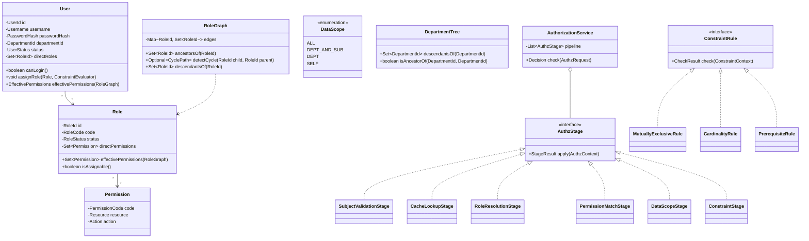

# 详细设计说明书 · 面向对象实现

**版本 0.1（骨架）· 2026 年 9 月 20 日** · 模块：`rbac-oo` · 对应迭代二（RBAC1）

> ⚠️ **本文档为骨架**，将在迭代二（11/24 检查）前填充完成。
> 当前阶段（迭代一）的重点是 `06-detail-structured.md`。此处先定下**准入标准与设计骨架**，避免届时仓促。

---

## 1. 范式准入标准

见 `02-architecture.md` §5.2。核心五条：

| # | 要求 |
|---|---|
| 1 | 领域对象**充血**：`Role` 自己知道如何计算有效权限，而非被 `RoleService` 操作 |
| 2 | 遵循 GRASP 九原则，每处设计要能说出依据了哪一条 |
| 3 | 至少显式应用 4 种设计模式，且每种要能回答「不用它会有什么问题」 |
| 4 | 依赖倒置：领域层定义仓储接口，基础设施层实现 |
| 5 | 与结构化实现共用契约与 schema，通过同一套契约测试 |

---

## 2. 领域模型（待细化）

---

## 3. 设计模式应用计划

每种模式必须回答「不用它会怎样」，否则就是为用而用。

| 模式 | 应用位置 | 不用它会有什么问题 |
|---|---|---|
| **责任链** | 授权判定管道的各阶段 | 结构化实现中，每个迭代都要修改 `authorize()` 主函数并让它越来越长；责任链让新增阶段变成新增一个类 + 注册 |
| **策略** | 约束规则、数据范围求值 | 结构化实现用 `switch(constraintType)` 分派，新增一类约束必须修改 switch（违反开闭原则）。策略让新增约束只需新增类 |
| **观察者** | 权限变更事件 → 缓存失效 + 审计 | 结构化实现中，每个修改权限的接口都要**手动记得**在事务外调用失效（见 `06` §4.5），编译器不会提醒，漏掉即安全漏洞 |
| **工厂 / 建造者** | `AuthzContext` 与 `Decision` 的构造 | 参数多且部分可选，构造函数会爆炸 |
| **组合**（候选） | 部门树与角色图的统一遍历 | — |
| **备忘录**（候选，迭代三） | What-if 分析的状态快照 | — |

> **答辩注意**：老师很可能追问「为什么这里用策略而不是 if-else」。准备好的答案不是「因为策略模式好」，而是「因为 SRS M-1 要求新增约束不改既有代码，而我们会在迭代三用新增时间窗口约束来**实测**这一点——结构化实现要改 3 个文件，面向对象实现只需新增 1 个文件」。用实测数据回答，而非教条。

---

## 4. GRASP 应用计划（待填充）

| 原则 | 应用位置 |
|---|---|
| 信息专家 | `Role.effectivePermissions()` —— 角色自己最清楚它有哪些权限 |
| 创建者 | `User.createSession()` —— 用户聚合会话 |
| 控制器 | `AuthorizationService` 作为用例控制器 |
| 低耦合 / 高内聚 | 模块划分依据 |
| 多态 | `AuthzStage`、`ConstraintRule` |
| 纯虚构 | `RoleGraph` —— 现实中没有这个「物」，但它承载了图算法，避免把遍历逻辑散落到 `Role` 中 |
| 间接 | 仓储接口隔离领域层与持久化 |
| 防止变异 | `context` 字段、管道阶段 |

> `RoleGraph` 作为**纯虚构（Pure Fabrication）**的例子特别值得讲：如果严格按「信息专家」把继承遍历放进 `Role`，每个 `Role` 都要持有整张图的引用，耦合会失控。引入一个现实中不存在的 `RoleGraph` 对象来承载图算法，是 GRASP 中「为了低耦合而牺牲纯粹的领域映射」的典型案例。

---

## 5. 待完成清单

- [ ] 完整类图（StarUML 绘制，导出至 `diagrams/`）
- [ ] 关键用例的时序图：授权判定、分配角色、建立继承关系
- [ ] 状态图：用户状态、稿件状态
- [ ] 各类的职责说明表
- [ ] 与结构化实现的逐项对比数据（填入 `10-paradigm-comparison.md`）
- [ ] 环检测的面向对象实现（`RoleGraph.detectCycle`，与结构化的显式栈 DFS 对照）
- [ ] 单元测试与 Jacoco 报告

---

## 6. 本文档对应的答辩设计点

**DP-3 角色继承的图模型与环检测**（迭代二陈述）

| 项 | 内容（待实现后补充实测数据） |
|---|---|
| **需求是什么** | 角色可继承多个角色，子角色自动获得父角色权限；权限清单给出的 5 个角色是扁平的，需从数据中推导层次 |
| **存在什么问题** | ① 继承关系是 DAG 而非树，无法用树形结构表达；② 管理员可能配出环，导致闭包计算不终止；③ 仅返回「有环」无法定位，管理员不知道该解除哪条边；④ 把图遍历放进 `Role` 会让每个角色持有整张图 |
| **采用什么方法与理由** | ① 独立的 `RoleGraph` 纯虚构对象承载图算法（GRASP 纯虚构，为低耦合牺牲领域纯粹性）；② 新增边前做可达性检测；③ 检测算法保留遍历栈，返回完整环路径供前端高亮；④ 同一个闭包算法复用于部门树 |
| **实现效果** | 待填充 |
