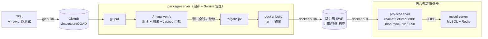

# 编译、打包与部署手册

**版本 0.2 · 2026 年 10 月 9 日**（0.1 · 10 月 1 日）

> 写给组内每个人：十月底个人验收会问到部署过程，每个人都要能讲清楚「代码怎么变成服务器上跑着的服务」。
>
> 0.2 按老师的**实验二《熟悉服务器环境》**改写：用华为云 SWR 代替自建镜像仓库，第 4 节的每一步都和实验二一一对应（4 节开头有对照表）。实验二部署的是老师的 `productdemojpa`，本文部署的是我们自己的 RBAC 服务，流程相同。
>
> **服务器的 IP、登录口令、数据库口令一律不写进仓库**（仓库是公开的）。组内在群精华消息里查，或各自记在本机被忽略的 `deploy/*.local.md` 里。

---

## 1. 定下来的事

| 项 | 取值 | 来源 |
|---|---|---|
| 服务器 | 华为云华北-北京四，**3 台 2 核 2G**，Ubuntu 18.04，40G 系统盘，峰值带宽 2Mbit/s | 9/30 组内；已购买 |
| 分工 | `package-server` 编译打包 + Swarm 管理节点；`mysql-server` 数据库；`project-server` 应用 | 实验二 |
| JDK | **21.0.2** | 9/30 组内、实验二 |
| Maven | 服务器上实验二装的是 **3.9.16**；本仓库 `./mvnw` 固定 **3.9.9**。构建一律用 `./mvnw`，两者互不影响，组内统一版本以 `./mvnw` 为准 | 9/30 组内；实验二 |
| 其他软件 | git、docker（`apt-get install docker.io git`，Ubuntu 18.04 上是 Docker 20.10） | 实验二 |
| 镜像仓库 | **华为云 SWR**（`swr.cn-north-4.myhuaweicloud.com/<组织名>/`） | 实验二 |
| 下载源 | JDK、Maven 走 `mirrors.huaweicloud.com`，Maven 依赖走 `repo.huaweicloud.com`（`deploy/maven-settings-huawei.xml`），Docker 镜像走 SWR | 9/30 组内 |
| 付款方式 | **用课程代金券**，不要自己付钱 | 课程《华为云学生侧指南 2026》 |

**《学生侧指南》的三步**（课程网站「华为云学生侧指南2026」）：

1. 领取华为云「码道」代码智能体体验版（按指南中的链接注册或登录华为云账号，勾选「免费开通」）；
2. **等老师发邀请链接，加入班级**；
3. 在华为云「费用中心」查看代金券是否到账，到账后在控制台购买云服务时用代金券抵扣。

这就是「别提前买」的原因：没加入班级之前代金券不会到账，提前买要自己付钱。

---

## 2. 从代码到服务：整条流水线



每一步做什么、为什么这么做：

| 步骤 | 做什么 | 为什么 |
|---|---|---|
| ① `git pull` | 编译服务器拉取 `main` 的最新代码 | 部署的永远是仓库里的代码，不是谁本机上的文件。出了问题能用 `git log` 查到是哪次提交 |
| ② `./mvnw verify` | 编译 → 跑全部单元测试 → 生成 Jacoco 报告 → 检查覆盖率门槛 → 打 jar | **任何一步失败都不会产出 jar**，也就不会有镜像。没测过的代码进不了服务器 |
| ③ `docker build` | 把 jar 和 JRE 装进一个镜像 | 镜像里带着运行环境。部署服务器不用装 JDK，只要有 docker |
| ④ `docker push` | 推到华为云 SWR | 两台部署服务器从同一个地方拿镜像，版本一致 |
| ⑤ `docker stack deploy` | manager 把服务按标签分派到两台部署服务器，各自从 SWR 拉镜像启动 | 应用启动时 Flyway 自动建表（V1→V2→V3）。实验二要手动 `source` 两个 SQL 文件，我们不需要 |

**为什么编译和部署分开**：2G 内存的机器，编译（Maven + 测试）和运行（MySQL + 两个 JVM）同时进行会互相抢内存，部署服务器可能被 OOM 杀掉进程。分开之后，编译服务器随便折腾，部署服务器只跑服务。

**为什么不在镜像里编译**（`Dockerfile` 注释）：编译服务器已经装了 JDK 和 Maven，先出 jar 再打镜像，省掉一个 500MB 的 Maven 镜像；而且进镜像的 jar 一定是第 ② 步测过的那个。

---

## 3. 内存预算：2G 放得下什么

2 核 2G 是本方案最紧的约束。操作系统和 docker 自身约占 300–400MB，每台可用约 1.6G。

| 节点 | 跑什么 | 内存上限 | 合计 |
|---|---|---|---|
| package-server | Maven 构建（临时）+ Swarm manager | Maven 约 1G | 约 1.0G |
| mysql-server | MySQL（`innodb_buffer_pool_size=256M`）+ Redis（`maxmemory 128mb`） | 800M + 200M | 1.0G |
| project-server | `rbac-structured`（`-Xmx512m`）+ `rbac-mock-biz`（`-Xmx256m`） | 700M + 350M | 1.05G |

⚠️ **实验二的 `lab` 栈（MySQL + productdemojpa）和本项目的 `rbac` 栈不要同时运行**：mysql-server 上会有两个 MySQL，2G 放不下。实验二验收完后先 `docker stack rm lab`，再部署 `rbac`。

这些上限写在 `docker-compose.yml` 的 `deploy.resources.limits` 和 `JAVA_OPTS` 里。**不设上限的后果**：JVM 默认堆是物理内存的 1/4，但 MySQL 默认 buffer pool 是 128M 起步、随连接数增长；三个进程互不知道对方存在，总和超过 2G 时 Linux 会随机杀一个，现象是「服务莫名其妙挂了」。

**与需求的差距要如实说明**：需求给的是 6–8 台一般性能的服务器、集群 10,000 QPS（`02-architecture.md` §6）。课程环境只有 1 台应用节点、且是 2 核 2G，**测不出这个指标**。在这套环境上压测只用于验证正确性和观察趋势（单节点吞吐、缓存命中率、P95/P99），10,000 QPS 按节点数推算，并在报告中写明推算依据。

---

## 4. 操作步骤

命令都以 root 执行。`deploy/stack.sh` 把实验二第四部分的命令包了一层。下表把本文各步和实验二的原始做法对照起来，便于验收时讲解。

| 本文 | 实验二 | 脚本 |
|---|---|---|
| 4.1 装软件 | 三、1–2 | `deploy/setup-server.sh` |
| 4.2 编译、打镜像、推 SWR | 三、3–5 | `deploy/build.sh push` |
| 4.3 组建 Swarm、打标签 | 四、1–3 | `deploy/stack.sh init` / `label` |
| 4.4 部署 | 四、4 | `deploy/stack.sh up` |
| 4.5 建库、初始数据、改口令 | 四、5 | **不需要**：Flyway 建表；口令首次部署时由 `.env` 设定 |
| 4.6 用 httpclient 调接口 | 五 | `deploy/rbac-demo.http` |

### 4.1 服务器初始化（每台一次）

实验二已经装好的服务器跳过这一步：脚本检测到 JDK 21 与 Maven 已在 PATH 中会自动跳过。

```bash
git clone https://github.com/vintcessun/OOAD.git && cd OOAD
bash deploy/setup-server.sh build     # package-server：git + docker + JDK 21.0.2 + Maven
bash deploy/setup-server.sh deploy    # mysql-server、project-server：git + docker
```

**安全组**：

- 公网只开放 22（SSH）、8081、8090。
- 以下端口只对内网（172.31.0.0/16）开放：3306、6379，以及 Swarm 用的 2377/tcp、7946/tcp+udp、4789/udp。

`docker-compose.yml` 不映射 3306：数据库端口暴露在公网上会被扫库。

### 4.2 编译、打镜像、推到 SWR（package-server，每次发布）

```bash
cd ~/OOAD && git pull
cp deploy/env.example .env      # 第一次：按文件里的注释改掉口令、JWT 密钥，填 REGISTRY
vi .env                         # REGISTRY=swr.cn-north-4.myhuaweicloud.com/<组织名>/

# SWR 控制台 → 总览 →「登录指令」，复制整条 docker login 执行（临时指令 24 小时过期）
docker login -u ... -p ... swr.cn-north-4.myhuaweicloud.com

bash deploy/build.sh push
```

`build.sh` 依次执行 `./mvnw verify`，打两个镜像（标签为当前提交的短哈希和 `latest`），再 push 到 SWR。对应实验二的 `docker tag` 与 `docker push`。

服务器拉不到 Docker Hub 时，在 `.env` 里把 `MYSQL_IMAGE`、`REDIS_IMAGE`、`BASE_IMAGE` 换成 SWR 上的镜像。老师实验二用的 MySQL 镜像是 9.2 版。本项目已用 MySQL 9.2 实测：3 个迁移脚本全部成功，只有一条「Flyway 未测试过 9.2」的警告。

### 4.3 组建 Swarm、打标签（package-server，一次）

```bash
bash deploy/stack.sh init <package-server 的私有IP>
#   → 输出一条 docker swarm join --token ... 命令，复制到 mysql-server、project-server 上执行
docker node ls                                 # 三台都是 Ready / Active，package-server 是 Leader
bash deploy/stack.sh label <数据节点主机名> <应用节点主机名>   # 以 docker node ls 的 HOSTNAME 列为准
```

- 主机名是操作系统里的名字，不一定等于华为云控制台显示的 `mysql-server`、`project-server`。实验二里数据节点的主机名就是 `mysql`。
- `init` 必须用 `--advertise-addr` 指定**私有 IP**，工作节点通过内网连接 manager。
- **join 命令里的 token 每次建集群都不同**，不要从历史记录里复制旧的。忘了就执行 `docker swarm join-token worker`。
- 标签决定容器放到哪台机器上。`docker-compose.yml` 里：
  - MySQL 和 Redis 写了 `node.labels.rbac.role == data`；
  - Java 服务写了 `node.labels.rbac.role == app`。

  实验二的 `mysql=yes` 是同一个机制。package-server 没有标签，不会被分配任何服务，编译时不影响线上。
- 实验二要手动 `docker network create --driver overlay` 建网络。`docker stack deploy` 会自动为本栈建一个 overlay 网络 `rbac_default`，服务之间按服务名互访（应用连 `mysql:3306`）。

### 4.4 部署（package-server）

```bash
TAG=<build.sh 打出的短哈希> bash deploy/stack.sh up     # 不写 TAG 则部署 latest
bash deploy/stack.sh ps                                # 4 个服务都应为 1/1，看每个任务在哪台机器上
bash deploy/stack.sh logs                              # rbac-structured 的日志
```

`stack.sh up` 做三件事：

1. 把 `.env` 读成环境变量。**`docker stack deploy` 不会自己读 `.env`**，直接执行它会用编排文件里给开发机准备的默认口令。
2. 检查口令。以下情况拒绝部署：
   - 还是模板值、开发默认值或常见弱口令；
   - root 口令与应用口令相同。

   实验二要求每组口令不同。
3. 执行 `docker stack deploy -c docker-compose.yml --with-registry-auth rbac`。`--with-registry-auth` 把 manager 上 `docker login` 的凭证转给工作节点，否则它们拉不到 SWR 的私有镜像。

首次部署时，MySQL 初始化约需 30 秒。这期间 `rbac-structured` 会因为连不上库重启几次，属正常现象（第 6 节）。

### 4.5 建库与口令：为什么不用像实验二那样手动执行 SQL

| 实验二 | 本项目 |
|---|---|
| 进 MySQL 容器 `source /sql/database.sql` 建库、建用户 | MySQL 镜像按 `MYSQL_DATABASE`、`MYSQL_USER`、`MYSQL_PASSWORD` 在**首次启动**时自动建库、建用户 |
| `source /sql/product.sql` 导入表和数据 | 应用启动时 Flyway 依次执行 V1→V2→V3 |
| `SET PASSWORD ... = PASSWORD('...')` 改口令 | 口令首次部署时由 `.env` 决定。⚠️ 实验指导里的 `PASSWORD()` 函数从 MySQL 8 起已删除，要改用 `ALTER USER 'rbac'@'%' IDENTIFIED BY '新口令';` |

**`MYSQL_ROOT_PASSWORD`、`DB_PASSWORD` 只在数据卷为空时生效。** 已经部署过再改 `.env` 不会改变数据库里的口令，只会让应用连不上库。要改口令，二选一：

- 进容器用 `ALTER USER` 改；
- 清库重来：`stack.sh down`，在 mysql-server 上执行 `docker volume rm rbac_mysql-data`，再 `up`。

**系统账号**：`admin` 与 `root` 的初始口令都是 `Admin@123`，登录返回 `mustChangePwd=true`。部署后立即用 `rbac-demo.http` 的第 11 个请求改掉。（「未改密前拒绝其他操作」尚未实现。）

### 4.6 验证：用 httpclient 调接口（实验二第五部分）

用 IntelliJ IDEA 打开 `deploy/rbac-demo.http`，把 `@host` 改成任一节点的公网 IP。Swarm 的路由网格让每个节点的 8081 都能访问到服务。然后从上到下逐个运行，每个请求的预期结果写在它上方。请求依次是：

- 健康检查；
- 口令错误；
- 登录，取得令牌和 24 个平台权限；
- 允许、拒绝、超级管理员旁路三种鉴权结果；
- 不带令牌返回 401；
- 未声明的接口返回 403；
- 调用模拟业务系统；
- 修改口令。

这些请求 10 月 9 日在 MySQL 9.2 上逐条跑过，结果与标注一致。

### 4.7 只有一台机器时（本地开发、检查现场演示）

```bash
./mvnw -s deploy/maven-settings-huawei.xml verify
docker compose up -d --build
```

单机时 `deploy:` 段被忽略，四个服务都跑在本机，口令用编排文件里的开发默认值。四个服务合计约 2G，一台 2G 服务器跑起来很勉强，建议只在本地开发机上这样用。

---

## 5. 版本控制约定

| 约定 | 原因 |
|---|---|
| 只从 `main` 发布；发布前 `git pull`，不在服务器上改代码 | 服务器上改的代码不在仓库里，下次发布就被覆盖，而且没人知道改过 |
| 镜像标签 = 提交短哈希（`build.sh` 自动打） | 服务器上跑的是哪个版本，`docker service ls` 一眼可见，能对应到具体提交 |
| 每次检查前打 git 标签：`check-1`、`check-2`、`check-3` | 检查时提交的 Jacoco 报告、详细设计与代码能对上同一个版本 |
| **已部署过的迁移脚本（V1、V2、V3）不得再改**，改表一律新增 `V4__xxx.sql` | Flyway 会校验已执行脚本的校验和，改了已执行的脚本，应用直接启动失败（`Validate failed: Migration checksum mismatch`）。首次部署之前可以改，之后不行 |
| `.env` 不入库；仓库里只有 `deploy/env.example` 模板 | 口令与 JWT 密钥进了 Git 历史就等于公开 |
| JDK、Maven 版本写死在 `pom.xml`（`java.version=21`）与 `.mvn/wrapper`（3.9.9） | 组员本机、编译服务器、镜像三处版本一致，不会出现「我这能编译」 |

---

## 6. 常见问题

| 现象 | 原因 | 处理 |
|---|---|---|
| 服务启动几秒后退出，`docker service ps` 显示反复重启 | MySQL 还没就绪。Swarm 不认 `depends_on` | 正常现象，`restart_policy` 会一直重试，MySQL 起来后就好。首次建表约 15 秒 |
| `unsupported Compose file version: 1.0` | Docker 20.10 的 `stack deploy` 要求编排文件写 `version` | 已在 `docker-compose.yml` 写 `version: "3.8"`，不要删 |
| `services.xxx.depends_on must be a list` | `stack deploy` 不接受 `condition: service_healthy` 写法 | 编排文件已改为列表形式 |
| 部署后应用一直报 `Access denied for user 'rbac'` | 数据卷已存在时改了 `.env` 的口令 | 见 4.5：口令只在首次初始化时生效 |
| 工作节点报 `No such image` 或 `unauthorized` | 没带 `--with-registry-auth`，或 SWR 临时登录指令已过 24 小时 | 重新 `docker login` 后再 `stack.sh up` |
| `docker stack rm` 后立刻重新部署失败，提示网络仍在使用 | `stack rm` 是异步的，命令返回时容器还在停 | `stack.sh ps` 确认为空后再部署 |
| 删掉并重建了挂载目录，容器里看不到新文件 | 运行中的容器仍挂着已被删除的旧目录（同名、不同 inode） | `docker service update --force <服务>` 重建容器。以后先停服务再动目录（实验二遇到过） |
| 加入 Swarm 失败 | 用了旧的 join token，或安全组没开 2377 | 在 manager 上 `docker swarm join-token worker` 重新取；检查 4.1 的端口 |
| 日志里有 `MySQL 9.2 is newer than this version of Flyway` | Flyway 10.10 只正式测试到 MySQL 8.1 | 只是警告，实测 9.2 建表正常 |
| `Migration checksum mismatch` | 改了已执行过的迁移脚本 | 见第 5 节；开发环境可 `docker volume rm rbac_mysql-data` 清库重来，**生产不行** |
| `Unsupported Database: MySQL 8.0` | 缺 `flyway-mysql` 依赖（Flyway 10 起拆包） | 已在 `rbac-structured/pom.xml` 加上 |
| 容器被杀，`dmesg` 里有 `Out of memory` | 内存超限 | 检查 `JAVA_OPTS` 与第 3 节的上限；不要在部署服务器上跑 Maven |
| `docker pull` 极慢或超时 | 直连 Docker Hub | `.env` 里把 `MYSQL_IMAGE` 等换成 SWR 上的镜像（4.2） |
| Maven 下载依赖很慢 | 没用华为镜像 | 所有 `mvn` / `./mvnw` 命令都带 `-s deploy/maven-settings-huawei.xml` |
| 接口返回 403「接口未在契约中声明权限」 | 访问了契约里没有、或尚未实现的路由 | 所有接口都受权限控制（`02-architecture.md` §4.7），这是预期行为 |

---

## 7. 验收时可能被问到的问题

| 问题 | 回答要点 |
|---|---|
| 为什么用 3 台而不是 1 台？ | 编译与运行分开，避免 2G 内存互相挤占；数据与应用分开，应用可以横向扩展而数据库不动 |
| jar 和镜像是什么关系？ | jar 是编译产物，只含我们的代码和依赖；镜像 = jar + JRE + 启动命令，是可以直接运行的单元 |
| 为什么部署服务器不装 JDK？ | JRE 在镜像里。部署服务器只要有 docker，换机器不用重新配环境 |
| 数据库表是谁建的？ | 应用启动时 Flyway 按 V1→V2→V3 顺序执行，并在 `flyway_schema_history` 记录执行过哪些，重启不会重复执行 |
| 为什么 `-Xmx512m`？ | 2G 的机器上不封顶，JVM 与 MySQL 会一起把内存吃满，被系统随机杀进程 |
| Swarm 怎么知道把 MySQL 放在哪台？ | 节点标签 `rbac.role`（实验二是 `mysql=yes`）+ 编排文件里的 `placement.constraints` |
| 改了代码怎么上线？ | push → package-server `build.sh push` → `stack.sh up`，Swarm 逐个替换容器 |
| `--with-registry-auth` 是干什么的？ | 把 manager 的 SWR 登录凭证转给工作节点，否则工作节点拉不到私有镜像 |
| 实验二要手动执行 SQL，你们为什么不用？ | 建库建用户由 MySQL 镜像的环境变量完成，建表由 Flyway 在应用启动时完成，并记录在 `flyway_schema_history`。部署可重复，不依赖人记得执行哪个文件 |
| 为什么数据库口令不能写在仓库里？ | 仓库公开；口令只在服务器的 `.env` 里，`stack.sh` 还会拒绝默认口令 |
| 测试不通过会怎样？ | `./mvnw verify` 失败，不产出 jar，后面的步骤都不会执行 |
