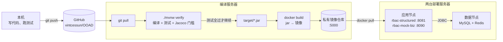

# 编译、打包与部署手册

**版本 0.1 · 2026 年 10 月 1 日**

> 写给组内每个人：十月底个人验收会问到部署过程，每个人都要能讲清楚「代码怎么变成服务器上跑着的服务」。
>
> ⚠️ **国庆期间老师会发配置视频和部署脚本，届时以老师的为准。** 本文先把组内能定的定下来：版本、服务器分工、编译到部署的每一步。老师的脚本到了之后，只改本文第 4 节的具体命令，流程不变。

---

## 1. 定下来的事

| 项 | 取值 | 来源 |
|---|---|---|
| 服务器 | 华为云北京区，**3 台 2 核 2G**，3 个月 | 9/30 组内 |
| 分工 | **1 台编译打包，2 台部署** | 9/30 组内 |
| JDK | **21.0.2** | 9/30 组内（华为云自带源里的版本太老，直接下载） |
| Maven | **3.9.9**（仓库自带 `./mvnw`，没装 Maven 也能构建） | 9/30 组内 |
| 其他软件 | git、docker | 9/30 组内 |
| 下载源 | 一律华为云镜像：JDK、Maven 走 `mirrors.huaweicloud.com`，Maven 依赖走 `repo.huaweicloud.com`（`deploy/maven-settings-huawei.xml`），Docker 镜像走 SWR 镜像加速器 | 9/30 组内 |
| 购买时间 | 等老师的配置视频出来再买，别提前 | 9/30 组内 |
| 付款方式 | **用课程代金券**，不要自己付钱 | 课程《华为云学生侧指南 2026》 |

**《学生侧指南》的三步**（课程网站「华为云学生侧指南2026」）：

1. 领取华为云「码道」代码智能体体验版（按指南中的链接注册或登录华为云账号，勾选「免费开通」）；
2. **等老师发邀请链接，加入班级**；
3. 在华为云「费用中心」查看代金券是否到账，到账后在控制台购买云服务时用代金券抵扣。

这就是「别提前买」的原因：没加入班级之前代金券不会到账，提前买要自己付钱。

---

## 2. 从代码到服务：整条流水线



每一步做什么、为什么这么做：

| 步骤 | 做什么 | 为什么 |
|---|---|---|
| ① `git pull` | 编译服务器拉取 `main` 的最新代码 | 部署的永远是仓库里的代码，不是谁本机上的文件。出了问题能用 `git log` 查到是哪次提交 |
| ② `./mvnw verify` | 编译 → 跑全部单元测试 → 生成 Jacoco 报告 → 检查覆盖率门槛 → 打 jar | **任何一步失败都不会产出 jar**，也就不会有镜像。没测过的代码进不了服务器 |
| ③ `docker build` | 把 jar 和 JRE 装进一个镜像 | 镜像里带着运行环境。部署服务器不用装 JDK，只要有 docker |
| ④ `docker push` | 推到编译服务器上的私有仓库 | 两台部署服务器从同一个地方拿镜像，版本一致 |
| ⑤ 部署 | 部署服务器拉镜像、启动容器 | 应用启动时 Flyway 自动建表（V1→V2→V3），不需要手动执行 SQL |

**为什么编译和部署分开**：2G 内存的机器，编译（Maven + 测试）和运行（MySQL + 两个 JVM）同时进行会互相抢内存，部署服务器可能被 OOM 杀掉进程。分开之后，编译服务器随便折腾，部署服务器只跑服务。

**为什么不在镜像里编译**（`Dockerfile` 注释）：编译服务器已经装了 JDK 和 Maven，先出 jar 再打镜像，省掉一个 500MB 的 Maven 镜像；而且进镜像的 jar 一定是第 ② 步测过的那个。

---

## 3. 内存预算：2G 放得下什么

2 核 2G 是本方案最紧的约束。操作系统和 docker 自身约占 300–400MB，每台可用约 1.6G。

| 节点 | 跑什么 | 内存上限 | 合计 |
|---|---|---|---|
| 编译服务器 | Maven 构建（临时）+ 私有镜像仓库 `registry:2` + Swarm manager | Maven 约 1G，仓库约 50MB | 约 1.1G |
| 部署服务器 A（数据） | MySQL 8.0（`innodb_buffer_pool_size=256M`）+ Redis（`maxmemory 128mb`） | 800M + 200M | 1.0G |
| 部署服务器 B（应用） | `rbac-structured`（`-Xmx512m`）+ `rbac-mock-biz`（`-Xmx256m`） | 700M + 350M | 1.05G |

这些上限写在 `docker-compose.yml` 的 `deploy.resources.limits` 和 `JAVA_OPTS` 里。**不设上限的后果**：JVM 默认堆是物理内存的 1/4，但 MySQL 默认 buffer pool 是 128M 起步、随连接数增长；三个进程互不知道对方存在，总和超过 2G 时 Linux 会随机杀一个，现象是「服务莫名其妙挂了」。

**与需求的差距要如实说明**：需求给的是 6–8 台一般性能的服务器、集群 10,000 QPS（`02-architecture.md` §6）。课程环境只有 1 台应用节点、且是 2 核 2G，**测不出这个指标**。在这套环境上压测只用于验证正确性和观察趋势（单节点吞吐、缓存命中率、P95/P99），10,000 QPS 按节点数推算，并在报告中写明推算依据。

---

## 4. 操作步骤

### 4.1 服务器初始化（每台一次）

```bash
git clone https://github.com/vintcessun/OOAD.git && cd OOAD
sudo bash deploy/setup-server.sh build     # 编译服务器：git + docker + JDK 21.0.2 + Maven 3.9.9
sudo bash deploy/setup-server.sh deploy    # 两台部署服务器：git + docker
```

然后在华为云控制台 → 容器镜像服务 SWR → 镜像加速器，取得加速地址，写进每台的 `/etc/docker/daemon.json`：

```json
{
  "registry-mirrors": ["https://<你的加速地址>.mirror.swr.myhuaweicloud.com"],
  "insecure-registries": ["<编译服务器内网IP>:5000"]
}
```

`insecure-registries` 允许部署服务器从编译服务器的私有仓库拉镜像（内网、无 HTTPS）。改完 `sudo systemctl restart docker`。

**安全组**：只对公网开放 22（SSH）、8081、8090；3306、6379、5000、2377（Swarm）只对内网开放。数据库端口暴露在公网上会被扫库，`docker-compose.yml` 已经不映射 3306。

### 4.2 组建 Swarm（一次）

```bash
# 编译服务器（manager）
docker swarm init --advertise-addr <编译服务器内网IP>
docker run -d --restart=always --name registry -p 5000:5000 registry:2

# 两台部署服务器：执行上一步输出的 docker swarm join ... 命令

# 回到编译服务器，给部署节点打标签，决定谁跑什么
docker node ls
docker node update --label-add rbac.role=data <部署服务器A的主机名>
docker node update --label-add rbac.role=app  <部署服务器B的主机名>
```

标签的作用：`docker-compose.yml` 里 MySQL 和 Redis 写了 `node.labels.rbac.role == data`，Java 服务写了 `== app`，Swarm 按标签把容器放到对应的机器上。**编译服务器没有标签，所以不会被分配任何服务**，编译时不影响线上。

### 4.3 每次发布

```bash
# 编译服务器，仓库根目录
cp deploy/env.example .env        # 第一次：改掉里面的口令与 JWT 密钥
vi .env                           # REGISTRY=<编译服务器内网IP>:5000/

git pull
REGISTRY=<编译服务器内网IP>:5000/ bash deploy/build.sh push
set -a; . ./.env; set +a
docker stack deploy -c docker-compose.yml rbac
```

`deploy/build.sh` 做的就是第 2 节的 ②③④：`./mvnw verify` → 打两个镜像（标签为当前提交的短哈希和 `latest`）→ 推送。

### 4.4 验证

```bash
docker stack services rbac                 # 4 个服务都应为 1/1
curl http://<应用节点IP>:8081/api/v1/actuator/health
# {"status":"UP",...}

curl -X POST http://<应用节点IP>:8081/api/v1/auth/login \
     -H 'Content-Type: application/json' \
     -d '{"username":"admin","password":"Admin@123"}'
# 返回 token。admin / root 初始口令都是 Admin@123，上线后立即用 POST /auth/change-password 改掉
# （登录结果里 mustChangePwd=true；「未改密前拒绝其他操作」尚未实现）
```

### 4.5 只有一台机器时（本地开发、检查现场演示）

```bash
./mvnw -s deploy/maven-settings-huawei.xml verify
docker compose up -d --build
```

单机时 `deploy:` 段被忽略，四个服务都跑在本机。一台 2G 服务器跑全部四个服务很勉强（合计约 2G），建议只在本地开发机上这样用。

---

## 5. 版本控制约定

| 约定 | 原因 |
|---|---|
| 只从 `main` 发布；发布前 `git pull`，不在服务器上改代码 | 服务器上改的代码不在仓库里，下次发布就被覆盖，而且没人知道改过 |
| 镜像标签 = 提交短哈希（`build.sh` 自动打） | 服务器上跑的是哪个版本，`docker service ls` 一眼可见，能对应到具体提交 |
| 每次检查前打 git 标签：`check-1`、`check-2`、`check-3` | 检查时提交的 Jacoco 报告、详细设计与代码能对上同一个版本 |
| **已部署过的迁移脚本（V1、V2、V3）不得再改**，改表一律新增 `V4__xxx.sql` | Flyway 会校验已执行脚本的校验和，改了已执行的脚本，应用直接启动失败（`Validate failed: Migration checksum mismatch`）。首次部署之前可以改，之后不行 |
| `.env` 不入库；仓库里只有 `deploy/env.example` 模板 | 口令与 JWT 密钥进了 Git 历史就等于公开 |
| JDK、Maven 版本写死在 `pom.xml`（`java.version=21`）与 `.mvn/wrapper`（3.9.9） | 组员本机、编译服务器、镜像三处版本一致，不会出现「我这能编译」 |

---

## 6. 常见问题

| 现象 | 原因 | 处理 |
|---|---|---|
| 服务启动几秒后退出，`docker service ps` 显示反复重启 | MySQL 还没就绪。Swarm 不认 `depends_on` | 正常现象，`restart_policy` 会一直重试，MySQL 起来后就好。首次建表约 15 秒 |
| `Migration checksum mismatch` | 改了已执行过的迁移脚本 | 见第 5 节；开发环境可 `docker volume rm rbac_mysql-data` 清库重来，**生产不行** |
| `Unsupported Database: MySQL 8.0` | 缺 `flyway-mysql` 依赖（Flyway 10 起拆包） | 已在 `rbac-structured/pom.xml` 加上 |
| 容器被杀，`dmesg` 里有 `Out of memory` | 内存超限 | 检查 `JAVA_OPTS` 与第 3 节的上限；不要在部署服务器上跑 Maven |
| `docker pull` 极慢或超时 | 直连 Docker Hub | 配置 SWR 镜像加速器（4.1） |
| Maven 下载依赖很慢 | 没用华为镜像 | 所有 `mvn` / `./mvnw` 命令都带 `-s deploy/maven-settings-huawei.xml` |
| 接口返回 403「接口未在契约中声明权限」 | 访问了契约里没有、或尚未实现的路由 | 所有接口都受权限控制（`02-architecture.md` §4.7），这是预期行为 |

---

## 7. 验收时可能被问到的问题

| 问题 | 回答要点 |
|---|---|
| 为什么用 3 台而不是 1 台？ | 编译与运行分开，避免 2G 内存互相挤占；数据与应用分开，应用可以横向扩展而数据库不动 |
| jar 和镜像是什么关系？ | jar 是编译产物，只含我们的代码和依赖；镜像 = jar + JRE + 启动命令，是可以直接运行的单元 |
| 为什么部署服务器不装 JDK？ | JRE 在镜像里。部署服务器只要有 docker，换机器不用重新配环境 |
| 数据库表是谁建的？ | 应用启动时 Flyway 按 V1→V2→V3 顺序执行，并在 `flyway_schema_history` 记录执行过哪些，重启不会重复执行 |
| 为什么 `-Xmx512m`？ | 2G 的机器上不封顶，JVM 与 MySQL 会一起把内存吃满，被系统随机杀进程 |
| Swarm 怎么知道把 MySQL 放在哪台？ | 节点标签 `rbac.role` + 编排文件里的 `placement.constraints` |
| 改了代码怎么上线？ | push → 编译服务器 `build.sh push` → `docker stack deploy`，Swarm 逐个替换容器 |
| 测试不通过会怎样？ | `./mvnw verify` 失败，不产出 jar，后面的步骤都不会执行 |
